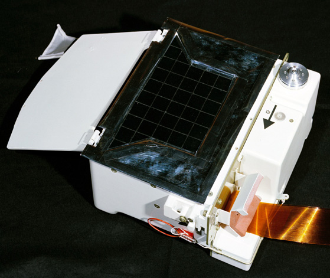

.. _Lunar Atmospheric Composition Experiment:

***********************************************
Lunar Atmospheric Composition Experiment (LACE)
***********************************************

.. csv-table:: Lunar Atmospheric Composition Experiment (LACE)
    :stub-columns: 1

    "Ośrodek badawczy", "University of Texas, USA"
    "Misje", "Apollo 17"
    "Nazwa eksperymentu (j. ang.)", "Lunar Atmospheric Composition Experiment"
    "Nazwa eksperymentu (j. pol.)", "Pomiar składu atmosfery Księżyca"
    "Dziedzina", "Badania atmosferyczne"

Przedmiot badania
=================
Księżyc posiada bardzo cienką atmosferę. Ze względu na niewielkie oddziaływanie grawitacyjne Księżyca gazy wchodzące w skład tej struktury łatwo ulatniają się w przestrzeń kosmiczną. Ze względu na otrzymywanie dużych energii na skutek słonecznego podgrzewania lekkie atomy takie jak hel, wyparowują w przestrzeń kosmiczną w ciągu kilku godzin. Dla cięższych atomów czas ten jest odpowiednio dłuższy. Jednakże w procesie jonizacji wywołanej przez promieniowanie UV pochodzące od słońca, atomy te mogą być uniesione na znaczne odległości od powierzchni Księżyca. Proces ten może trwać nawet do kilku miesięcy.

Ze względu na tempo z którym atomy uciekają w przestrzeń kosmiczną, musi istnieć ciągłe źródło cząsteczek aby utrzymać cienką warstwę atmosfery. Takim źródłem są w głównej mierze przechwycone cząsteczki wiatru słonecznego oraz materiał uwolniony podczas zderzeń komet i meteorytów z powierzchnią Księżyca. Dla atomów, głównie helu-4 oraz argon-40 źródłem może być również odgazowywanie wnętrza Księżyca.

Materiały i metody
==================

    Zdjęcie przedstawia eksperyment Lunar Atmospheric Composition Experiment (LACE). Źródło: :cite:`Lindsay2008`.

Przebieg eksperymentu
=====================
Eksperyment :ref:`Lunar Atmospheric Composition Experiment` został wykonany przez załogę misji :ref:`Apollo 17`. Zawierał spektrometr masowy, który pozwolił na określenie składu atmosfery księżycowej. Podczas wcześniejszych misji wykazano obecność takiej warstwy za pomocą eksperymentu :ref:`Cold Cathode Ion Gauge`.

Rezultaty
=========
W skład atmosfery księżycowej wchodzą głównie trzy gazy: neon, hel, wodór w równych proporcjach. Zaobserwowano również niewielkie ilości metanu, dwutlenku węgla, amoniaku oraz wody. Ponadto zaobserwowano argon-40, którego znacznie większe wartości były notowane w trakcie sejsmicznej aktywności. Argon-40 jest produktem rozpadu radioaktywnego potasu-40 we wnętrzu Księżyca. Wzmożona aktywność sejsmiczna mogła przyczynić się do uwolnienia pokładów gazu z wnętrza na powierzchnię poprzez pęknięcia w skorupie.
