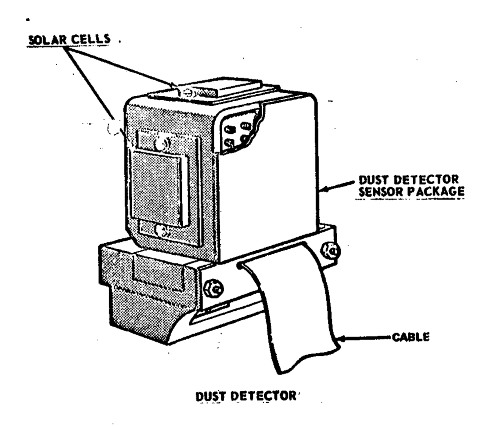

.. _Lunar Dust Detector:

*************************
Lunar Dust Detector (LDD)
*************************

.. csv-table:: Lunar Dust Detector (LDD)
    :stub-columns: 1

    "Ośrodek badawczy", "NASA Manned Spacecraft Center, USA"
    "Misje", "Apollo 11, 12, 14, 15"
    "Nazwa eksperymentu (j. ang.)", "Lunar Dust Detector"
    "Nazwa eksperymentu (j. pol.)", "Wykrywacz pyłu księżycowego"
    "Dziedzina", "Petrofizyka"

Przedmiot badania
=================
Część eksperymentów wykonywanych w ramach programu Apollo miała działać również po opuszczeniu Księżyca przez astronautów. Przed lądowaniami w ramach programu Apollo sądzono, że urządzenia w ramach pakietu ALSEP pokryte zostaną warstwą pyłu uniesionego w skutek startu :term:`LM`. Przyczyną zanieczyszczenia miały być również inne źródła w wyniku długotrwałej ekspozycji na szkodliwe czynniki środowiskowe.

Eksperyment :ref:`Lunar Dust Detector` wykonano podczas misji :ref:`Apollo 11`, :ref:`12 <Apollo 12>`,  :ref:`14 <Apollo 14>` i :ref:`15 <Apollo 15>`. Badanie zostało zaprojektowane w celu pomiaru złogów regolitu Księżycowego na urządzeniach elektronicznych i mechanicznych. Informacja ta była wyliczana na podstawie różnicy w wartości luminacji zarejestrowanej przez fotokomórki paneli fotowoltaicznych w czasie. Obserwowano również poziom zniszczeń paneli przez wysokoenergetyczne promieniowanie jak również poziom odbitego promieniowania podczerwonego i temperaturę powierzchni Księżyca :cite:`Apollo12PressKit`.

Materiały i metody
==================

    Diagram przedstawia eksperyment Lunar Dust Detector (LDD). Źródło: :cite:`Apollo12PressKit`.

:ref:`Lunar Dust Detector` zbudowany był z dwóch komponentów:

    - pakietu sensorów fotokomórek,
    - drukowanego układu obwodów.

Pakietu sensorów składał się z trzech fotokomórek zamontowanych górze osłony przeciwsłonecznej :ref:`stacji centralnej <Central Station>`.

Drukowany układ obwodów umieszczono wewnątrz :ref:`stacji centralnej <Central Station>`. Był częścią interfejsu rozdzielania mocy dla podsystemów eksperymentów naukowych w ramach pakietu :term:`ALSEP`.

Przebieg eksperymentu
=====================
Eksperyment dokonywał pomiaru mocy wyjściowej i temperatury trzech paneli fotowoltaicznych. Na skutek uszkodzeń wywołanych ekspozycją na promieniowanie oraz pokrywę pyłu parametry wyjściowe urządzenia się obniżały. Pozwoliło to na obliczenie temperatury powierzchniowej i stopnia zanieczyszczenia paneli.

Ponadto podczas misji :ref:`Apollo 12` pobrano również próbki zanieczyszczeń amerykańskiej bezzałogowej sondy kosmicznej *Surveyor 3* w celu analizy długotrwałej ekspozycji na promieniowanie kosmiczne.

Rezultaty
=========
Warstwa pyłu zgromadzona na urządzenia okazała się być znacznie niższa od oczekiwanej. Eksperyment był również wykorzystywany do monitorowania długotrwałej deterioracji fotokomórek paneli na skutek promieniowania oraz fluktuacji termicznej.

Eksperyment był uznawany za inżynieryjny w naturze i nie klasyfikował się w zestawieniu eksperymentów naukowych.

