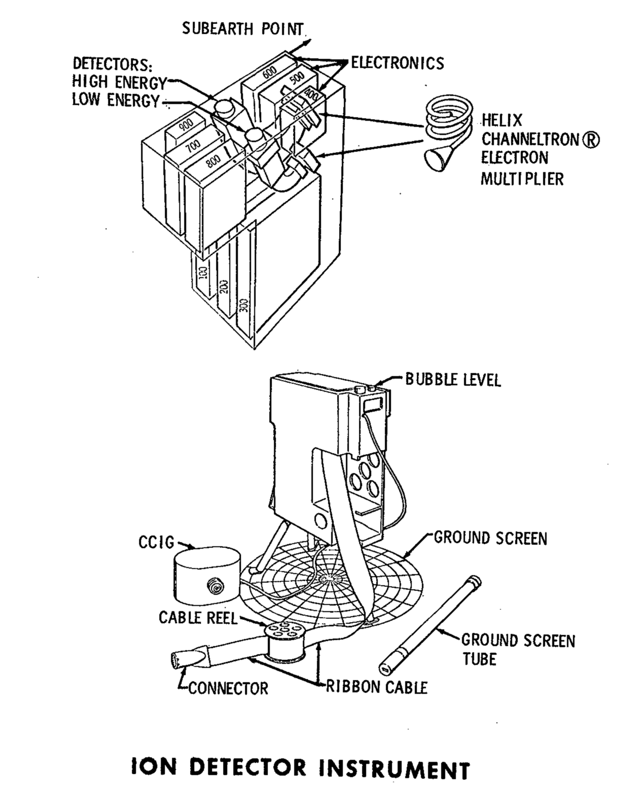

.. _Lunar Ionosphere Detector:

*******************************
Lunar Ionosphere Detector (LID)
*******************************

.. csv-table:: Lunar Ionosphere Detector (LID)
    :stub-columns: 1

    "Ośrodek badawczy", ""
    "Misje", "Apollo 12"
    "Nazwa eksperymentu (j. ang.)", "Lunar Ionosphere Detector"
    "Nazwa eksperymentu (j. pol.)", "Wykrywacz jonosfery księżycowej"
    "Dziedzina", "Elektromagnetyzm"

Przedmiot badania
=================
Naukowym celem eksperymentu :ref:`Lunar Ionosphere Detector` było zbadanie naładowanych cząstek w księżycowej atmosferze. W połączeniu z :ref:`Lunar Atmospheric Detector` zbadano zarówno cząsteczki naładowane jak i nieposiadające ładunku. Mimo zebrania niewielkiej próbki materiału badawczego, wiedza na temat księżycowej jonosfery, jej gęstości i składu przyczyniła się do zrozumienia procesów chemicznych, radioaktywnych oraz wulkanicznej aktywności, jak również składu chemicznego wiatru słonecznego.

Siła uderzenia meteorytów w powierzchnię księżyca powoduje wyparowanie zarówno materiału meteorytowego jak również regolitu księżycowego. Podczas gdy te czynniki przyczyniają się do tworzenia jonosfery i atmosfery, siły oddziałujące na wyrzucony materiał powodują ich ucieczkę w kosmos. Siłami tymi są: niska wartość przyciągania grawitacyjnego, wysoka fluktuacja temperaturowa jak również aktywność wiatru słonecznego, która może również przyczyniać się do tworzenia jak i niszczenia wyżej wymienionych warstw.

Cząsteczki wiatru słonecznego są głównymi składowymi jonosfery, mimo iż zaobserwowane z Ziemi księżycowe "gorące strefy" (ang. *heat spot*) sugerują uwalnianie się gazów z jego wnętrza.

Materiały i metody
==================

    Diagram przedstawia eksperyment Lunar Ionosphere Detector (LID). Źródło: :cite:`Apollo12PressKit`.

:term:`LID` używał :ref:`Suprathermal Ion Detector Experiment` w celu detekcji i zliczenia dodatnio naładowanych jonów. Składał się z dwóch wykrzywionych płytek analizatora, mierzących energię dodatnich jonów. Jedna płytka mierzyła jony z energiami w zakresie od 0,2 eV do 48,6 eV. Zawierała również filtr prędkości w postaci przecinającego się pola magnetycznego i elektrycznego, Urządzenie było zaprojektowane do spowalniania jonów z prędkościami rzędu od 4 km/s do 935 km/s :cite:`Calio1970`.

Instrument badawczy ważył 8,62 kg i pracował przy poborze mocy na poziomie 60 W i napięciu wejściowym prądu stałego +29 V :cite:`Jones1995`.

Za projekt eksperymentu i analizę danych byli odpowiedzialni naukowcy: Dr John Freeman i Dr Curt Michel z Rice University :cite:`Apollo12PressKit`.

Przebieg eksperymentu
=====================
Badając charakter spowolnienia i prędkość pierwotną uzyskano informację na temat masy cząstek wiatru słonecznego dla energii od 10 eV do 3500 eV. Masa pozostałych wysokoenergetycznych cząstek pochodzących z :term:`SEP` nie mogła być określona, ze względu na brak możliwości selektywnego spowalniania cząstek o różnych prędkościach :cite:`Calio1970`.

Rezultaty
=========
:ref:`Lunar Ionosphere Detector` jest urządzeniem, które pomogło zidentyfikować jonizację naładowanych cząstek i atomów. Posłużyło również do obserwacji ładowania cząstek w trakcie przejścia Księżyca przez pole magnetyczne Ziemi. Eksperyment został zaprojektowany także w celu badania wartości pola elektrycznego Księżycowej powierzchni.

