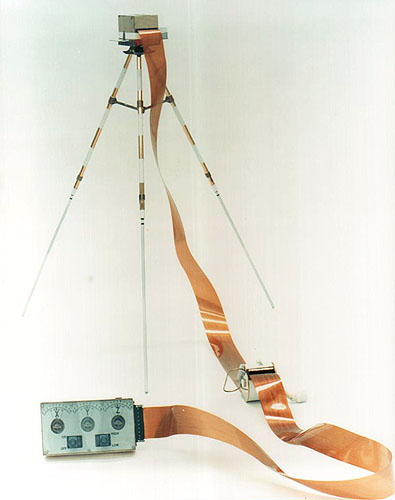

.. _Lunar Portable Magnetometer:

*********************************
Lunar Portable Magnetometer (LPM)
*********************************

.. csv-table:: Lunar Portable Magnetometer (LPM)
    :stub-columns: 1

    "Ośrodek badawczy", "Centrum badań naukowych NASA AMES, USA"
    "Misje", "Apollo 14, 16"
    "Nazwa eksperymentu (j. ang.)", "Lunar Portable Magnetometer"
    "Nazwa eksperymentu (j. pol.)", "Przenośny księżycowy magnetometr"
    "Dziedzina", "Magnetometria"

Przedmiot badania
=================
Metoda mapowania różnic pola magnetycznego jest standardową procedurą wykorzystywaną na Ziemi w badaniach prospekcyjnych. Wiele złóż naturalnych i obiektów podziemnych może powodować anomalie pola magnetycznego. Średnia wartość pola magnetyczne Ziemi wynosi 50µT (50000 nT), a anomalie na poziomie kilkudziesięciu tysięcy Tesli są częste. Ze względu na fakt, iż pole magnetyczne Księżyca jest około trzy rzędy wielkości mniejsze od Ziemskiego, oczekiwane wartości anomalii są proporcjonalnie mniejsze.

Materiały i metody
==================

    Zdjęcie przedstawia eksperyment Lunar Portable Magnetometer (LPM) w laboratorium. Źródło: NASA/S70-56721 :cite:`Lindsay2008`.

Przedstawiony na :numref:`figure-alsep-LPM-photo` przedstawia układ elektroniczny zawierający przełączniki i trzy wskaźniki wyjściowe. Zestaw przymocowano do :term:`Modular Equipment Transporter`. Głowicę sensora zamocowano na trójnogu i rozstawiano 15 metrów od :term:`MET` w celu dokonania odczytów. Podobny instrument był częścią misji :ref:`Apollo 16`, którego elementy elektroniczne umieszczono na tyle :term:`LRV`. Podłączenie do obwodów elektronicznych :term:`LRV` zrealizowano za pomocą płaskiej wiązki kabla elektrycznego o długości 15,2 m.

Zakres pomiarowy instrumentu wynosił 256 nT.

Przebieg eksperymentu
=====================
W połączeniu z :ref:`Lunar Surface Magnetometer` w trakcie misji :ref:`Apollo 14` oraz :ref:`Apollo 16` wykorzystano również eksperyment :ref:`Lunar Portable Magnetometer`. Astronauci przenosili urządzenie podczas przemieszczania się po powierzchni Księżyca zarówno z wykorzystaniem :term:`MET` (:ref:`Apollo 14`) jak i :term:`LRV` (:ref:`Apollo 16`). Pomiarów dokonano w celu rejestracji lokalnej wartości pola magnetycznego.

Podczas użytkowania, trójnóg był rozstawiany 15 metrów od :term:`LRV`. Konieczne było zachowanie odległości trójnoga od pojazdu w celu uniknięcia jego wpływu magnetycznego, jak również oddziaływania pochodzącego oraz astronautów i ich ekwipunku. Urządzenie musiało być wypoziomowane oraz znajdować się w cieniu od słońca :cite:`Jones1995`.

Odczyt dokonywany był z urządzenia zamontowanego w :term:`LRV`. Panel składał się z trzech cyfrowych mierników przypominających zegary. Każdy ze wskaźników pokazywał wartości pola magnetycznego dla jednej osi, składowej Księżycowego pola magnetycznego. Astronauci przekazywali na Ziemię odczytane wartości za pomocą komunikacji radiowej :cite:`Jones1995`.

Rezultaty
=========
Instrument :ref:`Lunar Portable Magnetometer` wykorzystany podczas misji :ref:`Apollo 14` zarejestrował jedynie dwie wartości lokalnego pola magnetycznego. Oba pomiary dały nieoczekiwane wartości. Pierwszy pomiar dokonano w niewielkiej odległości od punktu lądowania, jednakże poza zasięgiem wpływu pola magnetycznego lądownika :term:`LM`. Zmierzona wartość wynosiła 43 nT. Drugiego pomiaru dokonano na krawędzi krateru Cone (ang. *Cone Crater*). Zarejestrowano wartość wynoszącą 103 nT.

Pomiary te były znacznie przewyższające wartości oczekiwane. Wcześniejsze dane zebrane z wykorzystaniem orbitujących Księżyc satelitów wykazały jednoznacznie, że uśredniona wartość pola magnetycznego nie może przekraczać 10 do 12 nT. Otrzymane wartości były znacznie większe od tego progu. Różnica (60 nT) w dwóch pomierzonych wartościach była równie nieoczekiwana. Tak znaczne różnice nie były oczekiwane przy tak stosunkowo niewielkich odległościach przemieszczenia :cite:`Chapman1971`, :cite:`Brett1972`.

W celu zrozumienia procesu gwałtownych zmian wartości pola magnetycznego, eksperyment wykonano ponownie podczas misji :ref:`Apollo 16` próbkując pole wielokrotnie.

Efekt ten jest rezultatem naturalnego procesu magnetyzacji skał Księżycowych. Zachodzenie tego procesu występuje również na Ziemi np. w naturalnie występującym i silnie magnetyzującym minerale *lodestone*. Podobny proces tworzenia właściwości magnetycznych skał zachodzi na powierzchni Księżyca :cite:`Jones1995`.
