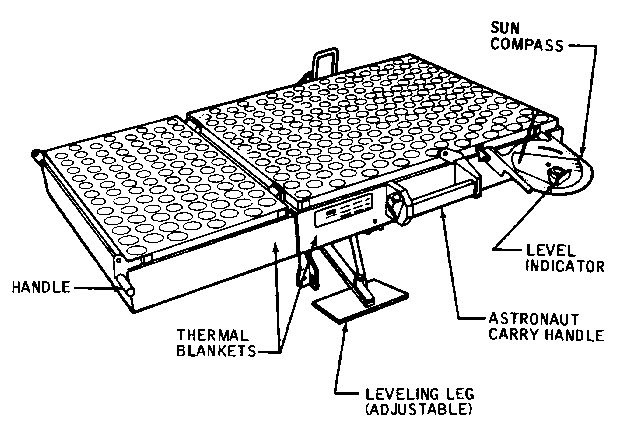

.. _Laser Ranging Retro-reflector:

************************************
Laser Ranging Retro-reflector (LRRR)
************************************

.. csv-table:: Laser Ranging Retro-reflector (LRRR)
    :stub-columns: 1

    "Ośrodek badawczy", ""
    "Misje", "Apollo 11, 14, 15"
    "Nazwa eksperymentu (j. ang.)", "Laser Ranging Retro-reflector"
    "Nazwa eksperymentu (j. pol.)", "Zwierciadło pomiaru dla dalmierza laserowego"
    "Dziedzina", "Astrometria"

Przedmiot badania
=================
Dalmierz laserowy pozwala na precyzyjne określenie odległości oddalonych od siebie obiektów. Składa się z dwóch części. Jedna jest generatorem wiązki lasera, a druga zawiera lustro, lub lustra odbijające promienie w kierunku padania. Na podstawie znanej prędkości światła oraz pomiaru czasu powrotu wiązki możliwe jest precyzyjne wyznaczenie odległości między dwoma elementami zestawu.

Mimo faktu, iż Księżyc posiada wartość albedo na średnim poziomie 0.136 i kierunkowo odbija promienie, to proces odbicia ma charakter nielambertowski, tj. nierównomiernie rozprasza światło we wszystkich kierunkach. Moc odbitego promienia jest niewystarczająca aby móc precyzyjnie określić jego odległość od Ziemi.

Materiały i metody
==================
.. figure:: img/LRRR-closed.gif
    :name: figure-alsep-LRRR-diagram1

    Diagram przedstawia eksperyment Laser Ranging Retro-reflector (LRRR) w konfiguracji zamkniętej. Źródło: :cite:`Apollo12PressKit`.

    Diagram przedstawia eksperyment Laser Ranging Retro-reflector (LRRR) w konfiguracji otwartej. Źródło: :cite:`ImageProjectApolloArchive`.

Powierzchnia odbijająca pasywnego eksperymentu :ref:`Laser Ranging Retro-reflector` składało się z kostek topionej krzemionki. Dla misji :ref:`Apollo 11` i :ref:`Apollo 14` liczba kostek wynosiła 100. W misji :ref:`Apollo 15` wykorzystywano matryce posiadające 300 kostek. Powierzchnię zaprojektowano tak, aby odbijała światło lasera równolegle do kąta jego padania :cite:`Jones1995`.

Przebieg eksperymentu
=====================
Urządzenie zostało ustawione na powierzchni Księżyca w sposób precyzyjny. Pozwalało to na dokładne jego namierzenie instrumentu. Naukowcy z dowolnego punktu na Ziemi mogli skierować wiązkę lasera w zwierciadło aby uzyskać promień odbity. Różnica czasu pomiędzy emisją, a odebraniem impulsu pozwala na wyznaczenie odległości z 8 centymetrową precyzją. Eksperyment był operacyjny do czerwca 1981 r. :cite:`Jones1995`.

Rezultaty
=========
Wykorzystując dane precyzyjnie pomierzonych odległości, ustalono, iż powierzchnia Księżyca ulega znacznym ugięciom i zakrzywieniom na skutek oddziaływania pola grawitacyjnego Ziemi. Do zmian tych dochodzi w trakcie różnych pozycji Księżyca na orbicie okołoziemskiej.
