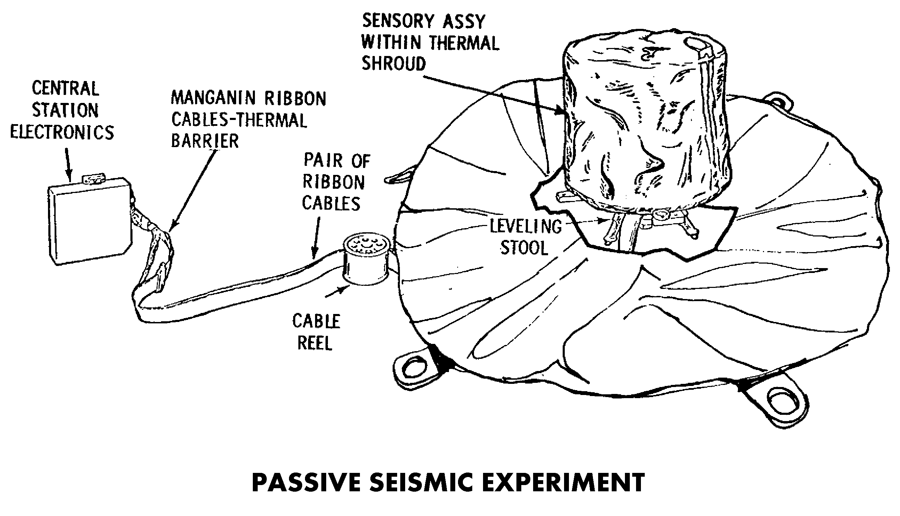

.. _Passive Seismic Experiment:

********************************
Passive Seismic Experiment (PSE)
********************************

.. csv-table:: Passive Seismic Experiment (PSE)
    :stub-columns: 1

    "Ośrodek badawczy", "University of Texas, USA"
    "Misje", "Apollo 12, 14, 15, 16"
    "Nazwa eksperymentu (j. ang.)", "Passive Seismic Experiment"
    "Nazwa eksperymentu (j. pol.)", "Pasywny eksperyment sejsmiczny"
    "Dziedzina", "Sejsmika"

Przedmiot badania
=================
Eksperyment :ref:`Passive Seismic Experiment` wykonano w celu określenia właściwości podpowierzchniowych i pomiaru ekstremalnie niewielkich wibracji powierzchni księżycowej spowodowanej przez odległe trzęsienia ziemi, jak również wywołane przez człowieka eksplozje i uderzenia statków kosmicznych.

:ref:`Passive Seismic Experiment` badał propagację fal sejsmicznych przez Księżyc i pozwolił na bardzo szczegółowe określenie jego wewnętrznej struktury.

W ciągu roku na Ziemi dochodzi do ponad 1 mln trzęsień ziemi. Na księżycu zarejestrowano ich około 300 i o znacznie mniejszej skali. W przypadku zaobserwowania zjawiska sejsmicznego przez trzy lub więcej oddalonych od siebie sejsmometrów, czas i lokacja wydarzenia mogła zostać określona z dużą precyzją. Ze względu na fakt, iż fale sejsmiczne odległych wydarzeń podróżują głębiej wewnątrz struktury Księżyca niż fale zjawisk bliskich, poprzez pomiar drgań na różnych odległościach od sejsmometru możliwe jest określenie prędkości rozchodzenia się fal sejsmicznych oraz ich charakterystyka głębokościowa :cite:`Jones1995`.

Sejsmometr użyty podczas misji :ref:`Apollo 11` zwracał dane tylko przez trzy tygodnie ale pozwolił na zarejestrowanie użytecznych sygnałów. Bardziej zaawansowane urządzenie zastosowano podczas misji Apollo 12, 14, 15 i 16. Dane sejsmiczne uzyskiwano do końca września 1977 r. Każdy z sejsmometrów mierzył wszystkie trzy składowe przesunięć powierzchni, tj. góra-dół, północ-południe, wschód-zachód :cite:`Chapman1971`.

Materiały i metody
==================

    Diagram przedstawia eksperyment Passive Seismic Experiment (PSE). Źródło: :cite:`ImageProjectApolloArchive`.

Gdy instrument rejestrował odpowiedzi na poruszanie się powierzchni wywoływało to harmoniczne drgania spowodowane bezwładnością centralnej dźwigni układu i elementów masowych. Wibracje były wykrywalne przez elektroniczne układy kondensatorowe. Wewnętrzny zestaw silników stale utrzymywał urządzenie w poziomie z dokładnością do kilku sekund kątowych.

Sieć czterech urządzeń rozstawionych podczas misji Apollo pozwoliła sejsmologom na lokalizację księżycowych trzęsień ziemi w trzech wymiarach. Uzyskano możliwość badania prędkości sejsmicznych i propagacji fal jak również na charakterystykę podpowierzchniowych materiałów.

Przebieg eksperymentu
=====================
:ref:`Passive Seismic Experiment` codziennie rejestrował uderzenia meteorytów oraz średnio dwa księżycowe trzęsienia ziemi miesięcznie. Pomiar był dokonywany do głębokości 800 km.

Naukowcy projektując eksperyment mieli nadzieję, że księżycowe trzęsienia ziemi i uderzenia meteorytów odpowiedzą na dwa fundamentalne pytania:

    - czy księżyc posiada płynne jądro?
    - jakie jest wnętrze księżyca?

Aby rozwiązać te kwestie naukowcy potrzebowali przynajmniej jednego impaktu po przeciwnej stronie księżyca o wartości przekraczającej 1019 ergów. 13 maja 1972 r. na stronie księżyca zorientowanej ku Ziemi zarejestrowano wydarzenie sejsmiczne o wartości 1100 kg. 19 września 1973 r. doszło do uderzenia po niewidocznej stronie z energią rzędu 1018 ergów. 17 lipca 1972 trzy miesiące po rozstawieniu eksperymentów podczas misji :ref:`Apollo 16` zaobserwowano uderzenie o największej zarejestrowanej dotychczas sile. Do uderzenia doszło po niewidocznie stronie Księżyca w pobliżu Mare Moscoviense (26°N, 147°E) :cite:`Jones1995`.

Zauważono również wzrost aktywności sejsmicznej gdy Księżyc był w skrajnych położeniach orbity wokół Ziemi, tj. w apogeum (najdalszej) i perigeum (najbliższej) odległości. Wibracje generowane przez zmiany temperatury powierzchni i rozszerzanie się materiału skalnego były rejestrowane każdego dnia księżycowego :cite:`Brett1972`.

Rezultaty
=========
W ciągu ośmiu lat z zbierania danych przez urządzenia pakietu ALSEP, sejsmometry zarejestrowały 10 tys. wstrząsów tektonicznych i 2000 uderzenia meteorytów :cite:`Orloff2000`.

Informacje sejsmiczne, magnetometryczne i uzyskane podczas eksperymentu :term:`HFE` przyczyniły się do zrozumienia podstawowych charakterystyk wnętrza Księżyca. Uważa się że skorupa jest wielowarstwowa i ma miąższość 50 km. Złożona jest z 20 kilometrowej warstwy przypowierzchniowej. Górna część płaszcza księżyca ma miąższość 500 km i złożona jest z jest jednorodnej warstwy oliwinu oraz piroksenu. Poniżej tej wartości dane sejsmiczne wskazują na bogate w żelazo jądro. Jednakże ilość danych nie jest wystarczająca do jednoznacznego określenia, iż jest ono w stanie płynnym :cite:`Jones1995`.

Odkryto, iż Księżycowe trzęsienia ziemi występują cyklicznie w stałych miejscach. Czas występowania wewnętrznych trzęsień ziemi jest skorelowany z cyklem pływów na tyle, iż uważa się, że te siły odgrywają znaczącą rolę w powstawaniu wstrząsów :cite:`Brett1972`.

Większość zjawisk zaobserwowanych przez sejsmometry była albo trzęsieniami ziemi lub uderzeniami meteorytów. Jednakże zaobserwowano również pojedyncze uderzenia członów trzecich stopni rakiety Saturn V i kilku modułów Księżycowych celowo rozbitych o powierzchnię Księżyca po tym jak zostały opuszczone przez astronautów. Te wytworzone przez człowieka zjawiska sejsmiczne o precyzyjnie określonych czasach i miejscach pozwalały na skalibrowanie działania sieci urządzeń :cite:`Chapman1971`.

:ref:`Passive Seismic Experiment` przyczynił się do poszerzenia wiedzy na temat :cite:`Calio1970`, :cite:`Chapman1971`, :cite:`Allen1972`, :cite:`Brett1972`:

    #. Wewnętrznej budowy księżyca. Podobnie jak Ziemia, Księżyc posiada skorupę, płaszcz i jądro. Skorupa księżyca jest bogata w plagioklazy (minerały skałotwórcze o składzie mieszanym z grupy skaleni, tj. skalenie sodowo-wapniowe) i średnią miąższość wynoszącą 50 km. Płaszcz Księżycowy leży pomiędzy skorupą a jądrem i składa się głównie z minerałów takich jak oliwin i piroksen. Jądro natomiast najprawdopodobniej złożone jest z żelaza i siarki. Rozciąga się od środka Księżyca do około 450 km, tj. 25% średnicy księżyca. Jest to wartość znacznie mniejsza w porównaniu z Ziemią, której Jądro rozciąga się do 54% średnicy. Jednakże wielkość jądra księżycowego nie jest zbyt dobrze określona ze względu na na brak możliwości dokonania precyzyjnych pomiarów sejsmicznych. Eksperymenty takie :term:`LRRR` i pomiary magnetometryczne pozwoliły na precyzyjniejsze określenie wielkości jądra :cite:`Jones1995`.

    #. Rozkład księżycowych źródeł aktywności sejsmicznej. Ponad 1700 uderzeń meteoroidów zostało zarejestrowanych przez sieć sejsmometrów. Rozkład przedziału mas szacuje się na wartości od 0,5 do 5000 kg. Większość trzęsień ziemi występowała na głębokości od 800 do 1000 km. Do tych wydarzeń dochodziło średnio raz na miesiąc w ponad 100 różnych miejscach. Wskazuje to na wpływ rozciągania mas skalnych wywołanych siłami pływowymi zależnymi od położenia orbitalnego Księżyca i Ziemi. Księżycowe trzęsienia ziemi osiągały wartość 2 w skali Richtera. Ilość energii uwolnionej podczas trzęsienia ziemi (na Ziemi) w typowym roku jest 10 milionów razy większa, niż ta uwolniona przez aktywność sejsmiczną księżyca. W trakcie obserwacji wykryto zaledwie kilka przypowierzchniowych trzęsień ziemi  :cite:`Jones1995`.

    #. Tłumienie fal sejsmicznych. Uderzenia meteoroidów powodują rozdrabnianie materiału skalnego w górnej warstwie 20 km skorupy księżycowej. Pęknięcia powodują rozprzestrzenianie się fal sejsmicznych w tych regionach. Poniżej 20 km głębokości fale odbicia fal sejsmicznych zanikają na skutek zarówno zamknięcia porowatości spowodowanego wzrostem ciśnień oraz zmianą składu chemicznego skorupy. Wewnątrz płaszcza fale sejsmiczne są tłumione znacznie w mniejszym stopni niż w analogicznej warstwie na Ziemi, gdzie tłumienie fal sejsmicznych jest wzmocnione wysokimi temperaturami i obecnością wody. Niski poziom tłumienia fall sejsmicznych na księżycu wskazuje na suche wnętrze o niskiej temperaturze. Ze względu na różnicę wielkości między Ziemią a Księżycem przypuszcza się, że proces schładzania nastąpił znacznie szybciej. Brak wody na Księżycu wynika z historii jego powstawania z suchego materiału zubożonego w substancje lotne, będącego konsekwencją zderzenia obiektu o wielkości Marsa z Ziemią. Poniżej 1000 km głębokości następuje wzrost tłumienia fal sejsmicznych. Prawdopodobnie wskazuje to na obecność niewielkiej ilości stopionych skał :cite:`Jones1995`

Do pierwszego zarejestrowanego zdarzenia sejsmicznego wywołanego przez człowieka doszło doszło 1969-11-20 o 10:17 UTC. Sejsmometr wykrył falę sejsmiczną pochodzącą od kontrolowanego impaktu modułu księżycowego :ref:`Apollo 12` o powierzchnię Księżyca. :term:`LM` uderzył z prędkością 6048 km/h. Uderzenie wytworzyło krater o średnicy 9 m zorientowany 72 km od pierwotnego miejsca lądowania. Spowodowało to również wzbudzenie wibracji o nieoczekiwanym charakterze. Amplituda fali rosła przez 8 minut, aż do osiągnięcia maksimum. Następnie drgania utrzymywały się przez około 55 minut, aż do wytracenia energii przez falę. Nawet po tym okresie wciąż rejestrowano nieznaczne odchylenia od normy. Dotychczas na Ziemi nigdy nie zaobserwowano zjawiska o podobnym przebiegu :cite:`Jones1995`.

Wg. wiedzy badaczy na Księżycu nie znajduje się wystarczająca ilość wilgotności pozwalająca na tłumienie wibracji. Powierzchnia Księżyca pokryta jest gruzem, który przenosi drgania fal sejsmicznych w sposób odmienny od procesu na Ziemi. Zjawisko to jest spowodowane suchą naturą skał księżycowych.
