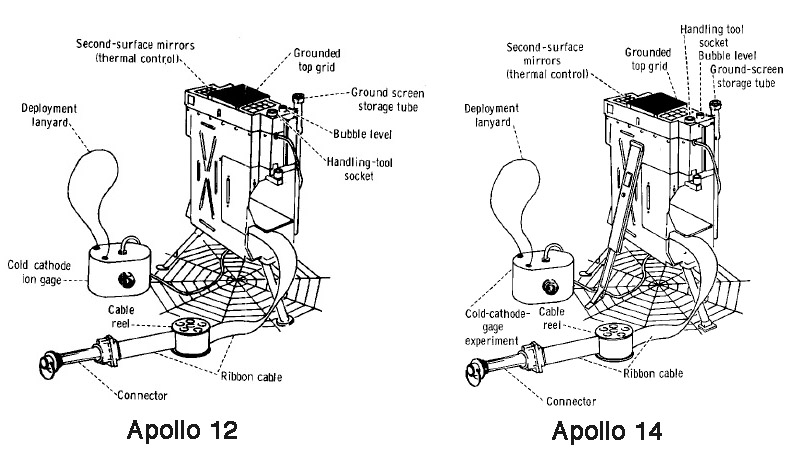
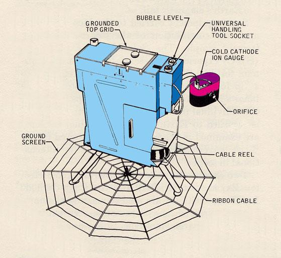
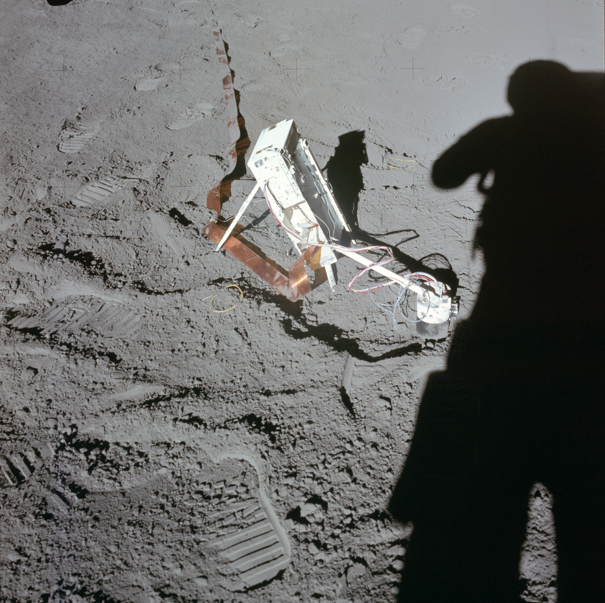

.. _Suprathermal Ion Detector Experiment:

*******************************************
Suprathermal Ion Detector Experiment (SIDE)
*******************************************

.. csv-table:: Suprathermal Ion Detector Experiment (SIDE)
    :stub-columns: 1

    "Ośrodek badawczy", "Rice University, USA"
    "Misje", "Apollo 12, 14, 15"
    "Nazwa eksperymentu (j. ang.)", "Suprathermal Ion Detector Experiment"
    "Nazwa eksperymentu (j. pol.)", ""
    "Dziedzina", "Elektromagnetyzm"

Przedmiot badania
=================
W celu pomiaru liczby oraz typu jonów na Księżycu wykonano dwa eksperymenty: :ref:`Suprathermal Ion Detector Experiment` (:term:`SIDE`) i :ref:`Cold Cathode Ion Gauge` (:term:`CCIG`). Badania te były ze sobą ściśle skorelowane i wykorzystywały jedno urządzenie połączone krótkim kablem elektrycznym.

Eksperyment :term:`SIDE` miał na celu pomiar własności strumienia pola magnetycznego, liczby cząstek, gęstości, prędkości i relatywnej energi naładowanych dodatnio jonów i ich wpływu na powierzchnię Księżyca. Zaobserwowane cząsteczki stanowiły głównie atomy wodoru jak i helu. Obserwacja ta wynikała ze składu wiatru słonecznego.

Materiały i metody
==================

    Diagram przedstawia eksperyment Suprathermal Ion Detector Experiment (SIDE). Źródło: :cite:`ImageProjectApolloArchive`.

    Diagram przedstawia połączenie eksperymentów :ref:`Suprathermal Ion Detector Experiment` / :ref:`Cold Cathode Ion Gauge` w konfiguracji dla :ref:`Apollo 12`. Źródło: :cite:`Lindsay2008`.

Urządzenie dla :ref:`Apollo 15` zostało przeprojektowane ze względu na uwagi dotyczące skomplikowanego sposobu rozkładania zestawu zgłaszane przez załogi wcześniejszych misji.

Przebieg eksperymentu
=====================

    Zdjęcie przedstawia rozstawione urządzenie :term:`SIDE` (po lewej stronie) i :term:`CCIG` (podłączone po prawej stronie). Źródło: NASA/AS15-86-11596 :cite:`ImageProjectApolloArchive`.

Nachylenie urządzenia eksperymentu :term:`SIDE` przedstawione na :numref:`figure-alsep-SIDE-photo`, jest wynikiem charakterystyki szerokości geograficznej miejsca lądowania :ref:`Apollo 15`.

Urządzenie pomiarowe SIDE/CCIG wyposażono w kierunkowy sensor zorientowany w płaszczyźnie ekliptycznej pod kontem 15 stopni od Księżycowego lokalnego południka. Ze względu na znaczną różnicę w długościach geograficznych miejsc lądowań, anteny urządzenia skierowano pod kątem 38 stopni na zachód (:ref:`Apollo 12`), 2 stopnie na wschód (:ref:`Apollo 14`) i 19 stopni na zachód (:ref:`Apollo 15`). W trakcie pomiarów urządzenie nie było bezpośrednio skierowane w stronę nadchodzącego wiatru słonecznego.
