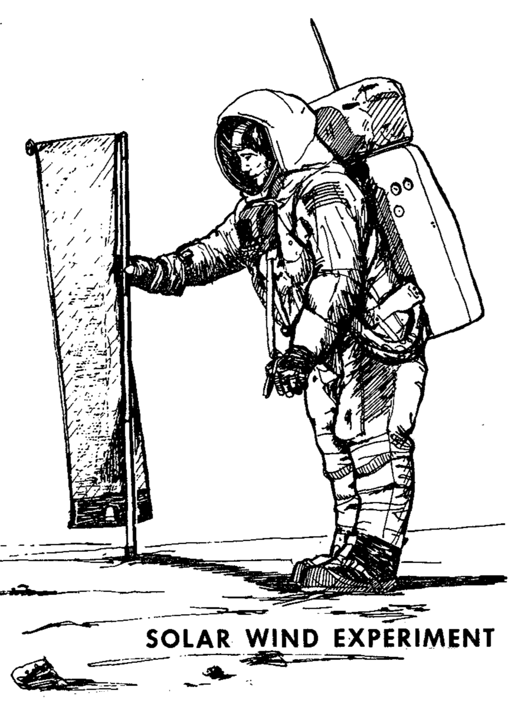

.. _Solar Wind Composition Experiment:

****************************************
Solar Wind Composition Experiment (SWCE)
****************************************

.. csv-table:: Solar Wind Composition Experiment (SWCE)
    :stub-columns: 1

    "Ośrodek badawczy", "University of Berne, Szwajcaria"
    "Misje", "Apollo 11, 12, 14, 15, 16"
    "Nazwa eksperymentu (j. ang.)", "Solar Wind Composition Experiment"
    "Nazwa eksperymentu (j. pol.)", "Badanie składu wiatru słonecznego"
    "Dziedzina", "Elektromagnetyzm"

Przedmiot badania
=================
Eksperyment :ref:`Solar Wind Composition Experiment` został wykonany w celu określenia składu pierwiastków oraz izotopów gazów szlachetnych, tj. hel, neon i argon, we wietrze słonecznym.

Materiały i metody
==================

    Diagram przedstawia eksperyment Solar Wind Composition Experiment (SWCE). Źródło: :cite:`Apollo12PressKit`.

Eksperyment składał się z folii aluminiowej o grubości 0,5 mm. Folia miała na celu uwięzienie poszczególnych cząsteczek wiatru słonecznego w grubej na kilkaset warstw atomowych strukturze. Została zaprojektowana tak, aby pozwolić na przejście promieniowaniu kosmicznemu bez interakcji.

Przebieg eksperymentu
=====================
Astronauci rozwijali folię zaraz po przybyciu podczas pierwszego :term:`EVA` i zwijali przed odlotem. Folię transportowano na Ziemię w celu analizy przez Szwajcarskich naukowców z uniwersytetu w Bernie.

Czasy ekspozycji eksperymentu były następujące :cite:`Jones1995`:

    * :ref:`Apollo 11`: 1 godzina 17 minut,
    * :ref:`Apollo 12`: 18 godzin 42 minut,
    * :ref:`Apollo 14`: 21 godzin,
    * :ref:`Apollo 15`: 41 godzin 8 minut,
    * :ref:`Apollo 16`: 45 godzin 5 minut.
