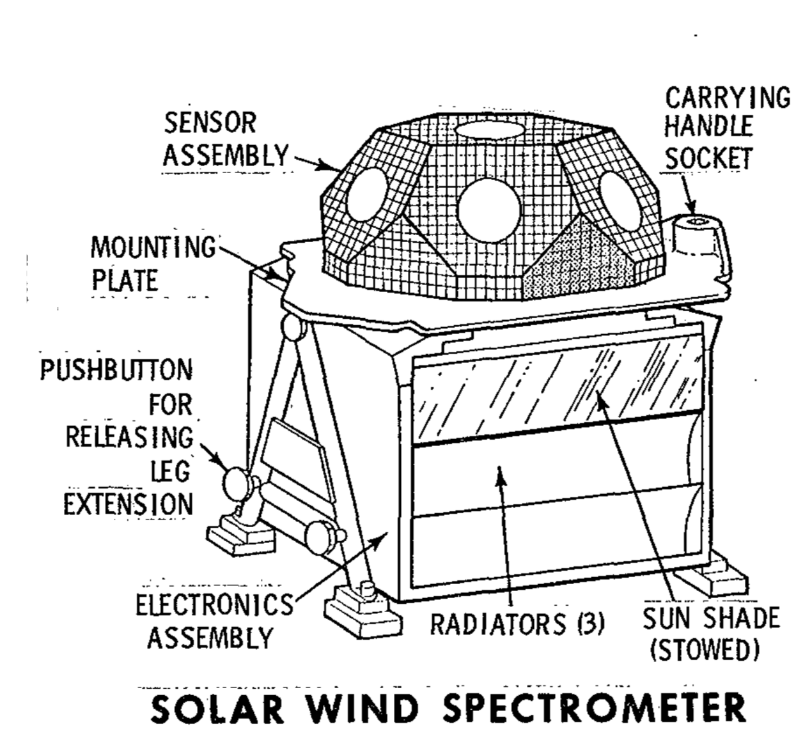
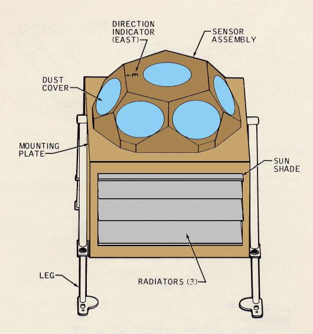
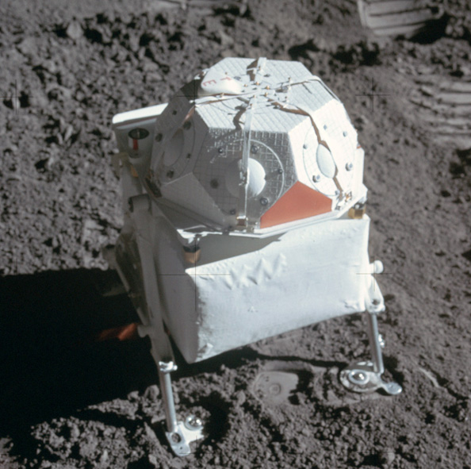

.. _Solar Wind Spectrometer:

*****************************
Solar Wind Spectrometer (SWS)
*****************************

.. csv-table:: Solar Wind Spectrometer (SWS)
    :stub-columns: 1

    "Ośrodek badawczy", "Jet Propulsion Laboratory"
    "Misje", "Apollo 12, 15"
    "Nazwa eksperymentu (j. ang.)", "Solar Wind Spectrometer"
    "Nazwa eksperymentu (j. pol.)", "Pomiar spektrometryczny wiatru słonecznego"
    "Dziedzina", "Elektromagnetyzm"

Przedmiot badania
=================
Wiatr słoneczny składa się z materii stale wyrzucanej ze Słońca. Oddziaływanie to rozciąga pole magnetyczne Ziemi daleko poza samą planetę, przekraczając orbitę Księżyca. Następnie cząstki rozprzestrzeniają się dalej w Układzie Słonecznym.

Eksperyment :ref:`Solar Wind Spectrometer` pozwalał na zbadanie energii, gęstości, kierunku i wariancji wyżej wymienionych parametrów. jak również na badanie pola magnetycznego Ziemi w trakcie przekraczania jego przez Księżyc.

Poza :ref:`Solar Wind Spectrometer` przeprowadzono także niezależny eksperyment :ref:`Solar Wind Composition Experiment`, który polegał na zebraniu próbek gazów wiatru słonecznego celem transportu ich na Ziemię i analizy laboratoryjnej.

Materiały i metody
==================

    Diagram przedstawia eksperyment Solar Wind Spectrometer (SWS). Źródło: :cite:`Apollo12PressKit`.

    Diagram przedstawia eksperyment Solar Wind Spectrometer (SWS). Źródło: :cite:`Lindsay2008`.

    Zdjęcie przedstawia eksperyment Solar Wind Spectrometer (SWS). Konfiguracja po rozstawieniu urządzenia. Źródło: NASA/AS15-86-11593 :cite:`Lindsay2008`.

Urządzenie składało się z 7 sensorów zlokalizowanych pod pokrywą chroniącą przed pyłem księżycowym. Pozwalało na pomiar wiatru słonecznego na powierzchni księżyca, określenie jego głównych właściwości i interakcji z Księżycem.

Instrument miał masę 5,44 kg. Jego napięcie wejściowe wynosiło 28,5 V a średnia wartość pobieranej mocy wynosiła 3,2 W. Zakresy pomiarowe urządzenia :cite:`Allen1972`, :cite:`Jones1995`:

    * elektrony:

        * modulacja wysokiego wzmocnienia: 10,5 - 1376 eV (elektronowoltów),
        * modulacja niskiego wzmocnienia: 6,2 - 817 eV,

    * protony:

        * modulacja wysokiego wzmocnienia: 75 - 9600 eV,
        * modulacja niskiego wzmocnienia: 45 - 5700 eV,

    * zakres obserwacji: 6,0 sr (steradianów),
    * rozdzielczość kątowa: około 15°,
    * minimalny wykrywalny strumień pola: 106 cząstek/cm2/s.

Za eksperyment odpowiedzialni byli: Dr Conway Snyder, Dr Douglas Clay and Dr Marcia Neugebauer z :term:`Jet Propulsion Laboratory`.

Przebieg eksperymentu
=====================
Siedem jednakowo zmodyfikowanych kubków - klatek Faradaja, będących pułapkami dla zjonizowanych cząstek, użyto w celu detekcji i zebrania elektronów i protonów wchodzących w skład wiatru słonecznego. Jeden kubek ustawiono w pozycji pionowej. Pozostałe sześć kubków otaczało go i było ustawione w taki sposób, że normalna dwóch przyległych kubków była skierowana pod kątem 60 stopni. Każdy kubek dokonywał pomiaru prądu indukowanego ze strumienia pola cząstek do niego wpadających. Jako, że pojemniki były identyczne, a strumień pola równy w każdym kierunku, zakładano, że zanotowane wartości każdego z kubeczków powinny być takie same. Nierównomierne rozłożenie interpretowano jako wariacja w kierunku napływu strumienia pola cząstek :cite:`Allen1972`.

Kolejno zmieniając napięcia w sieci detektorów i mierząc ich wpływ na przepływ prądu, uzyskano pełny obraz spektrum energii zarówno elektronów jak i protonów wiatru słonecznego.

Dane zebrane przez detektory przetwarzano w odpowiednim podsystemie zestawu ALSEP. Cykle pomiarowe zostały zorganizowane w 16 sekwencjach 186 dziesięciobitowych słów.

Rezultaty
=========
Wiatr słoneczny jest główną zewnętrzną siłą oddziałującą na powierzchnię na Księżyca. Pomiary spektrometryczne pozwoliły na interpretację pola magnetycznego Księżyca, jego atmosfery i analizę próbek gruntu.

Eksperyment SWS zrealizowany podczas misji Apollo 12 przekroczył oczekiwania naukowców i wysyłał dane nie tylko o protonach ale również o fotoelektronach jeszcze przez kilka minut po zachodzie słońca :cite:`Allen1972`.

Eksperyment SWS pokazał, że wiatr słoneczny zachowuje się tak samo wolnej przestrzeni kosmicznej jak poza polem magnetycznym Ziemi, jak podczas przechodzenia przez jej ogon magnetyczny. Nieznacznie wtedy ulega zakłóceniom. Podczas :ref:`Apollo 15` z nieoczekiwanym efektem ukazało się obserwacja chmury gazu unoszącego się po uderzeniu członu rakiety Saturn-IV z :term:`Apollo 13`.

Poznanie składu wiatru słonecznego pozwoliło na lepsze zrozumienie pochodzenia z słońca i określenie procesów w nim zachodzących. Przyczyniło się do poznania procesu tworzenia i przyspieszania cząsteczek, jak również ich propagacji przez przestrzeń międzyplanetarną.

Oszacowano, że Słońce każdej sekundy deponuje wartość równą 1 kilotony energii w polu magnetycznym Ziemi. Efektem tego są zorze polarne, procesy zachodzące w jonosferze oraz zmiany pogodowe :cite:`Jones1995`.
