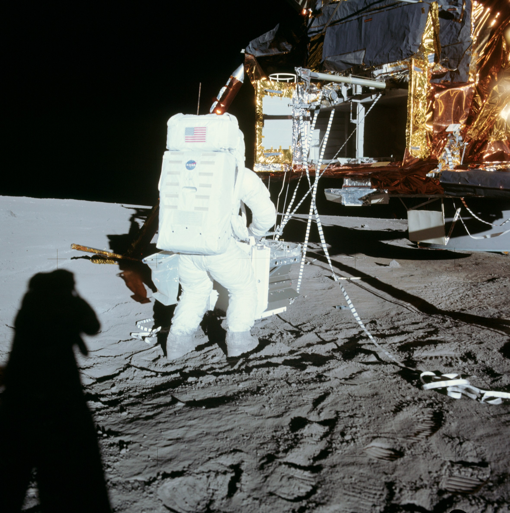

.. _ALSEP:

****************
O pakiecie ALSEP
****************

Księżyc bombardowany jest wiatrem słonecznych, który składa się z naładowanych cząstek, w większości protonów i elektronów emanujących ze Słońca. Wiatr niesie ze sobą również międzyplanetarne pole magnetyczne :cite:`Apollo12PressKit`.

Planeta Ziemia otoczona jest polem magnetycznym, które chroni ją przed bezpośrednim wypływem strumienia pola wysokoenergetycznych cząstek. Księżyc, ma zaniedbywalne pole magnetyczne. Z tego względu powierzchnia Księżyca narażona jest na wpływ szkodliwego promieniowania :cite:`Apollo12PressKit`.

Eksperymenty z pakietu Apollo Lunar Surface Experiments Package (ALSEP) były przeznaczone do zbadania szkodliwego wpływu wiatru słonecznego, powierzchni księżyca oraz sejsmiki Księżyca. Część eksperymentów była zaprojektowana aby mierzyć i przesyłać informacje po opuszczeniu powierzchni przez astronautów.

Program ALSEP kosztował 200 mln. USD, wliczając w to zaprojektowanie oraz wytworzenie stacji centralnych, eksperymentów, wsparcia inżynieryjnego w Houston i analizy danych przez laboratoria w USA i na świecie. Koszt operacyjny utrzymania infrastruktury zdalnego wykonywania eksperymentów wynosił 2 mln. USD rocznie. Ceny podane wg. wartości amerykańskiego dolara lat 1969-1972 :cite:`Lindsay2008`.

Program ALSEP został zamknięty wraz z wyczepianiem budżetu projektu 30 września 1977 roku. W trakcie całego okresu zostało wysłanych 153 tys. poleceń i otrzymano około tryliona bitów informacji naukowych. Mimo wyłączenia infrastruktury naziemnej, część eksperymentów pasywnie emitowała informacje za pośrednictwem fal radiowych. Dane te były przechwytywane i wykorzystywane przez różne instytucje tj. Jet Propulsion Laboratory w celu opracowywania pomiarów geodezyjnych, astrometrycznych oraz nawigacji statków kosmicznych :cite:`Lindsay2008`.

Nazwa
=====
W trakcie programu Apollo dwóch zestawów eksperymentów:

    * Early Apollo Surface Experiments Package (EASEP),
    * Apollo Lunar Surface Experiments Package (ALSEP).

Pakiet :term:`EASEP` był wykorzystany podczas misji :ref:`Apollo 11`. W kolejnych misjach, tj. :ref:`Apollo 12`, :ref:`14 <Apollo 14>`, :ref:`15 <Apollo 15>`, :ref:`16 <Apollo 16>` i :ref:`17 <Apollo 17>` zastosowano konfigurację w wariantach zwanych macierzami ALSEP (ang. *ALSEP Array*):

.. csv-table:: Warianty pakietu ALSEP w poszczególnych misjach
    :header-rows: 1

    "Misja", "Nazwa zestawu"
    "Apollo 11", "EASEP"
    "Apollo 12", "ALSEP Array A"
    "Apollo 13", "ALSEP Array B"
    "Apollo 14", "ALSEP Array C"
    "Apollo 15", "ALSEP Array A-2"
    "Apollo 16", "ALSEP Array D"
    "Apollo 17", "ALSEP Array E"

Transport eksperymentów na Księżyc
==================================

Konfiguracja transportowa
-------------------------
.. figure:: img/ALSEP-transport.jpg
    :name: figure-alsep-ALSEP-transport

    Źródło: :cite:`Knudson2013`

.. _Scientific Equipment Bay:

Scientific Equipment Bay (SEQ)
------------------------------

    Zdjęcie przedstawia ciemno szare drzwi Scientific Equipment Bay (SEQ) znajdujące się na lewo od środka. W srebrnej otulinie na prawo od drzwi znajduje się eksperyment :ref:`Cosmic Ray Detector`. W celu otwarcia dostępu do drzwi astronauci używali specjalnych taśm. Samo otwarcie drzwi wykonywane było przy użyciu rękawic skafandra. Źródło: NASA/AS16-113-18335, :cite:`Lindsay2008`.

    Alan Bean w trakcie rozpakowywania zestawu ALSEP. W tym celu astronauta użył zmiennej długości wysięgnika, rolki i taśm. Po prawej stronie od kolana Alan Beana można zobaczyć elementy generatora :ref:`Radioisotope Thermo-electric Generator`. Źródło: NASA/AS12-46-6783 :cite:`Lindsay2008`.

Lista eksperymentów
===================
.. csv-table:: Lista eksperymentów zrealizowanych w trakcie misji Apollo
    :file: data/alsep-experiments.csv
    :header-rows: 1
    :widths: 10, 40, 20, 30
