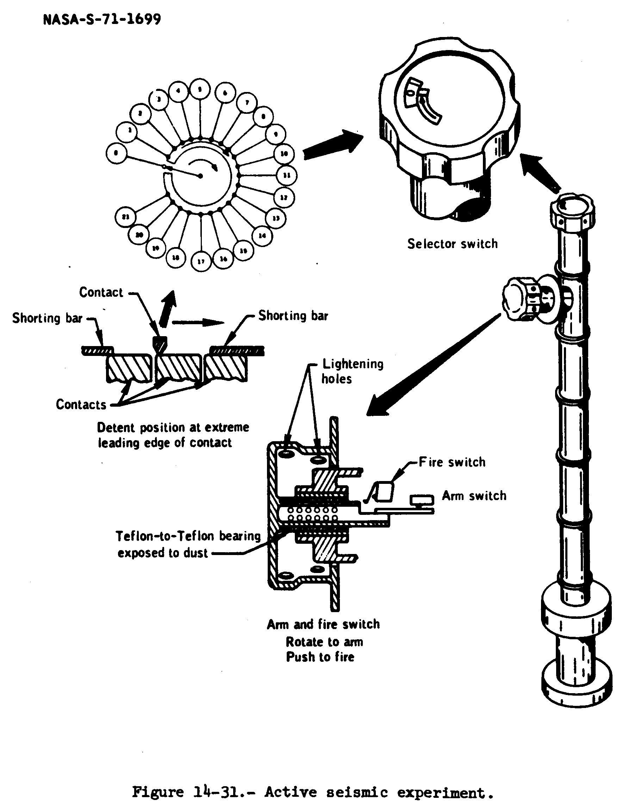

.. _Active Seismic Experiment:

*******************************
Active Seismic Experiment (ASE)
*******************************

.. csv-table:: Active Seismic Experiment (ASE)
    :stub-columns: 1

    "Ośrodek badawczy", "Stanford University"
    "Misje", "Apollo 14, 16"
    "Nazwa eksperymentu (j. ang.)", "Active Seismic Experiment"
    "Nazwa eksperymentu (j. pol.)", "Aktywny eksperyment sejsmiczny"

Przedmiot badania
=================
:ref:`Aktywny eksperyment sejsmiczny <Active Seismic Experiment>` pozwalał na uzupełnienie danych zebranych podczas :ref:`pasywnego eksperymentu <Passive Seismic Experiment>`. :term:`ASE` od :term:`PSE` różnił się na dwa sposoby, tj. ze względu na mniejszą skalę i źródło energii.

Dwa :ref:`aktywne eksperymenty sejsmiczne <Active Seismic Experiment>` zostały wykonane podczas misji :ref:`Apollo 14` i :ref:`16 <Apollo 16>`. W trakcie misji :ref:`Apollo 17` wykonano :ref:`eksperyment profilowania sejsmicznego <Lunar Seismic Profiling Experiment>` w celu określenia struktury górnej warstwy powierzchni Księżyca do głębokości 1000 m.

Materiały i metody
==================

    Diagram przedstawia eksperyment Active Seismic Experiment (ASE). Źródło: :cite:`Apollo12PressKit`.

W przeciwieństwie do :ref:`Pasywnego eksperymentu <Passive Seismic Experiment>`, który był zaprojektowany do badań całego Księżyca, :ref:`aktywny eksperyment sejsmiczny <Active Seismic Experiment>` skupiał się na poznaniu lokalnej okolicy lądowania. :term:`ASE` zamiast czekać na naturalnie wystąpienie zdarzeń sejsmicznych wewnątrz Księżyca i na jego powierzchni, polegał na wykorzystaniu niewielkich ładunków wybuchowych w celu wzbudzenia fali sejsmicznej.

Eksplozje wywołane w celu badań aktywności sejsmicznej podzielone były na dwa rodzaje:

    - niewielkie wybuchy w trakcie prac operacyjnych na powierzchni Księżyca,
    - większe eksplozje wywoływane zdalnie, po opuszczeniu przez astronautów powierzchni.

Do wzbudzenia fali sejsmicznej użyto dwóch rodzajów źródeł:

    - wzbudnik (ang. *thumper*),
    - moździerz (ang. *mortar*).

Przebieg eksperymentu
=====================
Detonacje wywołane zarówno podczas misji Apollo 16 jak i 17 były wyzwalane za pomocą urządzenia sterowanego radiowo.

Wzbudnik był używany przez astronautów w celu detonacji ładunków przypominających naboje strzelby. Każde urządzenie posiadało 19 takich naboi uruchamianych sekwencyjnie w równych odstępach czasowych wzdłuż 90-cio metrowej linii :term:`geofonów <geofon>`. Rezultaty z wykorzystaniem powyższej metody były dostępne jeszcze podczas pobytu astronautów na powierzchni Księżyca i mogły posłużyć do aktualizacji dalszych eksperymentów.

Drugi rodzaj ładunków, który znalazł zastosowanie podczas misji Apollo 16 wyzwalał falę sejsmiczną za pomocą ładunku moździerzy znajdującej się w "moździerzowym zespole opakowaniowym" (ang. *mortar package assembly*). Składał się on z czterech granatów wystrzeliwanych za pomocą rakiet. Do detonacji dochodziło po opuszczeniu powierzchni przez astronautów. Operatorzy przed odlotem ustawiali urządzenia i nastawiali przyrządy celownicze. Urządzenia posiadały geofony mierzące czas pojawienia się fali sejsmicznej spowodowanej uderzeniem pocisku o powierzchnię. Pociski wystrzeliwano z lufy mechanizmu. Ciągnięty za pociskiem drut pozwalał na określenie odległości poziomej lotu. Ze względu na brak atmosfery oraz zmniejszoną grawitację można było precyzyjnie zmierzyć dystans. Urządzenie zostało zaprojektowane aby punkt uderzenia wypadał na: 137, 282, 853, 1372 metrach od moździerzy. W celu zwiększenia odległości stosowano ładunki wybuchowe różnej wielkości. Profilowanie pozwalało określić strukturę powierzchni.

Rezultaty
=========
Eksperymenty pozwoliły na określenia prędkości rozchodzenia się fali sejsmicznej określanej od 0.1 do 0.3 km/s w górnej warstwie skorupy Księżyca. Wartości były podobne dla wszystkich trzech wykonań eksperymentów i zgadzały się z danymi zmierzonymi w :ref:`pasywnym eksperymencie sejsmicznym <Passive Seismic Experiment>`. Prędkości te są znacznie niższe niż zaobserwowane w analogicznych formacjach geologicznych na Ziemi. Wartości natomiast korelują się z prędkościami rozchodzenia się fal sejsmicznych w skałach :term:`brekcji <brekcja>` o wysokim stopniu porowatości oraz spękaniach spowodowanych długotrwałym bombardowaniem meteorytami powierzchni Księżyca.

Za pomocą :ref:`aktywnego eksperymentu sejsmicznego <Active Seismic Experiment>` w miejscu lądowania Apollo 14 określono miąższość powierzchni na 8.5 metrów regolitu księżycowego. W miejscu lądowania Apollo 17 powierzchnię określono na warstwę bazaltową o miąższości 1.4 km. Wartość ta jest była wyższa od zmierzonej za pomocą :ref:`Traverse Gravimeter Experiment`.
