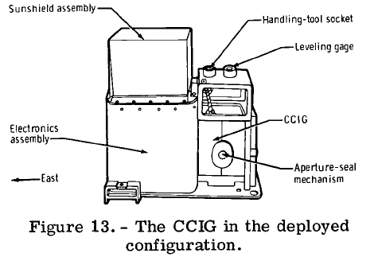

.. _Cold Cathode Ion Gauge:

*****************************
Cold Cathode Ion Gauge (CCIG)
*****************************

.. csv-table:: Cold Cathode Ion Gauge (CCIG)
    :stub-columns: 1

    "Ośrodek badawczy", "University of Texas, USA"
    "Misje", "Apollo 12, 14, 15"
    "Nazwa eksperymentu (j. ang.)", "Cold Cathode Ion Gauge"
    "Nazwa eksperymentu (j. pol.)", "Pomiar jonów zimną katodą"

Przedmiot badania
=================
W celu pomiaru liczby oraz typu jonów na Księżycu wykonano dwa eksperymenty: :ref:`Suprathermal Ion Detector Experiment` (:term:`SIDE`) i :ref:`Cold Cathode Ion Gauge` (:term:`CCIG`). Badania te były ze sobą ściśle skorelowane i wykorzystywały jedno urządzenie połączone krótkim kablem elektrycznym.

Eksperyment :term:`SIDE` miał na celu pomiar własności strumienia pola, liczby cząstek, gęstości, prędkości i relatywnej energi naładowanych dodatnio jonów przy powierzchni Księżyca. Zaobserwowane cząsteczki stanowiły głównie atomy wodoru jak i helu. Obserwacja ta wynikała ze składu wiatru słonecznego.

Materiały i metody
==================

    Diagram przedstawia eksperyment Cold Cathode Ion Gauge (CCIG). Źródło: :cite:`Apollo12PressKit`.

Urządzenie pomiarowe SIDE/CCIG było wyposażone w kierunkowy sensor zorientowany w płaszczyźnie ekliptycznej pod kontem 15 stopni od Księżycowego lokalnego południka. Ze względu na znaczną różnicę w długościach geograficznych miejsc lądowań, anteny urządzenia skierowane były 38 stopni na zachód (:ref:`Apollo 12`), 2 stopnie na wschód (:ref:`Apollo 14`) i 19 stopni na zachód (:ref:`Apollo 15`). W trakcie pomiarów urządzenie nie było bezpośrednio skierowane w stronę nadchodzącego wiatru słonecznego.

Przebieg eksperymentu
=====================
Z racji ustawienia eksperymentu w trakcie poszczególnych faz orbity Księżyca zaobserwowano strumienie jonów w zewnętrznej warstwie magnetosfery (ang. *magnetosheath*). Detektor zarejestrował również zjawiska częściowo związane z oddziaływaniem na powierzchnię Księżyca jak również na ogon magnetosferyczny (ang. *magnetotail*) tego ciała niebieskiego. Dane z eksperymentu zostały wykorzystane do określenia potencjału powierzchni Księżyca, zbadania parametrów plazmy przy powierzchni, jak również określenia spektrum masowego jonów i badań strumieni jonowych w ogonie magnetosferycznym.

Podczas rozstawiania eksperymentu w trakcie misji :ref:`Apollo 12`, błędne ustawienie kabla łączeniowego sprawiło wiele problemów z pozycjonowaniem :term:`CCIG` i :term:`SIDE`. Zgodnie z pierwotnym założeniem, :term:`SIDE` był wsparty na trzech krótkich nogach. W misji Apollo 14 do urządzenia dodano stabilizator. Z tego względu Astronauta Ed Mitchell miał jeszcze większe trudności z ustawieniem :term:`CCIG`, bez zakłócania eksperymentu :term:`SIDE`. Przed misją :ref:`Apollo 15` urządzenie poddano znacznej modyfikacji.

Rezultaty
=========
Podczas trzech misji (:ref:`Apollo 12`, :ref:`14 <Apollo 14>`, :ref:`15 <Apollo 15>`), w których wykonano eksperymenty dotyczące określenia ciśnienia atmosfery księżycowej. Zakres operacyjny urządzenia :term:`CCIG` wynosił od 10E-6 to 10E-12 tora. Wyniki pomiarów określiły poziom ciśnienia w maksymalnym dolnym zakresie urządzenia, tj. 10E-12 tora. Dla porównania Ziemska atmosfera na poziomie morza przyjmuje wartość 760 torów.

Urządzenie ze względu na wysoką czułość było w stanie zaobserwować ucieczkę cząsteczek gazów, głównie wody i dwutlenku węgla ze skafandrów astronautów znajdujących się w pobliżu urządzenia.
