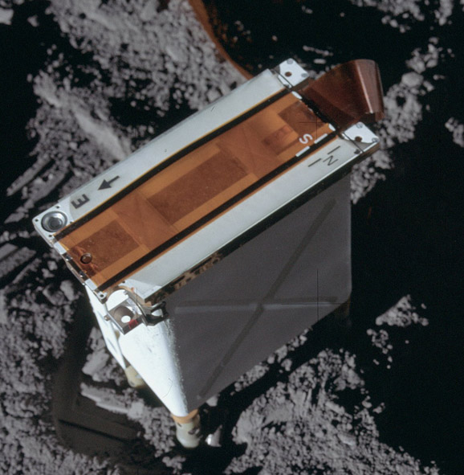

.. _Charged Particle Lunar Environmental Experiment:

*******************************************************
Charged Particle Lunar Environmental Experiment (CPLEE)
*******************************************************

.. csv-table:: Charged Particle Lunar Environmental Experiment (CPLEE)
    :stub-columns: 1

    "Ośrodek badawczy", "University of Sydney, Australia"
    "Misje", "Apollo 14"
    "Nazwa eksperymentu (j. ang.)", "Charged Particle Lunar Environmental Experiment"
    "Nazwa eksperymentu (j. pol.)", "Pomiar ładunku cząstek w środowisku księżycowym"

Przedmiot badania
=================
Eksperyment :ref:`Charged Particle Lunar Environmental Experiment` polegał na pomiarze energii cząstek wiatru słonecznego (protonów i elektronów) docierających do powierzchni Księżyca. Dane pozwoliły na wyznaczenie rozkładu energii tych cząstek oraz zmierzenie ich wpływu na układ Ziemia-Księżyc. Ponadto określono ich wpływ na zorze polarne występujące na Ziemi i :term:`pasy Van Allena <Pas Van Allena>`, co pozwoliło na dokładniejsze określenie charakterystykę Ziemskiego pola magnetycznego. Zbadano procesy zachodzące w strefie napływu fal promieniowania słonecznego podczas uderzania o powierzchnię Księżyca jak również wpływ naładowanych cząstek wiatru słonecznego na środowisko księżycowe.

Materiały i metody
====================

    Zdjęcie przedstawia eksperyment Charged Particle Lunar Environmental Experiment (CPLEE). Źródło: NASA/AS14-67-9364, :cite:`Apollo12PressKit`.

Za pomocą zestawu wykorzystującego dwa spectrometry zorientowane dla minimalnej ekspozycji do płaszczyzny ekliptyki słońca zbadano protony i elektrony w przedziale energetycznym 40 KeV do 70 KeV. Każdy ze spektrometrów posiadał 6 detektorów cząstek: 5 C-kształtnych kanalikowych powielaczy elektronowych (ang. *channeltron photon multiplier*) składających się ze szklanej rurki o średnicy 1 mm i długości 10 cm oraz jednej spiralnej dynody o kształcie lejka o 8 mm otworze.

Przebieg eksperymentu
=====================
Eksperyment wykonano raz podczas całego programu Apollo w trakcie misji :ref:`Apollo 14`. Eksperyment :term:`CPLEE` był rozstawiony 3 metry na północny wschód od :ref:`Centralnej Stacji <Central Station>` :ref:`Apollo 14`. Cząsteczki o określonym ładunku i różnych energiach wpadające do spektrometru były poddane oddziaływaniu prądu o różnym napięciu, który powodował ugięcie ich toru i kierował je do pięciu powielaczy elektronowych, a cząsteczki o przeciwnym ładunku były odbijane i kierowane do spiralnej dynody o kształcie lejka. Z tego względu istniała możliwość wykonania równoległych pomiarów właściwości fizycznych protonów i elektronów na pięciu różnych poziomach energii.

Rezultaty
=========
Rezultaty pozwoliły na określenie, że w ciągu dnia Księżyc poddawany jest bombardowaniu niskoenergetycznych foto-elektronów. Ich wariancja zmienia się wraz natężeniem strumienia wiatru słonecznego. Niespodziewanym odkryciem podczas eksperymentu :ref:`Charged Particle Lunar Environmental Experiment` okazało się zaobserwowanie elektronów w ogonie magnetycznym Ziemi o potencjale porównywalnym z wartościami wiązania w Ziemskich zorzach polarnych.
