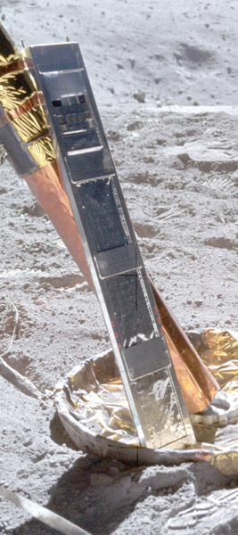

*************************
Cosmic Ray Detector (CRD)
*************************

.. csv-table:: Cosmic Ray Detector (CRD)
    :stub-columns: 1

    "Ośrodek badawczy", "University of California-Berkeley and Washington University"
    "Misje", "Apollo 16, 17"

Konstrukcja eksperymentu
========================

    Detail from AS16-107-17442 shows the Apollo 16 Cosmic Ray Detector sitting in the minus-Y (south) footpad early in EVA-2. Źródło: :cite:`ImageProjectApolloArchive`.

Opis eksperymentu
=================
Cosmic rays are just particles that have extremely large energies and very high velocities. Their velocity is almost, but not quite, the speed of light. They are mostly protons and alpha particles (helium nuclei). But 1 to 2% of the cosmic rays consist of the nuclei of heavier elements. The cosmic rays seem to arrive from all directions and, although their origin is not yet known with certainty, they come from outside our solar system. In addition to cosmic rays, the CRD equipment detected low energy solar wind particles. The range of energy of the particles is very great, but some have very low energy. One purpose of the CRD experiment was to investigate the low-energy particles. Another purpose was to investigate neutrons from the lunar surface.

In the CRD experiment actual records of the particles was obtained. The collector was a four panel array. Plate 1 was a sandwich of 31 sheets of 0.025 centimeters Lexan, covered by perforated aluminiumised Teflon. Plate 2 was similar to Plate 1.  Plate 3 was four layers of 0.2 centimeter thick Kodacel cellulose triacetate sheets, overlaid on the upper half by ten 5 micron thick Lexan sheets. Plates of several special materials (some resemble plexiglass) are carried on the outside of the Lunar Module to the Moon and then brought back to Earth. The passage of particles through the material is recorded in the form of tiny tracks. The characteristics of these tracks, seen through a microscope, tell us the kind of particle and, of course, its direction of travel. Some of the interest in this experiment is due to the possibility that new elements could have been discovered!
