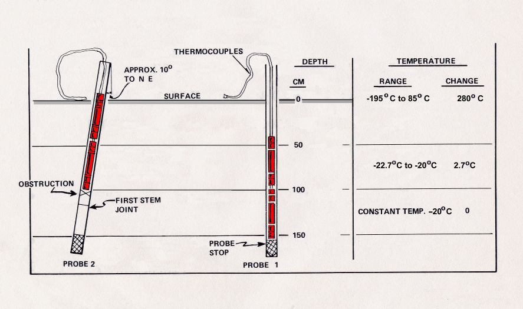
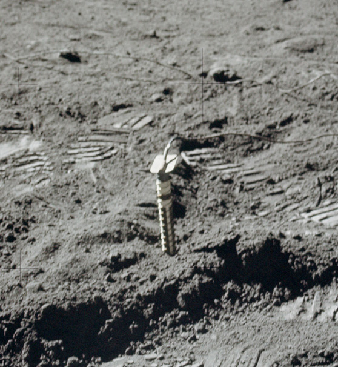

.. _Heat Flow Experiment:

**************************
Heat Flow Experiment (HFE)
**************************

.. csv-table:: Heat Flow Experiment (HFE)
    :stub-columns: 1

    "Ośrodek badawczy", "Columbia University"
    "Misje", "Apollo 15, Apollo 16 (nieskutecznie), Apollo 17"
    "Nazwa eksperymentu (j. ang.)", "Heat Flow Experiment"
    "Nazwa eksperymentu (j. pol.)", "Badanie przepływu ciepła"

Przedmiot badania
=================
Przebieg ciepła określa II zasada termodynamiki. Ciepło przebiega z obszarów o większej temperaturze do obszarów o mniejszej temperaturze w celu osiągnięcia równowagi termodynamicznej.

Wnętrze Księżyca jest znacznie cieplejsze niż jego powierzchnia. Z tego powodu znaczna ilość ciepła z wnętrza jest wypromieniowywana w kosmos. Źródłem ciepła jest głównie rozpad radionukleotydów pochodzenia naturalnego takich jak tor, uran czy potas. Proces ten jest odpowiedzialny za zwiększanie temperatury we wnętrzu Księżyca.

Prędkość utraty ciepła w postaci wypromieniowywania w kosmos jest znaczącym czynnikiem wpływającym na tektonikę (tworzenie się uskoków i fałdowań powierzchni na skutek deformacji wewnętrznej) oraz na aktywność wulkaniczną.

Eksperyment :ref:`Heat Flow Experiment` wykonany w trakcie :ref:`Apollo 15` i :ref:`Apollo 17` miał na celu pomiar utraty ciepła przez Księżyc na skutek promenowania. Eksperyment próbowano wykonać również podczas misji :ref:`Apollo 16`, lecz ze względu na przerwany kabel łączący urządzenie nie funkcjonowało :cite:`Brett1972`.

Wyniki eksperymentu posłużyły do określenia poziomu radioaktywności jako źródła długotrwałego generowania temperatury we wnętrzu oraz określenia parametrów dla modelu termicznej historii Księżyca.

Materiały i metody
==================

    Diagram przedstawia eksperyment Heat Flow Experiment (HFE). Źródło: :cite:`Lindsay2008`.

    .. todo:: Only one of the two Apollo 15 heatflow probes was successfuly emplaced to full depth. There was evidently an obstruction in the drill string in Hole No. 2, believed to be due to separation of two stems that occurred when the astronauts tried to overcome binding of the stems in the hole. A re-design of the stem joins eliminated the problem of binding on Apollo 16 and 17. Unfortunately, no data was returned from Apollo 16 after the HFE ribbon cable was accidentally sheared off at the base of the Central Station.  Good data was obtained from the Apollo 17 emplacement, which confirmed the Apollo 15 results.

    Zdjęcie przedstawia eksperyment Heat Flow Experiment (HFE). Źródło: :cite:`Lindsay2008`.

    .. todo:: This detail from AS17-134-20493 shows one of the two holes drilled for the Apollo 17 HFE. The holes were drilled using hollow drill stems, with a closed bit on the bottom stem to keep the string open. Once a hole was drilled to the desired depth, a multi-sensor probe was inserted and a thermal cap emplaced around the cable that connected the probe to the HFE electronics package. Źródło: :cite:`Lindsay2008`.

Przebieg eksperymentu
=====================
Eksperyment polegał na stworzeniu dwóch otworów wiertniczych w regolicie księżycowym o głębokości od 1,6 m do 2,3 m. Drugi otwór wiertniczy miał za zadanie potwierdzić pomiary pierwszego. Za pomocą platynowych termometrów oporowych dokonano pomiarów temperatury na wielu poziomach każdego z otworów. Część termometrów umieszczono w dolnych częściach otworu a część znajdowała się w górnej części.

Za pomocą termopar określono prędkość wzrostu temperatury wraz z głębokością. Proces odwiertu spowodował zwiększenie temperatury, lecz efekt ten zanikł z czasem samoczynnie. Temperatura w górnych partiach regolitu jest zmienna w czasie ze względu na zmienną aktywność słoneczną oraz intensywność promieniowania cieplnego ze słońca w cyklach dób księżycowych. Poprzez monitorowanie temperatury w otworach wiertniczych w trakcie długiego procesu obserwacji możliwe było wyeliminowanie tego wpływu. Pozwoliło to na wniesienie poprawki temperatury powierzchniowej i otrzymanie prawidłowych wyników.

Rezultaty
=========
Eksperyment :ref:`Heat Flow Experiment` pozwolił na określenie temperatury powierzchni Księżyca w trakcie cyklu nocy i dnia. Wartość ta wyniosła odpowiednio 76 K (-197ºC) w trakcie nocy, oraz 358 K (+85ºC) w ciągu dnia. Temperatura pod powierzchnią regolitu księżycowego na głębokości 1,5 m była stała i wynosiła 253 K (-20ºC). Pozwoliło to na określenie właściwości regolitu księżycowego jako izolatora termicznego o bardzo dobrej sprawności :cite:`Allen1972`, :cite:`Parker1973`.

Wynik pomiarów generowane były w jednostkach mili Wat na metr kwadrat (mW/m2). Podczas eksperymentu określono wartości przepływu ciepła na poziomie 21 mW/m2 dla miejsca lądowania :ref:`Apollo 15`, 16 mW/m2 dla obszaru Taurus-Littrow z misji :ref:`Apollo 17`. Średni strumień cieplny dla Ziemi wynosi 87 mW/m2 :cite:`Allen1972`, :cite:`Parker1973`.

Niski poziom przepływu cieplnego był oczekiwany, ze względu na mniejszy rozmiar Księżyca w porównaniu z Ziemią. Ponadto wpływ na takie wartości ma również brak procesów wulkanicznych w ciągu ostatnich 3 mld. lat.

Ze względu na to, iż pomiarów dokonano jedynie w dwóch miejscach, brak jest statystycznie znaczących danych aby móc określić średnią wartość dla całości powierzchni. Obydwie wartości zostały określone w pobliżu stuku mórz księżycowych oraz wyżyn. Z tego powodu przypuszcza się, iż wartość średnia przepływu cieplnego może być wyższa o 10-20% od przeciętnej dla pozostałych terenów :cite:`Lindsay2008`.
