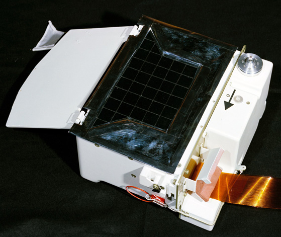

***********************************************
Lunar Atmospheric Composition Experiment (LACE)
***********************************************

.. csv-table:: Lunar Atmospheric Composition Experiment (LACE)
    :stub-columns: 1

    "Ośrodek badawczy", "University of Texas"
    "Misje", "Apollo 17"

Konstrukcja eksperymentu
========================

    Źródło: :cite:`Lindsay2008`.

Opis eksperymentu
=================
The Moon does have an atmosphere, but it is very tenuous. Gases in the lunar atmosphere are easily lost to space. Because of the Moon's low gravity, light atoms such as helium receive enough energy from solar heating so that they escape in just a few hours. Heavier atoms take longer to escape, but are ultimately ionised by the Sun's ultraviolet radiation, after which they are carried away from the Moon by the solar wind. This process takes a few months. Because of the rate at which atoms escape from the lunar atmosphere, there must be a continuous source of particles to maintain even a tenuous atmosphere. Sources for the lunar atmosphere include capture of particles from the solar wind and of material released from the impact of comets and meteorites. For some atoms, particularly helium-4 and argon-40, out-gassing from the Moon's interior may also be a source.

The Lunar Atmospheric Composition Experiment was flown on Apollo 17. It was a mass spectrometer that measured the composition of the lunar atmosphere. On earlier missions, only the total abundance of the lunar atmosphere was measured by the Cold Cathode Gauge. The three primary gases in the lunar atmosphere are neon, helium, and hydrogen, in roughly equal amounts. Small amounts of methane, carbon dioxide, ammonia, and water were also detected. In addition, argon-40 was detected, and its abundance increased at times of high seismic activity. Argon-40 is produced by the radioactive decay of potassium-40 in the lunar interior, and the seismic activity may have allowed escape of argon from the interior to the surface along newly created fractures.
