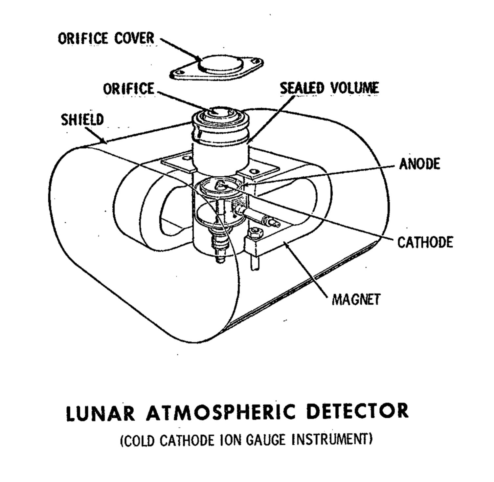

.. _Lunar Atmospheric Detector:

********************************
Lunar Atmospheric Detector (LAD)
********************************

.. csv-table:: Lunar Atmospheric Detector (LAD)
    :stub-columns: 1

    "Ośrodek badawczy", ""
    "Misje", "Apollo 11, 12"
    "Nazwa eksperymentu (j. ang.)", "Lunar Atmospheric Detector"
    "Nazwa eksperymentu (j. pol.)", "Wykrywacz atmosfery Księżyca"

Materiały i metody
====================

    Diagram przedstawia eksperyment Lunar Atmospheric Detector (LAD). Źródło: :cite:`Apollo12PressKit`.

Przedmiot badania
=================
