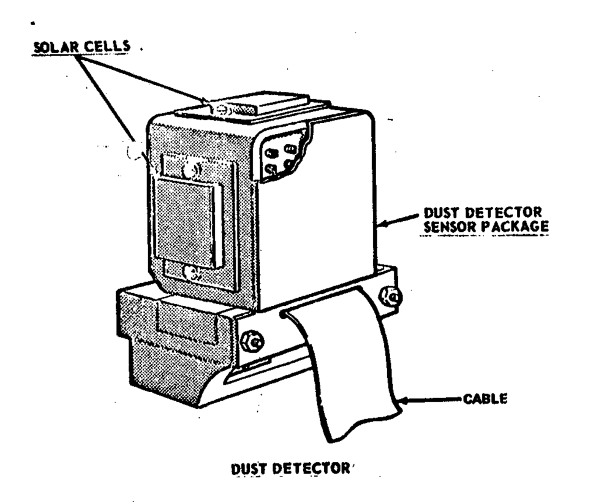

*************************
Lunar Dust Detector (LDD)
*************************

.. csv-table:: Lunar Dust Detector (LDD)
    :stub-columns: 1

    "Ośrodek badawczy", "Manned Spacecraft Center, Texas"
    "Misje", "Apollo 11, 12, 14, 15"
    "Nazwa eksperymentu (j. ang.)", "Lunar Dust Detector"
    "Nazwa eksperymentu (j. pol.)", "Wykrywacz pyłu księżycowego"

Projekt eksperymentu
====================

    Źródło: :cite:`Apollo12PressKit`.

Opis eksperymentu
=================
Eksperyment został zaprojektowany w celu

This experiment measured the amount of dust accumulating on the lunar surface, which translated into the solar illumination detected by the cells. It also measured the damage to solar cells by high-energy radiation as well as the reflected infrared energy and temperatures of the lunar surface. It consisted of three photocells mounted on the Central Station.

Prior to the Apollo landings, it was thought that there would be a heavy dust layer deposited on the ALSEP experiment package during LM ascent and possibly from other long-term sources. This experiment was designed to measure this dust layer deposition and was performed on Apollo 11, 12, 14, and 15 missions. It was housed in the ALSEP central station and measured the power output and temperature of the three solar cells. The dust accumulation proved to be much lower than expected, and the results from this experiment were also used to monitor the long-term degradation of solar cells from radiation and thermal effects. This was considered to be an engineering rather than a scientific experiment.

The function of the experiment was to separate and measure high-energy radiation damage to the solar cells, to measure reduced solar cell output due to dust accumulation, and to measure reflected infrared energy and temperatures for use in computing lunar surface temperatures. The Dust Detector had two components -- a sensor package mounted to the top of the Central Station sun shield, and a printed circuit board located within the Central Station that interfaced with the power distribution unit of the ALSEP data subsystem.

