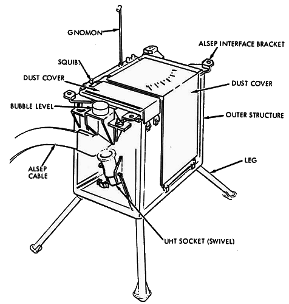
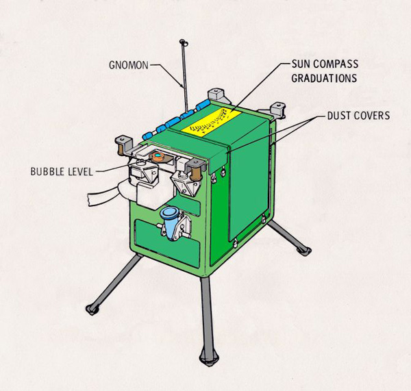

.. _Lunar Ejecta and Meteorite Experiment:

********************************************
Lunar Ejecta and Meteorite Experiment (LEAM)
********************************************

.. csv-table:: Lunar Ejecta and Meteorite Experiment (LEAM)
    :stub-columns: 1

    "Ośrodek badawczy", "Goddard Space Flight Center"
    "Misje", "Apollo 17"
    "Nazwa eksperymentu (j. ang.)", "Lunar Ejecta and Meteorite Experiment"
    "Nazwa eksperymentu (j. pol.)", "Badanie księżycowego i meteorytowego materiału piroklastycznego"

Przedmiot badania
=================
Księżyc jest ciałem niebieskim posiadającym pole grawitacyjne i zaniedbywalną warstwę atmosfery. Trajektoria obiektów kosmicznych przelatujących w pobliżu Księżyca jest zakrzywiana w polu grawitacyjnym i może prowadzić do zderzenia mniejszych odłamków z jego powierzchnią. Ze względu na cienką warstwę atmosfery nie będącą w stanie w skutek tarcia zniszczyć tych obiektów, uderzają one z dużymi prędkościami w powierzchnię. Przyczynia się to do wyrzucenia regolitu, oraz materiału z innych warstw skorupy Księżyca. Niewielkie cząsteczki pyłu przyciągane niewielkim polem grawitacyjnym powoli opadają na powierzchnię tworząc drobnoziarnistą warstwę regolitu.

Eksperyment :ref:`Lunar Ejecta and Meteorite Experiment` był przeprowadzony podczas misji :ref:`Apollo 17`. Wykonano go w celu zbadania częstotliwości i charakteru uderzania małych obiektów o powierzchnię Księżyca i pomiaru materiału wyrzucanego w skutek takiego zdarzenia.

Oczekiwano, iż eksperyment będzie w stanie wykryć zarówno obiekty pochodzenia zewnętrznego, tj. odłamki komet czy pył międzygwiezdny, jak również cząstki wyniesione w skutek kolizji innych obiektów o powierzchnię Księżyca, np. człony rakiety :ref:`Saturn`, odrzucony moduł :ref:`LM`, itp.

Materiały i metody
==================

    Diagram przedstawia eksperyment Lunar Ejecta and Meteorite Experiment (LEAM). Źródło: :cite:`Apollo12PressKit`.

    Diagram przedstawia eksperyment Lunar Ejecta and Meteorite Experiment (LEAM). Źródło: :cite:`ImageProjectApolloArchive`.

Eksperyment składał się z trzech płyt sensorów skierowanych w różne kierunki. Pozwalało to na pomiar prędkości i kierunku poruszania się uderzających obiektów.

Rezultaty
=========
Analiza rezultatów wykazała, że drobny pył stanowiący warstwę regolitu księżycowego jest transportowany z niewielką prędkością pomiędzy różnymi regionami w trakcie księżycowego wschodu słońca.
