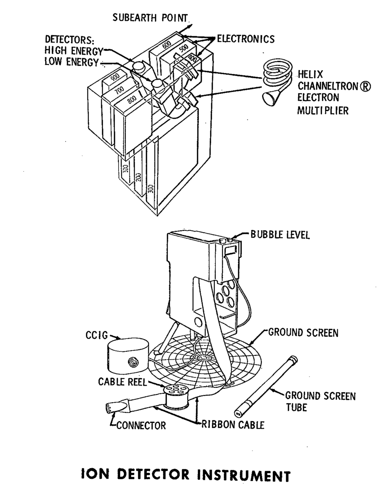

.. _Lunar Ionosphere Detector:

*******************************
Lunar Ionosphere Detector (LID)
*******************************

.. csv-table:: Lunar Ionosphere Detector (LID)
    :stub-columns: 1

    "Ośrodek badawczy", ""
    "Misje", "Apollo 12"
    "Nazwa eksperymentu (j. ang.)", "Lunar Ionosphere Detector"
    "Nazwa eksperymentu (j. pol.)", "Wykrywacz jonosfery księżycowej"

Przedmiot badania
=================
.. todo:: The scientific objective of the Lunar Ionosphere Detector is to study the charged particles in the lunar atmosphere.

    In conjunction with the Lunar Atmosphere Detector both charged and neutral particles will be measured by Apollo 12 ALSEP. Although the amount of material detected is expected to be very small, knowledge of the lunar ionosphere density and composition will contribute to the understanding of the Moon's chemistry, radioactivity, and volcanic activity and to the chemical composition of the solar wind. Elements of the solar wind are expected to be the major ionosphere component, but observation from Earth of lunar "hot spots" suggest gas is being released from the Moon. The impact of meteorites on the lunar surface will vaporize both the meteorite and lunar surface material. While all these factors contribute material to the lunar ionosphere and atmosphere, forces are at work contributing to their escape, i.e., the low gravity of the Moon, the high thermal activity and the sweeping solar wind which can remove as well as contribute particles.

    The Lunar Ionosphere Detector will help identify the ionized charged elements and molecules. It will also measure the charged particles as the Moon passes through the. Earth's magnetic field. The experiment is also designed to give us a preliminary value for the electric field of the lunar surface.

The ALSEP Lunar Ionosphere Detector design and subsequent data analysis are the responsiblities of Dr. John Freeman and
Dr. Curt Michel both of Rice University.

The LID utilizes a suprathermal ion detector to detect and count positive ions. It contains two curved plate analyzers that measure the energy of positive ions. One curved plate analyzer measures ions with an energy range from 0.2 electron volts to 48.6 (e.v.). It contains a velocity filter (crossed magnetic and electric fields) that admits ions with velocities from 4 x 10E4 to 9.35 x 10E6 cm/sec. From the velocity data, the mass of the solar wind particles in the energy range from 10 e.v. to 3500 e.v. can be determined. The mass of these high energy particles from solar flares cannot be determined because the analyzer does not have the velocity selector.

    The weight of the instrument is 19.6 pounds, operational power is 60 watts, and input voltage is +29 VDC.

Materiały i metody
==================

    Diagram przedstawia eksperyment Lunar Ionosphere Detector (LID). Źródło: :cite:`Apollo12PressKit`.

Przebieg eksperymentu
=====================

Rezultaty
=========
