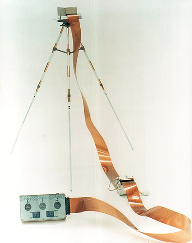

.. _Lunar Portable Magnetometer:

*********************************
Lunar Portable Magnetometer (LPM)
*********************************

.. csv-table:: Lunar Portable Magnetometer (LPM)
    :stub-columns: 1

    "Ośrodek badawczy", "NASA AMES Research Center, California"
    "Misje", "Apollo 14, 16"
    "Nazwa eksperymentu (j. ang.)", "Lunar Portable Magnetometer"
    "Nazwa eksperymentu (j. pol.)", "Przenośny księżycowy magnetometr"

Przedmiot badania
=================
Metoda mapowania różnic pola magnetycznego jest standardową procedurą wykorzystywaną na Ziemi w badaniach prospekcyjnych. Wiele złóż naturalnych i obiektów podziemnych może powodować anomalie pola magnetycznego. Średnia wartość pola magnetyczne Ziemi wynosi 50µT, a anomalie na poziomie kilkudziesięciu tysięcy Tesli są częste. Ze względu na fakt, iż pole magnetyczne Księżyca jest około trzy rzędy wielkości mniejsze od Ziemskiego, oczekiwane wartości anomalii są znacznie mniejsze.

Materiały i metody
==================

    Zdjęcie przedstawia eksperyment Lunar Portable Magnetometer (LPM). Źródło: NASA/S70-56721 :cite:`Lindsay2008`.

    .. todo:: NASA photo  the Apollo 14 LPM in a lab setting. The electronics box in the foreground included setting switches and three output dials and was attached to the Modular Equipment Transporter (MET or handcart). The sensor head was fitted onto the tripod, which was deployed 15 meters or so away from the MET during readings. A similar instrument was flown on Apollo 16, with the electronics box fitted to the back of the Lunar Roving Vehicle (LRV). NASA photo AS14-68-9393a shows the deployed Apollo 14 instrument. Ed Mitchell took this documentation photo while standing at the MET waiting for a measurement to finish.

Sensory były przechowywane w osłonie zamontowanej na trójnogu. Podłączone były do obwodów elektronicznych :term:`LRV` za pomocą płaskiej wiązki kabla elektrycznego o długości 15,2 m. Zakres pomiarowy instrumentu wynosił 256 nT.

Przebieg eksperymentu
=====================
W połączeniu z :ref:`Lunar Surface Magnetometer` w trakcie misji :ref:`Apollo 14` oraz :ref:`Apollo 16` wykorzystano również eksperyment :ref:`Lunar Portable Magnetometer`. Urządzenie było noszone przez astronautów podczas przemieszczania się po powierzchni Księżyca zarówno z wykorzystaniem :term:`MET` (:ref:`Apollo 14`) jak i :term:`LRV` (:ref:`Apollo 16`)  w celu rejestracji lokalnej wartości pola magnetycznego.

Podczas użytkowania, trójnóg był rozstawiany 15 metrów od :term:`LRV`. Konieczne było zachowanie odległości trójnoga od pojazdu w celu uniknięcia jego wpływu magnetycznego oraz astronautów i ich ekwipunku. Urządzenie musiało być wypoziomowane oraz znajdować się w cieniu od słońca.

Odczyt dokonywany był z urządzenia zamontowanego w :term:`LRV`. Panel składał się z trzech cyfrowych mierników przypominających zegary. Każdy ze wskaźników pokazywał wartości pola magnetycznego dla jednej osi, składających się na Księżycowe pole magnetyczne. Astronauci przekazywali głosowo odczytane wartości.

Rezultaty
=========
Instrument :ref:`Lunar Portable Magnetometer` podczas misji :ref:`Apollo 14` zarejestrował jedynie dwie wartości lokalnego pola magnetycznego. Oba pomiary były zaskakujące dla badanych. Pierwszy pomiar dokonano w niewielkiej odległości od punktu lądowania, ale poza zasięgiem wpływu pola magnetycznego lądownika :term:`LM`. Wartość wynosiła 43nT. Drugiego pomiaru dokonano w na krawędzi krateru Cone (ang. *Cone Crater*). Wartość wynosiła 103nT.

Wartości te były znacznie przewyższające oczekiwane dane. Wcześniejsze pomiary z wykorzystaniem orbitujących Księżyc satelit wykazały jednoznacznie, że uśredniona wartość pola magnetycznego nie może przekraczać 10 do 12 nT. Otrzymane wartości były znacznie większe. Różnica (60nT) w dwóch pomierzonych wartościach była równie nieoczekiwana. Tak znaczne zmiany nie były oczekiwane przy tak niewielkich odległościach przemieszczenia.

W celu zrozumienia procesu gwałtownych zmian wartości pola magnetycznego, eksperyment wykonano ponownie podczas misji :ref:`Apollo 16` próbkując pole wielokrotnie.

Efekt ten był rezultatem naturalnego procesu magnetyzacji skał Księżycowych. Zachodzenie tego procesu było już wcześniej poznane na Ziemi, np. w naturalnie występującym minerale *lodestone*, który jest silnie magnetyzujący. Podobny proces tworzenia właściwości magnetycznych skał zachodzi na powierzchni Księżyca.
