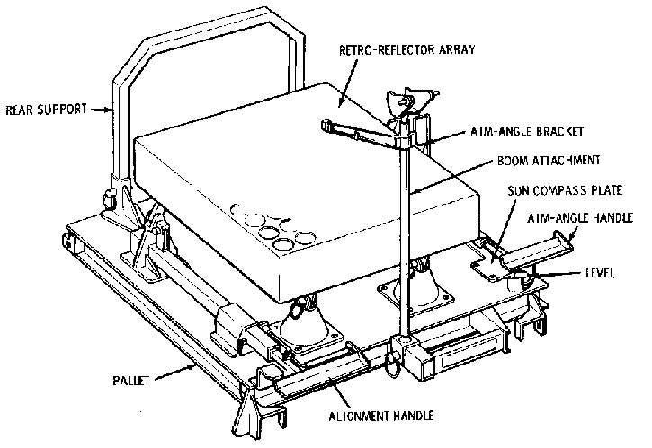
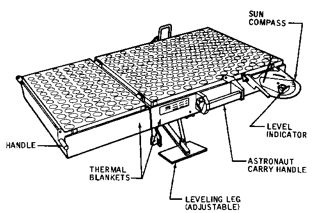

************************************
Lunar Ranging Retro-Reflector (LRRR)
************************************

.. csv-table:: Lunar Ranging Retro-Reflector (LRRR)
    :stub-columns: 1

    "Ośrodek badawczy", ""
    "Misje", "Apollo 11, 14, 15"
    "Nazwa eksperymentu (j. ang.)", "Lunar Ranging Retro-Reflector "
    "Nazwa eksperymentu (j. pol.)", "Księżycowe zwierciadło do pomiaru odległości"

Projekt eksperymentu
====================

    Źródło: :cite:`Apollo12PressKit`.

    Źródło: :cite:`ImageProjectApolloArchive`.

Opis eksperymentu
=================
* Apollo 14: reflector had 100 silica cubes
* Apollo 15: reflector had 300 silica cubes

This passive experiment consisted of an array of 100 fused silica cubes on Apollo 11, arranged to reflect a beam of light back on a parallel path to its origin. The LRRR placed on the Moon was aligned precisely so that it faced the Earth. Scientists from around the world directed laser beams at the instrument which reflected them back to Earth; the elapsed time for the round trip allowed precise measurements of distances, down to an accuracy of 8 centimeters, between the Earth and the Moon. This instrument continued operating until June 1981.

Apart from accurately determining the Moon's distance from the Earth, results have shown there is considerable warping of the lunar surface as it journeys around the Earth.

These reflectors were also deployed on the Apollo 14 and 15 missions.  The Apollo 15 reflector had 300 silica cubes.
