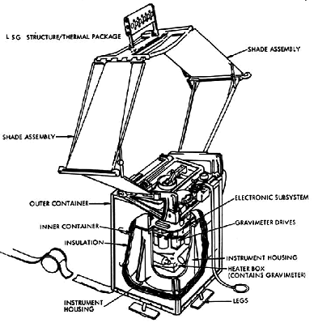
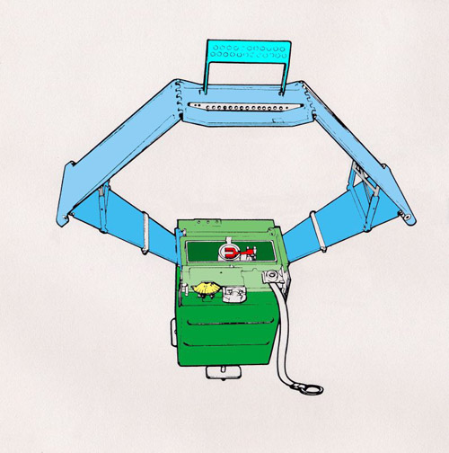
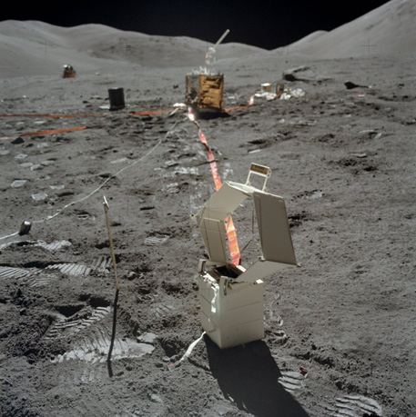

.. _Lunar Surface Gravimeter Experiment:

*****************************************
Lunar Surface Gravimeter Experiment (LSG)
*****************************************

.. csv-table:: Lunar Surface Gravimeter Experiment (LSG)
    :stub-columns: 1

    "Ośrodek badawczy", "University of Maryland"
    "Misje", "Apollo 17"
    "Nazwa eksperymentu (j. ang.)", "Lunar Surface Gravimeter Experiment"
    "Nazwa eksperymentu (j. pol.)", "Grawimetryczny pomiar powierzchni Księżyca"

Przedmiot badania
=================
.. todo::
    Only flown on Apollo 17 ALSEP, the LSG’s major goal was to confirm the existence of gravity waves as predicted by Einstein; to measure the response of the Moon to the Earth’s tidal pull; and to detect free lunar oscillations in periods of 15 minutes or longer. It could also measure vertical components of seismic events with frequencies up to 16 cycles per second, thus supplementing the passive seismic network of Apollo 12, 14, 15 and 16 missions.

    This instrument was designed to make very accurate (1 part in 1011) measurements of the lunar gravity and of its variation with time. It was essentially a sensitive spring balance, and also functioned as a one-axis seismometer. Its intent was to measure gravity waves by using the Moon as an antenna and also investigate tidal distortions of the shape of the Moon. Following deployment of the gravimeter during Apollo 17, problems occurred in trying to balance the beam. These problems were caused by a mathematical error in the sensor mass weights. Several reconfigurations of the instrument had been made during the previous year.

    It was discovered on EVA 2 that the sensor beam of the LSG could not be nulled (using the micrometer screw adjustment of the instrument), even though Harrison Schmitt re-verified that the instrument was level and the gimbal was free. Later analysis showed a design (arithmetic) error of the sensor mass weights. They were approximately 2% lighter than the proper nominal weight for one sixth gravity operation of the flight unit. The sensor mechanism allowed up to only 1.5% adjustment from the nominal for possible inaccuracies. The error was made in the conversion calculations from 1 g to 1/6 g for the flight unit by including an erroneous value in the calculations from the uncorrected calculations for the qualification unit.

    Repairs were attempted on EVA 2 and 3, but were unsuccessful. Schmitt rapped the exposed top plate on the gimbal; rocked the experiment in all directions; re-levelled the instrument, working the base well against the surface; and verified the sunshade tilt. These actions were taken to free a mass assembly or a sensor beam that was suspected of being caught or bound, but no change was apparent. The problem was at least partly overcome by applying pressure on the beam with the mass-changing mechanism beyond the design point by addition of all included masses so that it contacted the beam. Much valuable EVA time (about 30 minutes) was spent on the attempt.

Materiały i metody
==================

    Diagram przedstawia eksperyment Lunar Surface Gravimeter Experiment (LSG). Źródło: :cite:`ImageProjectApolloArchive`.

    Diagram przedstawia eksperyment Lunar Surface Gravimeter Experiment (LSG). Kolorem niebieskim zaznaczono osłonę przeciwsłoneczną :cite:`Lindsay2008`.

    Zdjęcie przedstawia eksperyment Lunar Surface Gravimeter Experiment (LSG). Źródło: NASA/AS17-134-20501 :cite:`Lindsay2008`.

    .. todo:: Documentation photo of the deployed LSG taken late in EVA-3. The Central Station is in the background at center with the RTG to the left and the LM in the distance beyond the RTG. Before taking this photo, Jack Schmitt planted the tongs, temporarily, next to the LSG on the left.

Przebieg eksperymentu
=====================

Rezultaty
=========
