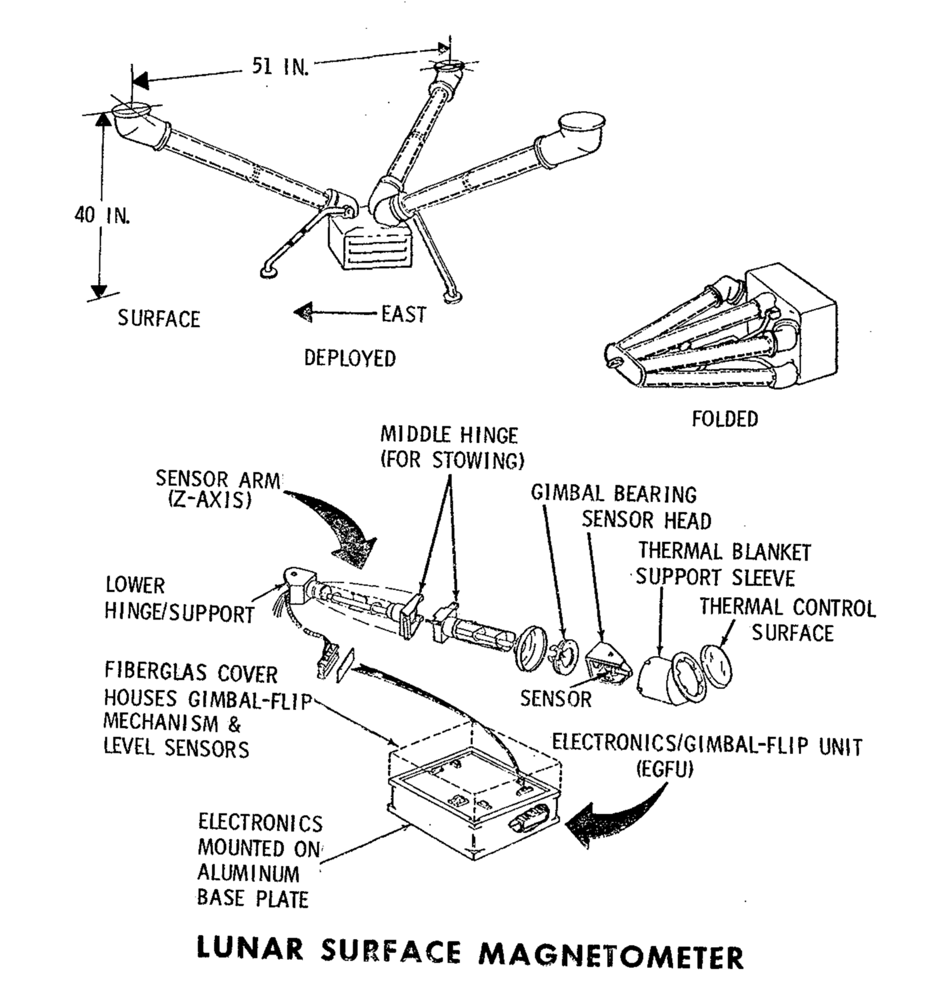

.. _Lunar Surface Magnetometer:

********************************
Lunar Surface Magnetometer (LSM)
********************************

.. csv-table:: Lunar Surface Magnetometer (LSM)
    :stub-columns: 1

    "Ośrodek badawczy", "University of Arizona"
    "Misje", "Apollo 12, 15, 16"
    "Nazwa eksperymentu (j. ang.)", "Lunar Surface Magnetometer"
    "Nazwa eksperymentu (j. pol.)", "Magnetometryczny pomiar powierzchni Księżyca"

Przedmiot badania
=================
.. todo::
    A tri-axis fluxgate magnetometer measured the variations of the magnetic field of the Moon with time. Because the magnetic field of the Moon can change in amplitude, frequency, and direction, the magnetometer measures the field in three directions with sensors located on the end of three small booms. The electronics were contained in a box at the base of the three booms. It could measure magnetic flux in nanoTeslas (nT) in three ranges with a resolution of 0.2 nT:

    -100 to +100 nT
    -200 to +200 nT
    -400 to +400 nT

    Magnetic fields of the Earth and Moon have two parts; one that changes with time, and one that is steady. The part that changes with time is caused by travelling electromagnetic waves. The steady part of the Earth’s magnetic field, which affects the common compass, varies from 35,000nT at the equator to 60,000nT at the poles, whereas the lunar magnetic field is only about 6 to 100 nT gamma, most likely due to the presence of natural magnetism in lunar rocks inherited early in the Moon’s history, when the magnetic field was much stronger that it is today. The Lunar Orbiters data inferred there was a steady magnetic field of about 8 nT. The magnetometer also measured the variation in time of the magnetic field, caused by electromagnetic waves propagated from the Sun.

    The moon has no global magnetic field like the Earth because it no longer has an internal dynamo, so it was a surprise when magnetometers placed by Apollo astronauts on the surface detected a faint magnetic field, as large as hundreds of nanoteslas. When the scientists built an electron detector that flew in lunar orbit aboard Apollo 15 in 1971 and Apollo 16 in 1972, they quickly realized they could use the instrument to remotely map the magnetic fields on the surface. Though crude and covering only about 10 percent of the lunar surface, the measurements nevertheless indicated a correlation between meteor impact basins -- dark, roughly circular features on the face of the moon and strong magnetic fields on the diametrically opposite side of the moon.

    Theorists came up with an explanation for magnetic fields antipodal to impact basins not long after the Apollo measurements hinted at a correlation. When a large meteorite hits the moon, it and much of the local lunar surface is vaporized and thrown into space, forming a cloud of debris and gas larger than the moon itself. Because of the heat released in the collision, much of the gas is ionised plasma in which the atoms are stripped of one or more electrons.

    Such plasmas exclude magnetic fields, so as the cloud spread around the moon it pushed the moon's magnetic field in front of it. When the plasma cloud finally converged on the diametrically opposite side of the moon -- a mere five minutes after impact -- the squeezed magnetic field would be quite large.

    At the same time debris was falling back on the lunar surface, concentrated at the antipodal site also. If this debris dropped onto the surface during the time when the magnetic field was high, it could have undergone shock magnetization. When rock is shocked, as when hit with a hammer, it can suddenly lose its own magnetic field and acquire that of the surrounding region.

    Scientists think that the magnetism of the Moon's surface is left over from a time when the Moon's magnetic field was actively created by a dynamo within the lunar core, and that this remnant magnetism may gradually erode away. Theories also suggest that the Moon's magnetism may come from collisions with other celestial bodies such as asteroids and comets, which might have imparted to the Moon some magnetic properties.

    The LSM measured a steady 38 nanoteslas (nT) at the Apollo 12 site, and 6 nT at the Apollo 15 site.

Materiały i metody
==================

    Diagram przedstawia eksperyment Lunar Surface Magnetometer (LSM). Źródło: :cite:`Apollo12PressKit`.

Przebieg eksperymentu
=====================

Rezultaty
=========
