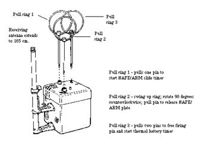
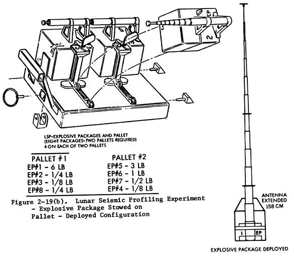
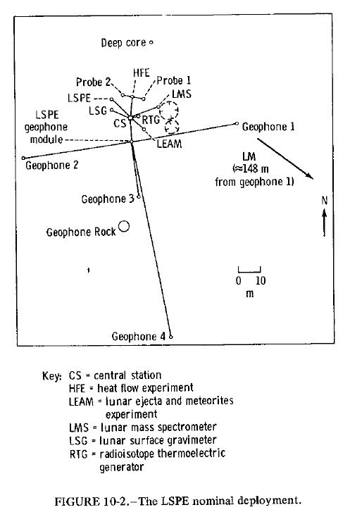
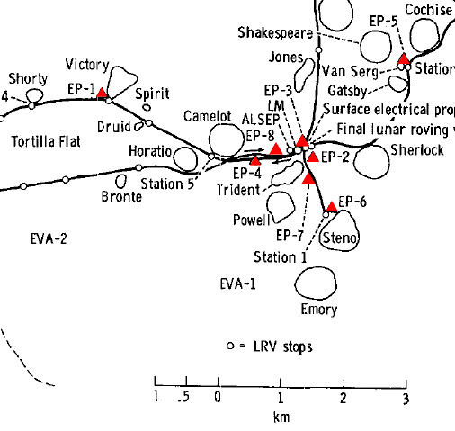
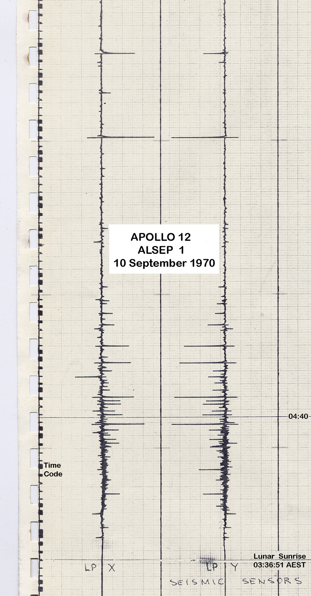

.. _Lunar Seismic Profiling Experiment:

*****************************************
Lunar Seismic Profiling Experiment (LSPE)
*****************************************

.. csv-table:: Lunar Seismic Profiling Experiment (LSPE)
    :stub-columns: 1

    "Ośrodek badawczy", "Stanford University, USA"
    "Misje", "Apollo 17"
    "Nazwa eksperymentu (j. ang.)", "Lunar Seismic Profiling Experiment"
    "Nazwa eksperymentu (j. pol.)", "Profilowanie sejsmiczne powierzchni Księżyca"

Przedmiot badania
=================
:ref:`Lunar Seismic Profiling Experiment` jest podobny w założeniu do innych eksperymentów sejsmicznych wykonywanych w ramach pakietu :term:`ALSEP`, lecz różni się od nich pod względem projektowym. Zbiera dane sejsmiczne z sieci 4 :term:`geofonów <geofon>` ułożonych w centrum, oraz w każdym kącie 90-cio metrowego metrowego trójkąta równobocznego. Ładunki wybuchowe na powierzchni wywoływały fale sejsmiczną o różnej mocy w celu profilowania sejsmicznego punktu lądowania :ref:`Apollo 17`.

Materiały i metody
==================

    Diagram przedstawia odbiornik Lunar Seismic Profiling Experiment (LSPE). Źródło: :cite:`ImageProjectApolloArchive`.

    Diagram przedstawia nadajnik Lunar Seismic Profiling Experiment (LSPE). Źródło: :cite:`ImageProjectApolloArchive`.

.. csv-table:: W celu profilowania sejsmicznego w trakcie misji :ref:`Apollo 17` dla eksperymentu :ref:`Lunar Seismic Profiling Experiment` rozstawiono osiem ładunków wybuchowych o specyfikacji podanej poniżej. Źródło: :cite:`Lindsay2008`.
    :file: data/alsep-LSPE-detonation-times.csv
    :header-rows: 1

Przebieg eksperymentu
=====================
Podczas eksperymentu astronauta-geolog Jack Schmitt zmuszony był wybrać lokacje :ref:`stacji centralnej <Central Station>`, tak aby móc przeprowadzić pozostałe zaplanowane eksperymenty oraz po rozłożeniu trójkąta :term:`LSPE` ominąć wysoki na 3 metry głaz nazwany "skałą geofonu" (ang. *Geophone Rock*).

    Mapa przedstawia eksperyment Lunar Seismic Profiling Experiment (LSPE). Źródło: Figure 10-2 :cite:`Parker1973`

    Mapa przedstawia rozstawienie eksperymentu Lunar Seismic Profiling Experiment (LSPE). Kolorem czerwonym wyróżniono lokalizację ładunków wybuchowych rozstawionych podczas eksperymentu. Źródło: Figure 10-7 :cite:`Parker1973`.

Rezultaty
=========
Rozstawienie :term:`geofonów <geofon>` w kształcie trójkąta równobocznego pozwoliło na pomiar azymutów i prędkości fal sejsmicznych bardziej dokładnie niż :ref:`Active Seismic Experiment` podczas :ref:`Apollo 14` i :ref:`Apollo 16`.

    Obrazek przedstawia wykres zarejestrowany podczas eksperymentu Lunar Seismic Profiling Experiment (LSPE). Źródło: :cite:`Lindsay2008`.
