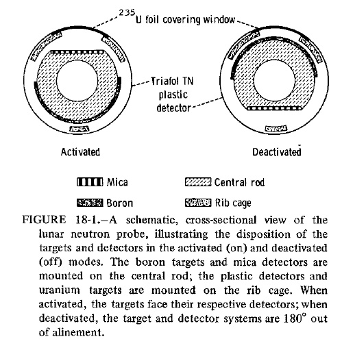

.. _Neutron Probe Experiment:

******************************
Neutron Probe Experiment (NPE)
******************************

.. csv-table:: Neutron Probe Experiment (NPE)
    :stub-columns: 1

    "Ośrodek badawczy", "California Institute of Technology"
    "Misje", "Apollo 17"
    "Nazwa eksperymentu (j. ang.)", "Neutron Probe"
    "Nazwa eksperymentu (j. pol.)", "Sonda neutronowa"

Projekt eksperymentu
====================

    Diagram przedstawia eksperyment Neutron Probe Experiment (NPE). Źródło: Fig. 18-1 :cite:`Parker1973`.

Przedmiot badania
=================
.. todo::
    The lunar regolith, or the uppermost few meters of the Moon, consists of soil and highly fragmented rocks formed by repeated impacts of meteoroids with the Moon's surface. These impacts eject material from the craters that are formed, and the ejecta are usually deposited nearby. The overall effect of many such impacts is a continual overturn of the regolith, which keeps it well mixed. This can be thought of as a sort of gardening, analogous to the mixing of soil performed by a farmer's plough. The NPE was performed on Apollo 17 to determine the rate at which the lunar regolith is overturned or mixed. It consisted of a 2.4 meter long rod, with several detectors, that was inserted into the hole left from drilling a deep core sample. These detectors measured the number of neutrons penetrating to different depths in the regolith. The Neutron Probe was deployed on the first EVA and retrieved at the end of the third EVA after being exposed to the lunar regolith for 49 hours. It was then returned to Earth for analysis.

    When cosmic-ray protons strike the lunar surface, nuclear reactions between the protons and atoms in the soil sometimes create neutrons, which may penetrate a short distance into the regolith. These neutrons are ultimately absorbed by other atoms, and the resulting nuclear reactions sometimes lead to the formation of radioactive isotopes, which later break down to form more stable isotopes. These radioactive isotopes provide a way to measure the rate at which the regolith is mixed. Because neutrons only penetrate a short distance into the regolith, finding radioactive elements at deeper depths means that material has been mixed to that depth in less time than it takes for the radioactive isotopes to break down. Measuring the regolith's mixing rate requires knowing three things: (1) the current abundance of radioactive elements, which is measured in core samples returned by the astronauts to Earth; (2) the rate at which radioactive elements decay, which is known from laboratory studies on Earth; and (3) the rate at which radioactive elements are created by neutron bombardment, which was determined from Lunar Neutron Probe data.

    The degree of mixing in the regolith depends on the size of an impacting body, with larger impacts mixing material to greater depths. Small impacts are much more common than larger impacts, and so mixing to small depths occurs more often than mixing to large depths. Current estimates are that mixing to a depth of 1 centimeter occurs on average every million years, while mixing to a depth of 1 meter occurs only about once every billion years. These estimates are based on measurements of radioactive element abundances in lunar core tubes as well as on a variety of other chemical measurements of these cores.

    This lunar neutron probe was designed to measure the rates of low-energy neutron capture as a function of depth in the lunar regolith. The experiment made use of two particle track detection systems. A cellulose triacetate plastic detector was used in conjunction with Boron 10 targets to record the alpha particles emitted with the neutron capture on Boron 10. The second system used mica detectors to detect the fission fragments from neutron-induced fission in uranium 235 targets. The neutron probe had the form of a rod which yielded an essentially continuous record of the neutron capture rate from the lunar surface down to a depth of over 2 meters. The probe was activated and deactivated by a rotational motion which brought the target and detector system in and out of alignment. An on-off mechanism was necessary to prevent accumulation of background events produced in flight by neutrons from the ALSEP power generator and from cosmic ray neutrons produced in the spacecraft. Point sources of uranium 238 were included at three positions along the probe to provide fiducial marks to verify that the probe was properly activated. In addition, cadmium absorbers were included in the center and bottom of the probe to obtain a neutron energy spectrum with a threshold of 0.35 eV. Further spectral information was obtained from analyses of krypton 80 and krypton 82 produced by bromide neutron capture in potassium bromide contained in evacuated capsules which were inserted at the top, middle, and bottom of the probe. The experiment performed normally from activation on  December 12 1972 to termination at the end of the third EVA on December 13 1972.
