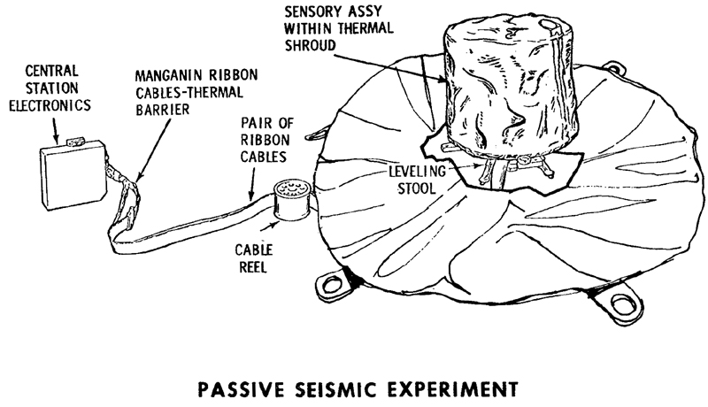

********************************
Passive Seismic Experiment (PSE)
********************************

.. csv-table:: Passive Seismic Experiment (PSE)
    :stub-columns: 1

    "Ośrodek badawczy", "University of Texas"
    "Misje", "Apollo 12, 14, 15, 16"
    "Nazwa eksperymentu (j. ang.)", "Passive Seismic Experiment"
    "Nazwa eksperymentu (j. pol.)", "Pasywny eksperyment sejsmiczny"

Projekt eksperymentu
====================

    Źródło: :cite:`ImageProjectApolloArchive`.

Opis eksperymentu
=================
To determine sub-surface properties and measure extremely small vibrations of the lunar surface caused by distant moonquakes, man-made explosions, and spacecraft impacts. When the instrument vibrated in response to movement of the ground surface, the inertia of the central lever and the mass on the end caused it to vibrate in sympathy, which was detected electronically by the capacitor effect of the mass on the end of the lever. An internal set of motors kept the seismometers constantly level within a few seconds of arc. Seismic motions were recorded on Earth with a magnification factor of 10 million. The network of four instruments deployed during Apollo enabled the seismologists to locate moonquakes in three dimensions, and to study the seismic velocities and propagation characteristics of the lunar subsurface materials. The PSEs measured daily meteorite impacts and an average of two moonquakes per month, up to depths of 800 kilometers. Earthquakes on the Earth exceed one million per year. On the Moon, there may be up to 300. And they are much smaller than the ones on Earth. It was noted that there was increased activity when the Moon was farthest from, and nearest to, the Earth.  Signals generated by heating at sunrise on the Moon's surface was recorded by ALSEP each lunar day.

The Passive Seismic Experiment studied the propagation of seismic waves through the Moon and provided our most detailed look at the Moon's internal structure. The Apollo 11 seismometer returned data for just three weeks but provided a useful first look at lunar seismology. More advanced seismometers were deployed at the Apollo 12, 14, 15, and 16 landing sites and transmitted data to Earth until September 1977. Each of these seismometers measured all three components of ground displacement (up-down, north-south, and east-west).

If a seismic event is observed by three or more seismometers separated by distance, the time and location of the event can be determined. Because seismic waves from distant events travel deeper into the Moon than waves from nearby events, by measuring events at various distances from the seismometer, one can determine how seismic velocities vary with depth in the Moon. In turn, this information can be used to study the Moon's internal structure. Most of the events observed by the seismometers were due either to moonquakes or to meteoroid impacts. However, the third stages of several Saturn 5 rockets and the ascent stages of several lunar modules were deliberately crashed onto the Moon after they were discarded. These man-made crashes produced seismic events of known times and locations and helped to calibrate the network of seismometers.

The Passive Seismic Experiment produced several important scientific results:

Knowledge of Lunar Interior Structure.  Like the Earth, the Moon has a crust, mantle, and core. The lunar crust is rich in the mineral plagioclase and has an average crustal thickness of 50 kilometers. The lunar mantle lies between the crust and the core and consists mostly of the minerals olivine and pyroxene. The core is probably composed mostly of iron and sulphur and extends from the center of the Moon out to a radius of no more than 450 kilometers, i.e., the core radius is less than 25% of the Moon's radius, which is quite small. In comparison, the Earth's core radius is 54% of the Earth's radius. However, the size of the lunar core is not well constrained by existing seismic observations. Better constraints came from the laser ranging retro-reflector and magnetometer experiments.

Distribution of Lunar Seismic Sources.  More than 1,700 meteoroid impacts were recorded by the seismometer network, with impactor masses estimated to be between 0.5 and 5000 kilograms. Most moonquakes occur at depths of 800 to 1000 kilometers. These occur at monthly intervals at about 100 distinct sites, indicating that these moonquakes are caused by stresses from changes in lunar tides as the Moon orbits the Earth. These moonquakes are quite small, mostly with Richter scale magnitudes less than 2. The amount of energy released by earthquakes in a typical year is about 10 million times larger than that released by moonquakes in a year. Only a few near-surface moonquakes were detected.

Attenuation of Seismic Waves.  Meteoroid impacts cause heavy fracturing in the upper 20 kilometers of the lunar crust. These fractures in turn cause scattering of seismic waves in these regions. Below 20 kilometers, seismic wave scattering decreases as a result of either closure of these fractures due to increasing pressure, or of a change in chemical composition of the crust. In the mantle, seismic waves are attenuated much less on the Moon than they are on Earth. Seismic wave attenuation is enhanced at high temperatures and in the presence of water, and the low attenuation on the Moon indicates a cold, dry interior. Because the Moon is smaller than Earth, it is expected to have cooled more rapidly, producing a cold interior. The total absence of water on the Moon is due to its formation from dry volatile-depleted material, a consequence of the impact of a Mars-sized body with the Earth. Below 1000 kilometers depth, seismic wave attenuation increases, possibly indicating the presence of a small amount of molten rock.

    Scientists hoped that moonquakes and meteorite impacts would answer two fundamental questions: (1) does the Moon have a molten core; and (2) what is the deep interior of the Moon like? To answer these questions they needed at least one impact event of at least 1019  ergs on the far side of the Moon. On May 13 1972 a near-side event with an energy of 1,100 kilograms was recorded. On  September 19 1973 a large back-side event with an energy of 1018  ergs took place. On July 17 1972, only three months after it was set up, Apollo 16’s seismometer registered the largest impact ever recorded on the moon when a meteorite hit the far side of the moon near Mare Moscoviense, located at 26ºN  147ºE.

    Over the 8 years of the ALSEP’s lives, around 10,000 moonquakes and 2,000 meteorite impacts were registered by the seismometers.

    The seismic information, magnetometer, and heat flow experiments contributed the principal information about the Moon’s interior. It is now believed the Moon’s crust is multi-layered and 50 kilometers thick, with a secondary boundary occurring about 20 kilometers under the surface. The upper mantle has been determined to consist of olivine or olivine-pyroxene matter, and to be quite homogeneous, extending about 500 kilometers down. Below this level the seismic data infers the interior is iron-enriched, although there is insufficient data to determine if the Moon has a molten core.

    Moonquakes were discovered to show periodicity and recur at several places in the interior. The time cycle of the deep focus moonquakes follows the tidal cycles so closely it appears likely that tidal forces are a major factor in triggering deep focus moonquakes.

The Moon rings like a bell when struck by a large object.

The first man-made crash directed at the Moon that could be detected by a seismometer occurred after the Apollo 12 astronauts had returned to the CSM and the LM ascent stage was sent smashing into the Moon's surface. The shock waves of this impact surprised the scientists  -  the Moon vibrated for over 55 minutes!! Also, the kinds of signals recorded by the seismometers were utterly different from any ever received before, starting with small waves, gaining in size to a peak, and then lasting for incredibly long periods of time. A seismic wave took 7 to 8 minutes to reach the peak of impact energy and then gradually decreased in amplitude over a period that lasted almost an hour. It was claimed that even after an hour the minutest reverberations had still not stopped.

When the Apollo 12 LM hit the lunar surface at 6,048 kilometers per hour, 72 kilometers from the landing site, digging an estimated 9 meter wide crater, the results were astonishing. All 3 seismometers in the package recorded the impact, which set up a sequence of reverberations lasting nearly an hour. Nothing like this had ever been measured on Earth.

The LM impact occurred at 1617 USCST November 20 1969. A news conference had been scheduled to begin at 1630, and when it did start, the Moon was still "ringing" as the scientists  -  all of them seismic experts  -  arrived at the news center from their laboratories.

Maurice Ewing, co-head of the seismic experiment, told the afternoon crowd of the unexpected event, informing them that the Moon was still ringing. He confessed he was at a loss to explain why the Moon behaved so strangely. "As for the meaning of it," Ewing announced, "I'd rather not make an interpretation right now. But it is as though one had struck a bell, say, in the belfry of a church a single blow and found that the reverberation from it continued for 30 minutes." As he spoke the reverberations continued on for another 25 minutes.

Dr Ross Taylor, a lunar scientist who had been on the team to examine the Apollo 11 samples in Houston, explains why the Moon rang for so long, "This was one of those extraordinary things. When you had the impact of these things on the Moon, unlike a terrestrial earthquake, which dies away quickly, the shock waves continued to reverberate around the Moon for a period of an hour or more, and this is attributed to the extremely dry nature of the lunar rock. As far as we know there is no moisture on the Moon, nothing to damp out these vibrations. The Moon’s surface is covered with rubble and this just transmits these waves without them being damped out in any way as they are on Earth. Basically, it’s a consequence of the Moon being extremely dry."

