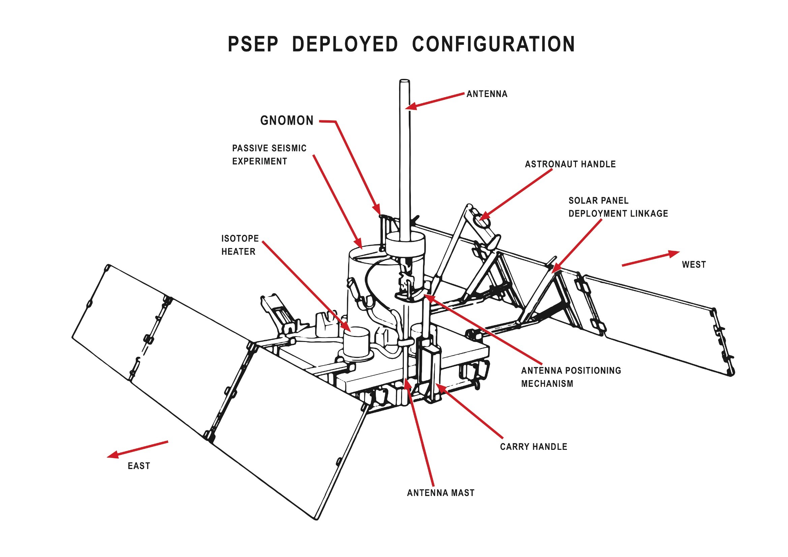

*****************************************
Passive Seismic Experiment Package (PSEP)
*****************************************

.. csv-table:: Passive Seismic Experiment Package (PSEP)
    :stub-columns: 1

    "Ośrodek badawczy", ""
    "Misje", "Apollo 11"
    "Nazwa eksperymentu (j. ang.)", "Passive Seismic Experiment Package"
    "Nazwa eksperymentu (j. pol.)", "Zestaw eksperymentalny eksperymentu sejsmicznego"

Projekt eksperymentu
====================

    Apollo 11 Passive Seismic Experiment. Źródło: :cite:`ImageProjectApolloArchive`.

Opis eksperymentu
=================
This instrument contained four seismometers powered by two panels of solar cells, which converted solar energy into electricity. It used three long-period seismometers and one short- period vertical seismometer for measuring meteorite impacts and moonquakes, recording about 100 to 200 hits by meteorites during its lifetime. Data regarding the strength, duration, and approximate direction of the seismic event were relayed to tracking stations on Earth. Because it was only powered by solar cells, the experiment only operated during the lunar days. During the 340 hour lunar night, when temperatures can plummet to minus 170ºC the instrument was kept to a minimum of minus 54ºC by a radioisotope heater, the first major use of nuclear energy in a NASA manned mission. Any temperature below this could damage the instrument.

At the other end of the scale the scientists tried controlling the daytime heat on the electronic components by a series of power 'dumps', cutting off the systems electrical power. Then, just before the lunar night began, the seismometer automatically shifted into stand-by mode, stopping transmission of all data. The seismic instrument package stopped responding to commands at 0400 UT August 25 1969, probably from overheating from the hot midday sun.  An alternate design was flown on later missions.
