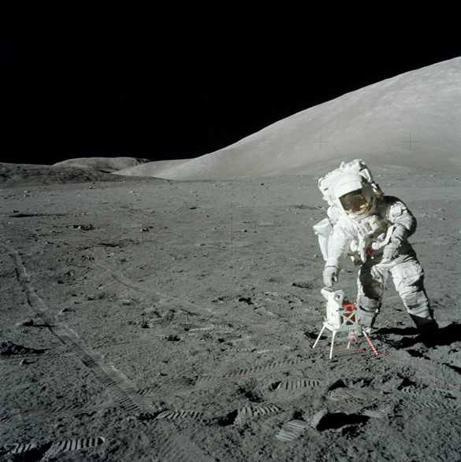
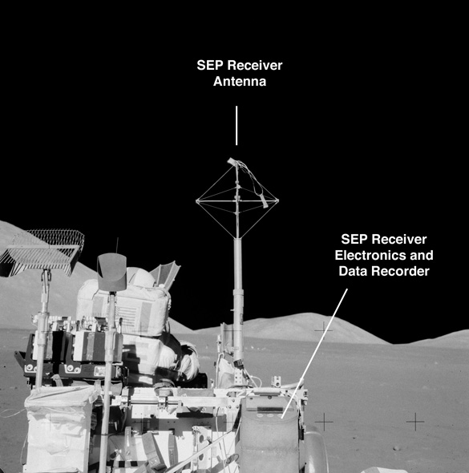

.. _Surface Electrical Properties Experiment:

**********************************************
Surface Electrical Properties Experiment (SEP)
**********************************************

.. csv-table:: Surface Electrical Properties Experiment (SEP)
    :stub-columns: 1

    "Ośrodek badawczy", "Massachusetts Institute of Technology"
    "Misje", "Apollo 17"
    "Nazwa eksperymentu (j. ang.)", "Surface Electrical Properties Experiment"
    "Nazwa eksperymentu (j. pol.)", "Pomiar właściwości elektrycznych powierzchni Księżyca"

Projekt eksperymentu
====================

    NASA photo AS17-134-20438 shows Jack Schmitt as he reaches down to open a three-segment solar array that powers the SEP transmitter.  The transmitter is located at the intersection of a cross of Rover tracks that Gene layed out prior to the deployment.  The antenna wires runing off to the south (upper left), east (lower left, and south (lower right) can be seen in the image. This frame is part of a partial panorama (assembled by David Nathan) that Gene took of the deployment.  The panorama shows more of the antenna layout. NASA photo AS17-141-21511 shows the transmitter as deployed, including pieces of duct tape used by the crew to keep the solar array open. Źródło: :cite:`Lindsay2008`.

    NASA photo AS17-135-20543 shows the components of the SEP Receiver mounted behind the LMP's Rover seat. The electronics and data recorder are stowed in a bag designed to provide thermal protection. Failure of adhesive on the back of Velcro patches that held the bag cover closed led to overheating, which significantly limited the amount of useful data collected. Źródło: :cite:`Lindsay2008`.

Opis eksperymentu
=================
This experiment consisted of a transmitting antenna deployed near the Lunar Module and a receiving antenna on the Rover. At several different traverse stops, electrical signals were transmitted through the regolith and recorded on the Rover. Comparison of the transmitted and received signals allowed the electrical properties of the regolith to be determined. This information was intended to provide "ground truth" for the analysis of orbital observations by the Bistatic Radar and Lunar Sounder Experiments. In addition, the results of this experiment showed that the upper 2 kilometers of the lunar surface are extremely dry, which is consistent with measurements of lunar rock composition.

The purpose of the SEP experiment was to obtain data about the electromagnetic energy transmission, absorption, and reflection characteristics of the lunar surface and subsurface for use in the development of a geological model of the upper layers of the moon. This experiment determined layering, searched for pressure of water below the surface, and measured electrical properties in situ, determining these as a function of depth. The selected frequency range was chosen to measure these properties in a range from a few meters to a few kilometers depth. The transmitter produced continuous waves at 1, 2.4, 4, 8.1, 16, and 32.1 MHz, successively. These waves permitted measurement of the size and number of scattered bodies in the subsurface. Any moisture present was easily detected because minute amounts of water in rocks or subsoil change the electrical conductivity by several orders of magnitude. The equipment for this experiment consisted of a deployable self-contained transmitter, a multiple frequency transmitter antenna, a portable receiver/recorder on the Rover, a wide-bandwidth mutually orthogonal receiver antenna, and a retrievable data recording device. The crew transported and set up the transmitter approximately 100 meters from the Lunar Module and then deployed the antennas. The receiver/recorder was placed on the Lunar Rover. The crew established the location of the Rover in relation to the transmitter for each data stop during the traverse. Wheel turns were counted for distance, and differences between wheel turns on the right and left sides of the vehicle were used to compute azimuth. The recorder was then returned to Earth.
