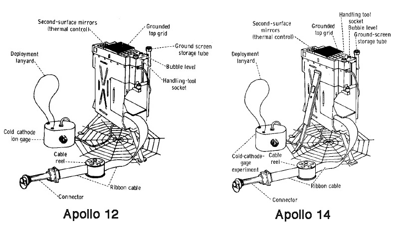
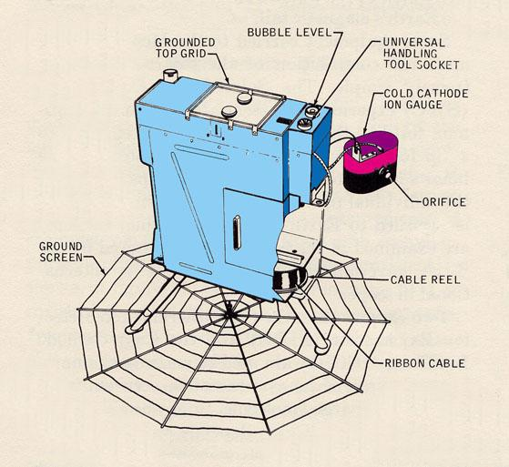

.. _Suprathermal Ion Detector Experiment:

*******************************************
Suprathermal Ion Detector Experiment (SIDE)
*******************************************

.. csv-table:: Suprathermal Ion Detector Experiment (SIDE)
    :stub-columns: 1

    "Ośrodek badawczy", "Rice University"
    "Misje", "Apollo 12, 14, 15"
    "Nazwa eksperymentu (j. ang.)", "Suprathermal Ion Detector Experiment"
    "Nazwa eksperymentu (j. pol.)", ""

Przedmiot badania
=================
.. todo::
    Two experiments, the Suprathermal Ion Detector Experiment (SIDE) and the Cold Cathode Ion Gauge (CCIG) were used to measure the number and types of ions (an electrically charged molecule, either positive or negative) on the Moon. These ions are chiefly hydrogen and helium and are largely derived from the solar wind. The SIDE was used to measure the flux, number, density, velocity, and relative energy of the positive ions near the lunar surface.

    The SIDE  had sensors which were directional, pointing in the ecliptic plane 15 degrees from the lunar local meridian. Due to the range of longitudes of the three mission landing sites, the look directions of the instruments were about 38 degrees west, 2 degrees west, and 19 degrees east of the Earth for Apollo 12, 14, and 15, respectively. Thus at certain times during the lunar orbit they could see ion flows in the magnetosheath, but never looked directly at the solar wind. During other times the detectors saw ion events of several different types; some appear to be mainly related to the moon and others to the magnetotail. These instruments resulted in numerous publications and theses. The data had been used to determine the potential of the lunar surface, to determine the effective plasma screening length at the surface, to study the ion mass spectra, and to study magnetotail ion fluxes.

    On all three missions on which it was flown, the CCIG was connected to the SIDE by a short electrical cable. It was used to measure the pressure of the lunar atmosphere. It operates at pressures of 10-6   to 10-12 torr. For a comparison the Earth’s atmosphere at sea level is 760 torr.  The pressure measured by the Apollo 14 CCIG on the lunar surface was 10-12 torr. It is interesting to note the astronauts continually released gas molecules, mainly water and carbon dioxide, from their space suits and this was happily measured by the CCIG from astronauts in the immediate vicinity.

    During the Apollo 12 deployment, set/memory in the connecting cable made it difficult for the astronauts to properly position the CCIG while keeping the SIDE upright.  As originally designed, the SIDE was supported by three short legs.  For Apollo 14,  a stabilizer was added as indicated in the figure above.  Unfortunately, Ed Mitchell had even more trouble getting the CCIG properly positioned without disturbing the SIDE. A significant redesign was done for Apollo 15.

Materiały i metody
==================

    Diagram przedstawia eksperyment Suprathermal Ion Detector Experiment (SIDE). Źródło: :cite:`ImageProjectApolloArchive`.

    Diagram przedstawia połączenie eksperymentów :ref:`Suprathermal Ion Detector Experiment` / :ref:`Cold Cathode Ion Gauge` w konfiguracji dla :ref:`Apollo 12`. Źródło: :cite:`Lindsay2008`.

Przebieg eksperymentu
=====================

Rezultaty
=========
