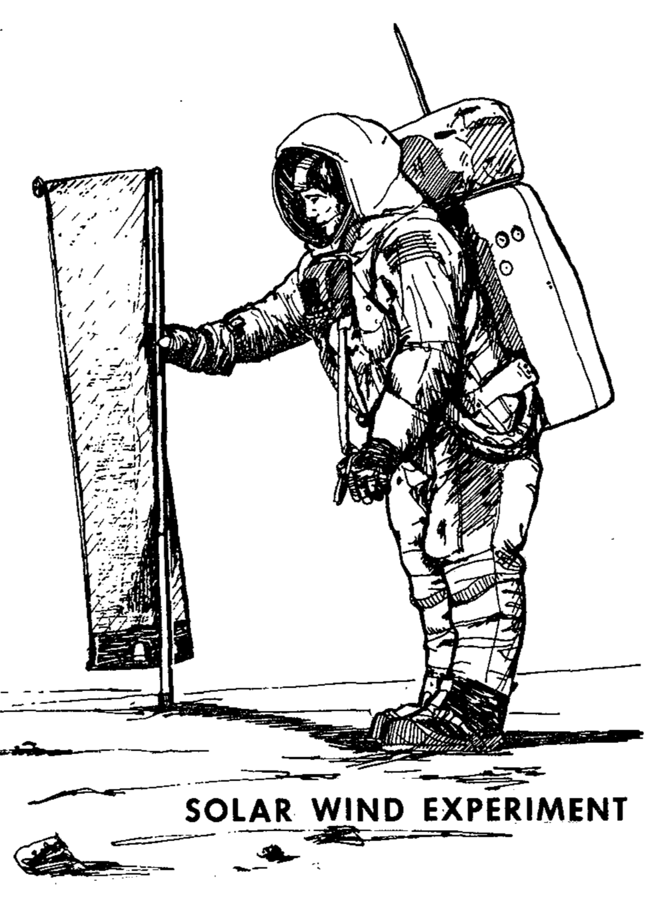

****************************************
Solar Wind Composition Experiment (SWCE)
****************************************

.. csv-table:: Solar Wind Composition Experiment (SWCE)
    :stub-columns: 1

    "Ośrodek badawczy", "University of Berne, Switzerland"
    "Misje", "Apollo 11, 12, 14, 15, 16"

Konstrukcja eksperymentu
========================

    Źródło: :cite:`Apollo12PressKit`.

Opis eksperymentu
=================
The Solar Wind Composition Experiment (SWC) was used to determine the elemental and isotopic composition of the noble gasses (helium, neon, and argon) in the solar wind. It was a simple experiment that used a sheet of 0.5 mm thick aluminium foil to trap individual particles of the solar wind to a depth of several hundred atomic layers, but allowed cosmic rays to pass through. The astronauts put the screens out on arrival and brought the foil back to Earth for analysis by Swiss scientists.

The Solar Wind Composition Experiment (SWCE), an aluminum foil panel, similar to household foil, that collected atomic particles released by the Sun into space was provided by scientists from Switzerland.  During Apollo 11 it was deployed and exposed for 1 hour 17 minutes and returned to Earth by the Apollo 11 crew for analysis by the Swiss experiment team.

* Apollo 11: exposed for 1 hour 17 minutes
* Apollo 12: exposed for 18 hours 42 minutes
* Apollo 14: exposed for 21 hours
* Apollo 15: exposed for 41 hours 8 minutes
* Apollo 16: exposed for 45 hours 5 minutes

