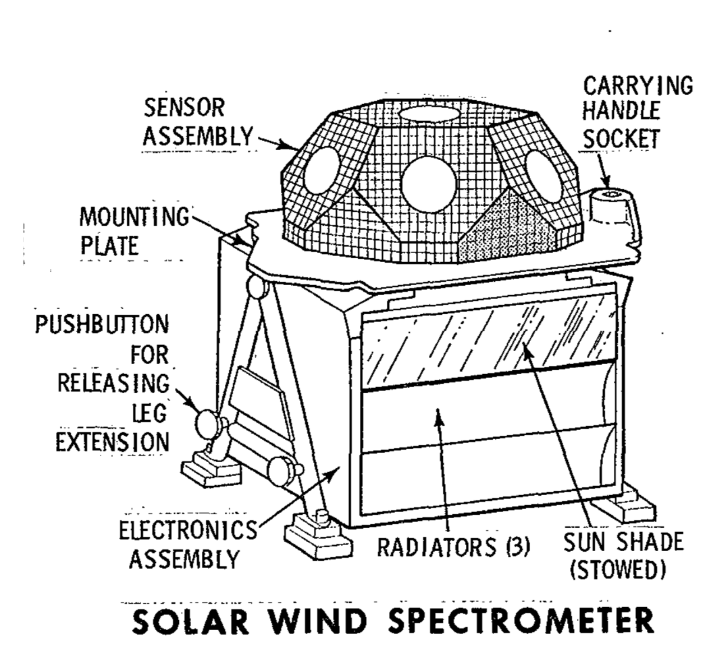
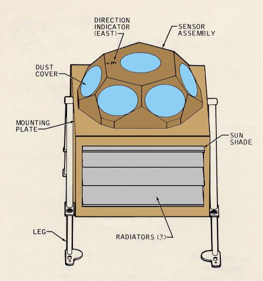
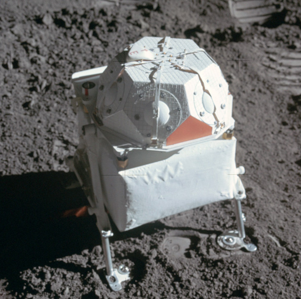

.. _Solar Wind Spectrometer:

*****************************
Solar Wind Spectrometer (SWS)
*****************************

.. csv-table:: Solar Wind Spectrometer (SWS)
    :stub-columns: 1

    "Ośrodek badawczy", "Jet Propulsion Laboratory, California"
    "Misje", "Apollo 12, 15"
    "Nazwa eksperymentu (j. ang.)", "Solar Wind Spectrometer"
    "Nazwa eksperymentu (j. pol.)", "Pomiar spektrometryczny wiatru słonecznego"

Projekt eksperymentu
====================

    Źródło: :cite:`Apollo12PressKit`.

    Diagram of the Solar Wind Spectrometer (SWS). Źródło: :cite:`Lindsay2008`.

    Detail from photo AS15-86-11593 showing the Solar Wind Spectrometer after deployment. Źródło: :cite:`Lindsay2008`.

Opis eksperymentu
=================
The solar wind is composed of matter ejected continuously from the Sun that spreads throughout the Solar System. The energy, density, direction of travel, and its variations were measured by the SWS. Seven sensors were located under dust shields, allowing a study of the solar wind at the lunar surface, the general properties of the solar wind and its interaction with the Moon. The solar wind stretches the Earth’s magnetic field out behind the Earth, beyond the Moon’s orbit, so the SWS also studied the Earth’s magnetic tail when the Moon passed through it.

The Apollo 12 SWS surprised the scientists by continuing to send data after the Sun had set. Dr Conway Snyder of JPL said, "The spectrometer didn't quit sending data – it continued to send back information on protons and even photo electrons several minutes after the Sun had stopped shining on it." He suspected the protons were sneaking around the edge of the Moon.

The SWS found the solar wind behaved the same as in free space outside the Earth’s magnetic tail and is slightly disturbed in the geomagnetic transition region. The surprise was the detection of a gas cloud from the Apollo 13 Saturn-IV impact.
