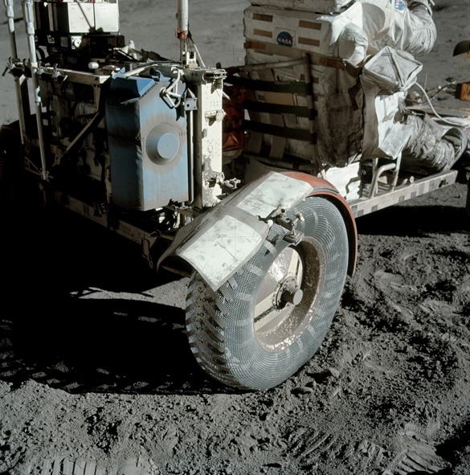

************************************
Traverse Gravimeter Experiment (TGE)
************************************

.. csv-table:: Traverse Gravimeter Experiment (TGE)
    :stub-columns: 1

    "Ośrodek badawczy", "Columbia University"
    "Misje", "Apollo 17"
    "Nazwa eksperymentu (j. ang.)", ""
    "Nazwa eksperymentu (j. pol.)", ""

Konstrukcja eksperymentu
========================

    NASA photo AS17-137-20979 shows the blue Traverse Gravitmeter Experiment (TGE) mounted on the back of the Rover. Gene Cernan took this photo to document the replacement fender just before he and Jack Schmitt (already seated at the upper right) left Apollo 17 Station 2.  At each geology station, Gene took the TGE off the back of the Rover, put it down on the surface well out of the way, got it to sit securely upright, and pushed a button to start a measurement.  He could then do other work and, at a convenient time, pushed another button to display the result.  NASA photo AS17-141-21600 shows Gene deploying the TGE on a steep slope at Station 6. Źródło: :cite:`ImageProjectApolloArchive`.

Opis eksperymentu
=================
This experiment was flown on Apollo 17 to measure variations of the gravitational acceleration resulting from sub-surface structure at the Taurus-Littrow landing site. Gravity measurements were made at 12 of the traverse stops on the three EVAs, and the results were read back to Earth by the crew. Interpretation of these observations also required knowledge of the topography of the landing site, which was obtained from analysis of stereo photography taken from lunar orbit. The results of this experiment indicated that the mare basalt layer in the vicinity of the landing site has a thickness of 1 kilometer. This value is slightly less than the 1.4 kilometers measured by the Lunar Seismic Profiling Experiment.

