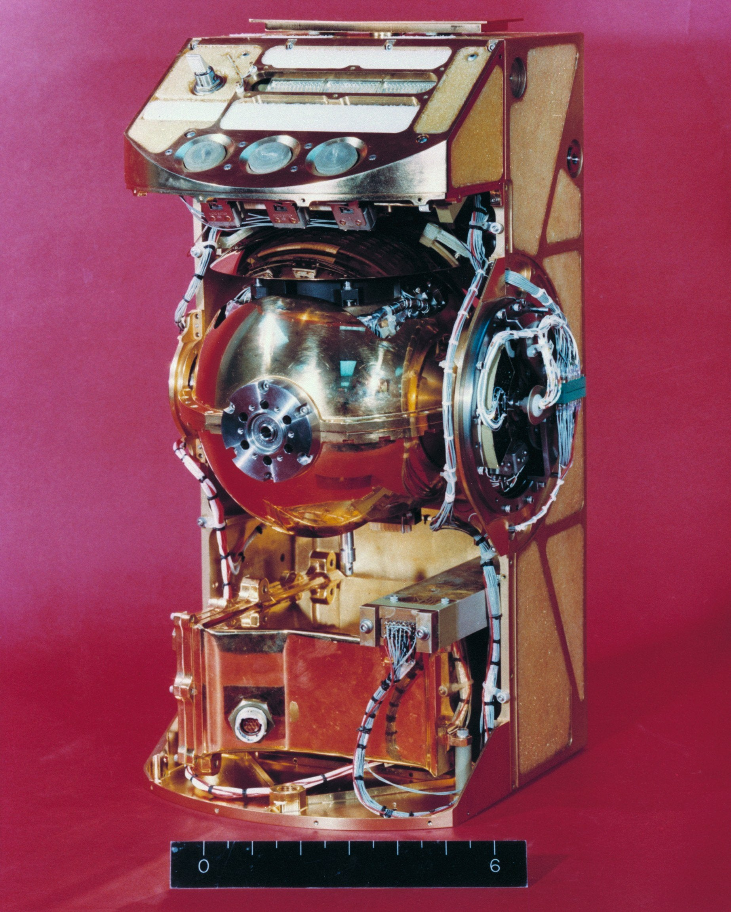

.. _Traverse Gravimeter Experiment:

************************************
Traverse Gravimeter Experiment (TGE)
************************************

.. csv-table:: Traverse Gravimeter Experiment (TGE)
    :stub-columns: 1

    "Ośrodek badawczy", "Columbia University"
    "Misje", "Apollo 17"
    "Nazwa eksperymentu (j. ang.)", "Traverse Gravimeter Experiment"
    "Nazwa eksperymentu (j. pol.)", "Trawersowy pomiar sejsmiczny"

Przedmiot badania
=================
Eksperyment :ref:`Traverse Gravimeter Experiment` został wykonany w trakcie misji :ref:`Apollo 17` w celu pomiaru wariacji przyspieszenia grawitacyjnego w skutek podpowierzchniowej struktury regionu Taurus-Littrow.

Materiały i metody
==================

    Zdjęcie przedstawia eksperyment niebieski Traverse Gravimeter Experiment (TGE) zamontowany na tylnym siedzeniu łazika :term:`LRV`. Astronauta Gene Cernan wykonał to zdjęcie w celu dokumentacji wymiany "błotnika". Źródło: NASA/AS17-137-20979 :cite:`ImageProjectApolloArchive`

    Zdjęcie przedstawia eksperyment niebieski Traverse Gravimeter Experiment (TGE).  Źródło: :cite:`ImageProjectApolloArchive`.

Przebieg eksperymentu
=====================
Pomiary grawimetryczne były wykonane w 12 miejscach pomiarowych podczas trzeciego :term:`EVA`. W każdej stacji geologicznej, Gene Cernan zdejmował :term:`TGE` z tyłu łazika i rozstawiał go na podłożu. Po ustawieniu pozycji horyzontalnej dokonywał pomiaru. Po ukończeniu pracy odczytywał wynik na wskaźniku. Wyniki były przekazane drogą radiową przez załogę na Ziemię do centrum kontroli misji.

Interpretacja wyników wymagała znajomości topografii miejsca lądowania. Dane te zostały uzyskane za pomocą stereofotografii z orbity Księżyca.

Rezultaty
=========
Analiza wyników wykazała, że warstwa morza bazaltowego znajdującego się w pobliżu miejsca lądowania ma miąższość 1 km. Wartość ta jest mniejsza niż wykazał to :ref:`Lunar Seismic Profiling Experiment`.
