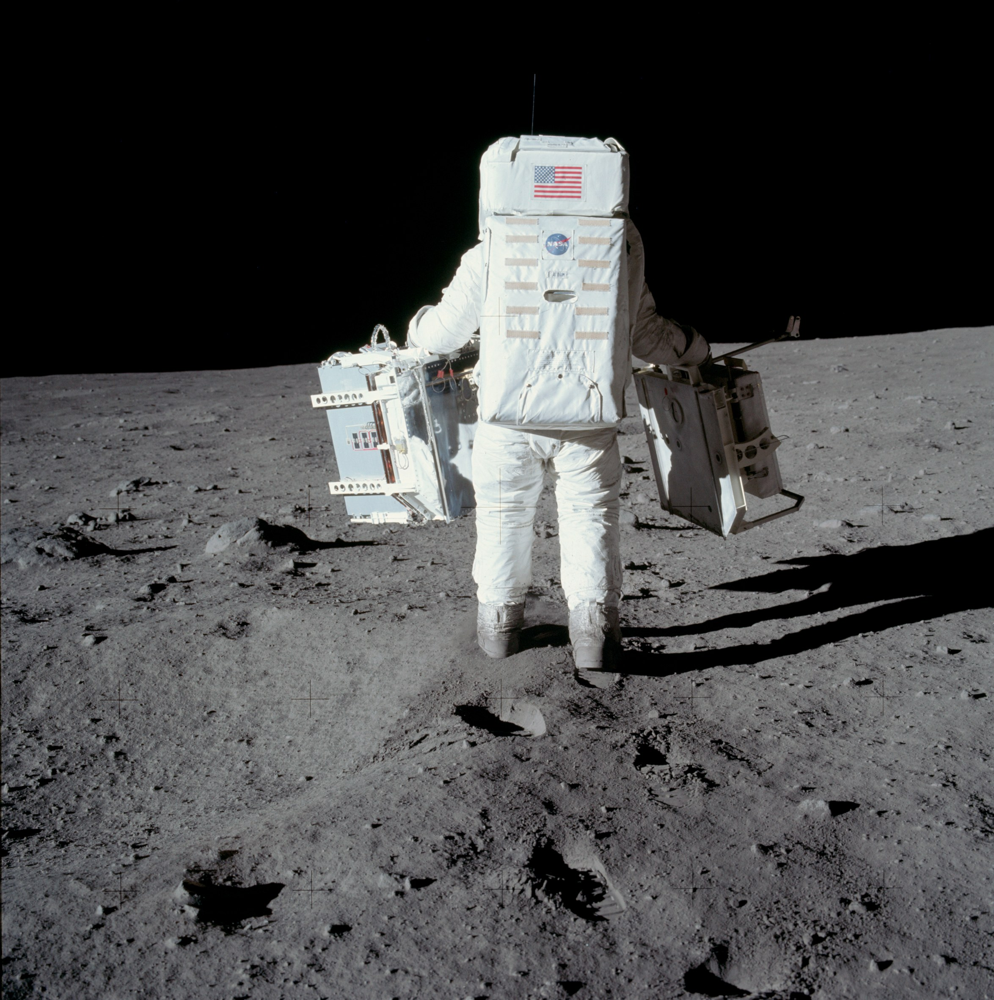
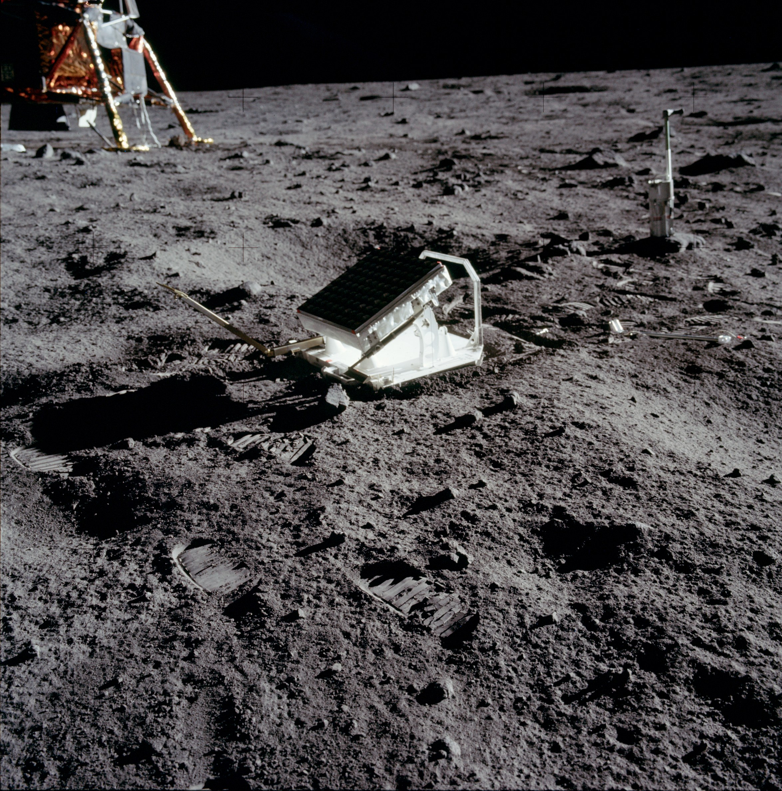
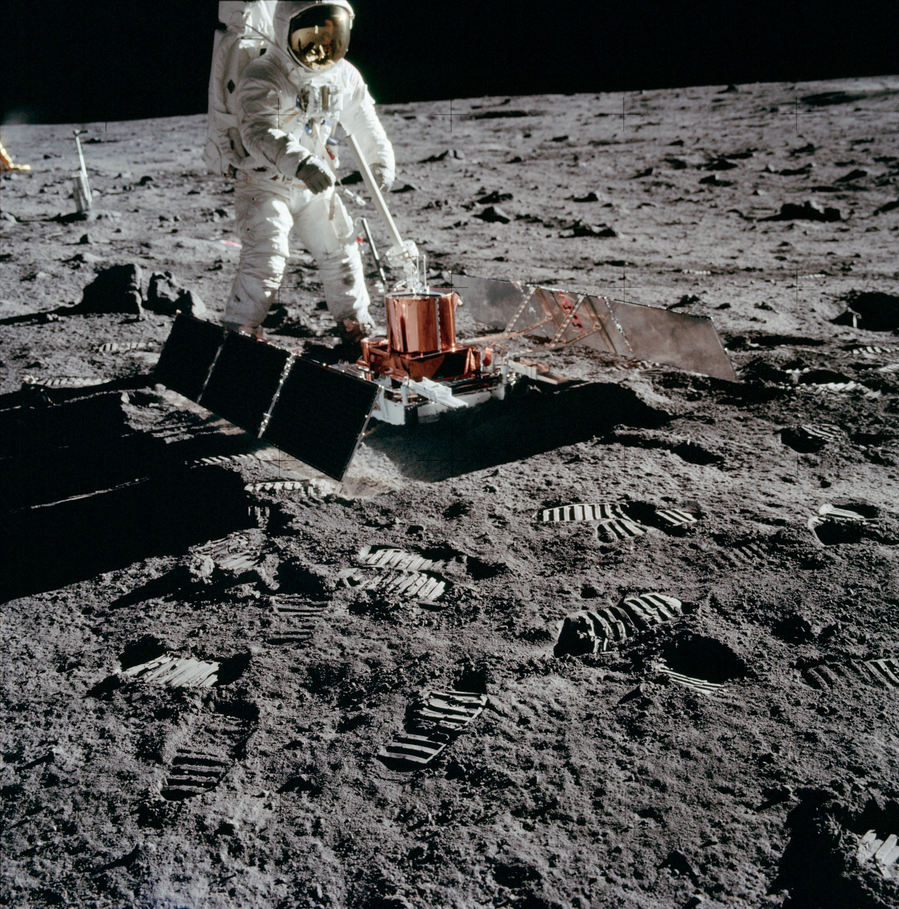

************************************************
Eksperymenty geofizyczne podczas misji Apollo 11
************************************************

Charakterystyka misji
=====================

Podstawowe informacje dotyczące misji
-------------------------------------
.. csv-table:: Wybrane informacje dotyczące parametrów misji Apollo 11.
    :stub-columns: 1
    :file: data/apollo11-info.csv

Załoga
------
.. csv-table:: Lista członków załogi głównej i zapasowej dla misji Apollo 11.
    :file: data/apollo11-crew.csv
    :header-rows: 1

.. figure:: img/apollo11-crew.jpg
    :name: figure-alsep-apollo11-crew

    Załoga misji Apollo 11. Od lewej astronauci: Armstrong, Collins, Aldrin.

Charakterystyka miejsca lądowania
---------------------------------
.. figure:: img/apollo11-map.png
    :name: figure-alsep-apollo11-map

    Mapa lokacji lądowania i rozstawienia eksperymentów naukowych podczas misji Apollo 11. Źródło: NASA/USGS/LPI/ASU

Eksploracja powierzchni Księżyca
--------------------------------
.. csv-table:: Harmonogram spacerów kosmicznych na powierzchni księżyca podczas misji Apollo 11.
    :file: data/apollo11-eva.csv
    :header-rows: 1

Lista eksperymentów
-------------------
#. Lunar Dust Detector (LDD)
#. Lunar Ranging Retro-Reflector (LRRR)
#. Passive Seismic Experiment Package (PSEP)
#. Solar Wind Composition Experiment (SWC)*

\* - Eksperyment dodatkowy, niebędący częścią EASEP

    Astronauta Buzz Aldrin w trakcie rozstawiania eksperymentów w ramach pakietu EASEP. Źródło: :cite:`ImageProjectApolloArchive`.

Przygotowanie do misji
----------------------
.. csv-table:: Obszary geograficzne na Ziemi wykorzystane podczas przeszkolenia geologicznego astronautów do misji Apollo 11.
    :file: data/apollo11-training.csv
    :header-rows: 1

Eksperymenty w ramach pakietu EASEP
===================================

Lunar Dust Detector (LDD)
-------------------------
This experiment measured the amount of dust accumulating on the lunar surface. It also measured the damage to solar cells by high-energy radiation as well as the reflected infrared energy and temperatures of the lunar surface. It consisted of three photocells mounted on the EASEP.

Lunar Ranging Retro-Reflector (LRRR)
------------------------------------
This passive experiment consisted of an array of 100 fused silica cubes on Apollo 11, arranged to reflect a beam of light back on a parallel path to its origin. The LRRR placed on the Moon was aligned precisely so that it faced the Earth. Scientists from around the world directed laser beams at the instrument which reflected them back to Earth; the elapsed time for the round trip allowed precise measurements of distances, down to an accuracy of 8 centimeters, between the Earth and the Moon. This instrument continued operating until June 1981.

Apart from accurately determining the Moon's distance from the Earth, results have shown there is considerable warping of the lunar surface as it journeys around the Earth.

These reflectors were also deployed on the Apollo 14 and 15 missions.  The Apollo 15 reflector had 300 silica cubes.

    Źródło: :cite:`ImageProjectApolloArchive`.

.. todo:: podpis dla Figure

Passive Seismic Experiment Package (PSEP)
-----------------------------------------
This instrument contained four seismometers powered by two panels of solar cells, which converted solar energy into electricity. It used three long-period seismometers and one short- period vertical seismometer for measuring meteorite impacts and moonquakes, recording about 100 to 200 hits by meteorites during its lifetime. Data regarding the strength, duration, and approximate direction of the seismic event were relayed to tracking stations on Earth. Because it was only powered by solar cells, the experiment only operated during the lunar days. During the 340 hour lunar night, when temperatures can plummet to minus 170ºC the instrument was kept to a minimum of minus 54ºC by a radioisotope heater, the first major use of nuclear energy in a NASA manned mission. Any temperature below this could damage the instrument.

At the other end of the scale the scientists tried controlling the daytime heat on the electronic components by a series of power 'dumps', cutting off the systems electrical power. Then, just before the lunar night began, the seismometer automatically shifted into stand-by mode, stopping transmission of all data. The seismic instrument package stopped responding to commands at 0400 UT August 25 1969, probably from overheating from the hot midday sun. An alternate design was flown on later missions.

    Źródło: :cite:`ImageProjectApolloArchive`.

.. todo:: podpis dla Figure

Eksperymenty poza pakietem EASEP
================================

Solar Wind Composition Experiment (SWC)
---------------------------------------
The Solar Wind Composition Experiment (SWC), an aluminum foil panel, similar to household foil, that collected atomic particles released by the Sun into space was provided by scientists from Switzerland. During Apollo 11 it was deployed and exposed for 1 hour 17 minutes and returned to Earth by the Apollo 11 crew for analysis by the Swiss experiment team.

.. figure:: img/apollo11-SWC.jpg
    :name: figure-alsep-apollo11-SWC

    Astronauta Buzz Aldrin w trakcie rozstawiania eksperymentu SWC. Źródło: Źródło: :cite:`ImageProjectApolloArchive`.
