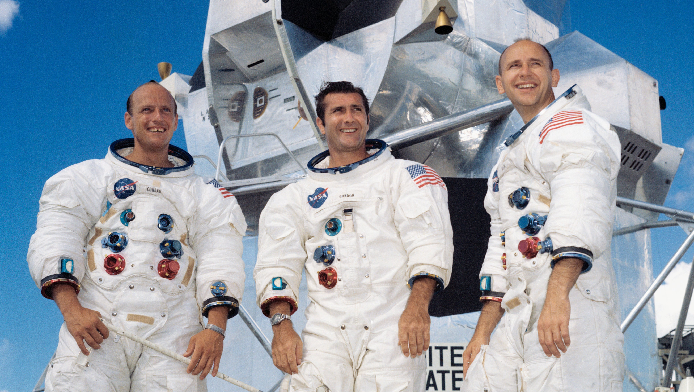
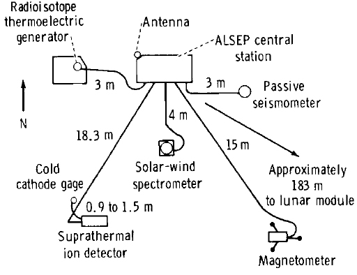
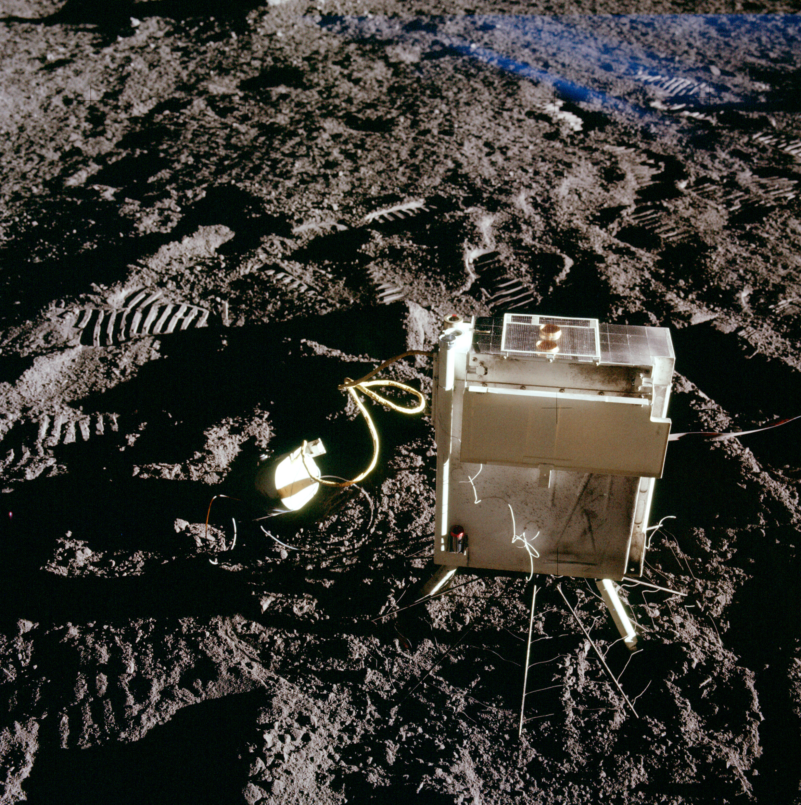
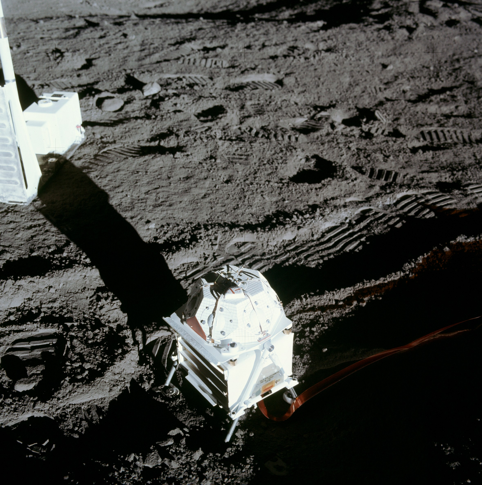

************************************************
Eksperymenty geofizyczne podczas misji Apollo 12
************************************************

Parametry misji
===============

Załoga
------
.. csv-table:: Lista członków załogi głównej i zapasowej dla misji Apollo 12.
    :file: data/apollo12-crew.csv
    :header-rows: 1

    Załoga misji Apollo 12. Od lewej astronauci: Conrad, Gordon, Bean

Parametry misji
---------------
.. csv-table:: Wybrane informacje dotyczące parametrów misji Apollo 12.
    :stub-columns: 1
    :file: data/apollo12-info.csv

.. csv-table:: Harmonogram spacerów kosmicznych na powierzchni księżyca podczas misji Apollo 12.
    :file: data/apollo12-eva.csv
    :header-rows: 1

Miejsce lądowania
-----------------
.. figure:: img/apollo12-map.png
    :name: figure-alsep-apollo12-map

    Mapa lokacji lądowania i rozstawienia eksperymentów naukowych podczas misji Apollo 12. Źródło: NASA/USGS/LPI/ASU

The central station, located 90 meters North West of the LM at 3.00942 S Latitude  23.42458 W longitude, was turned on at 1421 UT on November 19 1969 and off on September 30 1977.

    Źródło: :cite:`ImageProjectApolloArchive`.

.. todo:: podpis dla Figure

Lista eksperymentów
-------------------
#. Cold Cathode Ion Gauge (CCIG)
#. Lunar Dust Detector (LDD)
#. Lunar Surface Magnetometer (LSM)
#. Passive Seismic Experiment (PSE)
#. Suprathermal Ion Detector Experiment (SIDE)
#. Solar Wind Composition (SWC)*
#. Solar Wind Spectrometer (SWS)

\* - Eksperyment dodatkowy, niebędący częścią ALSEP

Eksperymenty w ramach pakietu ALSEP
===================================

Lunar Dust Detector (LDD)
-------------------------

Lunar Surface Magnetometer (LSM)
--------------------------------
.. figure:: img/apollo12-LSM.jpg
    :name: figure-alsep-apollo12-LSM

    Źródło: :cite:`ImageProjectApolloArchive`.

.. todo:: podpis dla Figure

Passive Seismic Experiment (PSE)
--------------------------------
.. figure:: img/apollo12-PSE.jpg
    :name: figure-alsep-apollo12-PSE

    Źródło: :cite:`ImageProjectApolloArchive`.

.. todo:: podpis dla Figure

SIDE/CCIG
---------
* Cold Cathode Ion Gauge (CCIG)
* Suprathermal Ion Detector Experiment (SIDE)

    Źródło: :cite:`ImageProjectApolloArchive`.

.. todo:: podpis dla Figure

Solar Wind Spectrometer (SWS)
-----------------------------

    Źródło: :cite:`ImageProjectApolloArchive`.

.. todo:: podpis dla Figure

Eksperymenty poza pakietem ALSEP
================================

Solar Wind Composition Experiment (SWC)
---------------------------------------
* exposed for 18 hours 42 minutes

The Solar Wind Composition Experiment (SWC), an aluminum foil panel, similar to household foil, that collected atomic particles released by the Sun into space was provided by scientists from Switzerland.  During Apollo 11 it was deployed and exposed for 1 hour 17 minutes and returned to Earth by the Apollo 11 crew for analysis by the Swiss experiment team.

