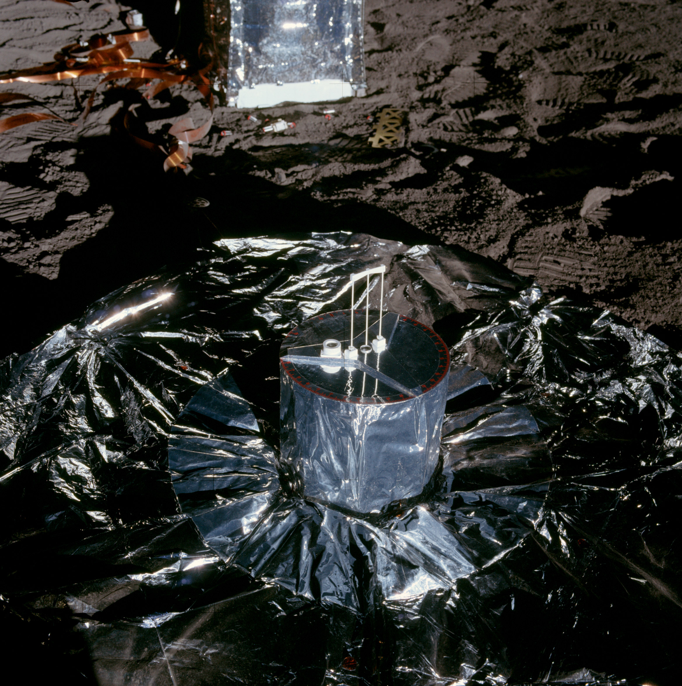

************************************************
Eksperymenty geofizyczne podczas misji Apollo 12
************************************************

Parametry misji
===============

Załoga
------

Data i czas misji
-----------------

Cel misji
---------

Miejsce lądowania
-----------------
The central station, located 90 meters North West of the LM at 3.00942 S Latitude  23.42458 W longitude, was turned on at 1421 UT on November 19 1969 and off on September 30 1977.

.. figure:: img/apollo12-setup.jpg
    :name: figure-alsep-apollo12-setup

    Źródło: :cite:`ImageProjectApolloArchive`.

.. todo:: podpis dla Figure

Lista eksperymentów
-------------------
#. Cold Cathode Ion Gauge (CCIG)
#. Lunar Dust Detector (LDD)
#. Lunar Surface Magnetometer (LSM)
#. Passive Seismic Experiment (PSE)
#. Suprathermal Ion Detector Experiment (SIDE)
#. Solar Wind Composition (SWC)*
#. Solar Wind Spectrometer (SWS)

\* - Eksperyment dodatkowy, niebędący częścią ALSEP

Eksperymenty w ramach pakietu ALSEP
===================================

Lunar Dust Detector (LDD)
-------------------------

Lunar Surface Magnetometer (LSM)
--------------------------------
.. figure:: img/apollo12-LSM.jpg
    :name: figure-alsep-apollo12-LSM

    Źródło: :cite:`ImageProjectApolloArchive`.

.. todo:: podpis dla Figure

Passive Seismic Experiment (PSE)
--------------------------------

    Źródło: :cite:`ImageProjectApolloArchive`.

.. todo:: podpis dla Figure

SIDE/CCIG
---------
* Cold Cathode Ion Gauge (CCIG)
* Suprathermal Ion Detector Experiment (SIDE)

.. figure:: img/apollo12-SIDE_CCIG.jpg
    :name: figure-alsep-apollo12-SIDE_CCIG

    Źródło: :cite:`ImageProjectApolloArchive`.

.. todo:: podpis dla Figure

Solar Wind Spectrometer (SWS)
-----------------------------
.. figure:: img/apollo12-SWS.jpg
    :name: figure-alsep-apollo12-SWS

    Źródło: :cite:`ImageProjectApolloArchive`.

.. todo:: podpis dla Figure

Eksperymenty poza pakietem ALSEP
================================

Solar Wind Composition Experiment (SWC)
---------------------------------------
* exposed for 18 hours 42 minutes

The Solar Wind Composition Experiment (SWC), an aluminum foil panel, similar to household foil, that collected atomic particles released by the Sun into space was provided by scientists from Switzerland.  During Apollo 11 it was deployed and exposed for 1 hour 17 minutes and returned to Earth by the Apollo 11 crew for analysis by the Swiss experiment team.

