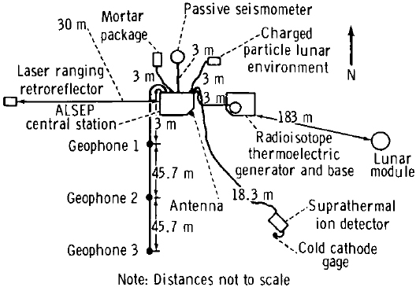
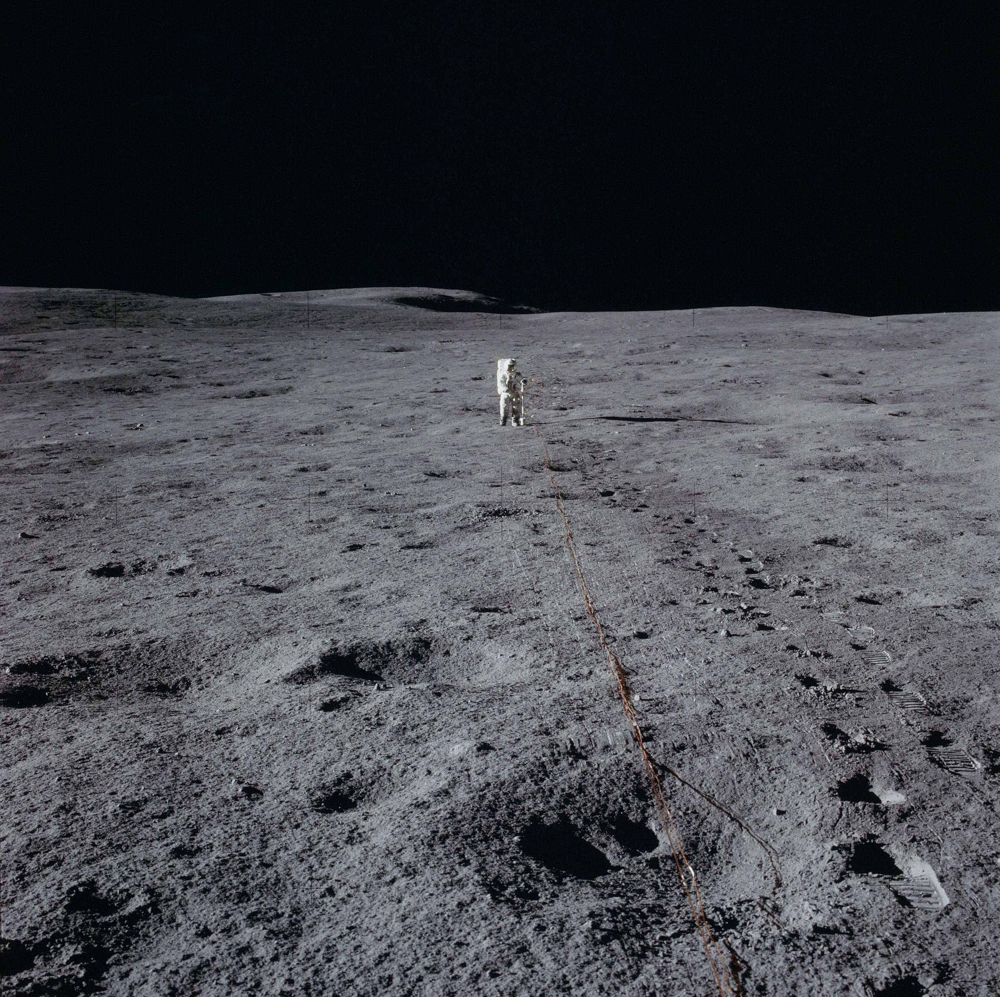
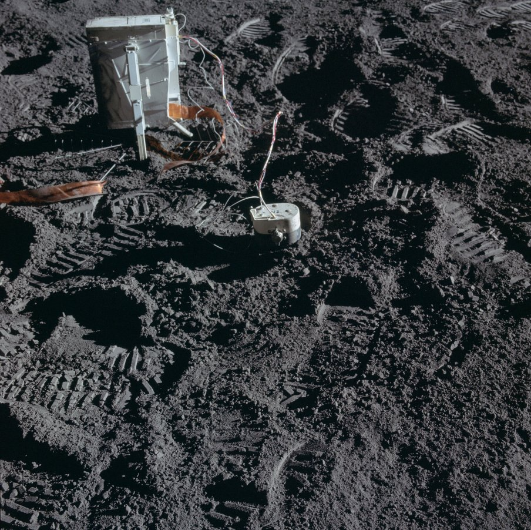

************************************************
Eksperymenty geofizyczne podczas misji Apollo 14
************************************************

Parametry misji
===============

Załoga
------

Data i czas misji
-----------------

Cel misji
---------

Miejsce lądowania
-----------------
The central station, located 180 meters West of the LM at 3.64398 S latitude, 17.47748 W longitude, was turned on at 1723 UT on February 5 1971 and failed during January 1976.

    Źródło: :cite:`ImageProjectApolloArchive`.

.. todo:: podpis dla Figure

Lista eksperymentów
-------------------
#. Active Seismic Experiment (ASE)
#. Charged Particle Lunar Environmental Experiment (CPLEE)
#. Cold Cathode Ion Gauge (CCIG)
#. Lunar Dust Detector (LDD)
#. Lunar Portable Magnetometer (LPM)*
#. Laser Ranging Retro-reflector (LRRR)*
#. Passive Seismic Experiment (PSE)
#. Suprathermal Ion Detector Experiment (SIDE)
#. Solar Wind Composition (SWC)*

\* - Eksperyment dodatkowy, niebędący częścią ALSEP

Eksperymenty w ramach pakietu ALSEP
===================================

Active Seismic Experiment (ASE)
-------------------------------
.. figure:: img/apollo14-ASE1.jpg
    :name: figure-alsep-apollo14-ASE1

    Źródło: :cite:`ImageProjectApolloArchive`.

.. todo:: podpis dla Figure

    Źródło: :cite:`ImageProjectApolloArchive`.

.. todo:: podpis dla Figure

Charged Particle Lunar Environmental Experiment (CPLEE)
-------------------------------------------------------
.. figure:: img/apollo14-CPLEE.jpg
    :name: figure-alsep-apollo14-CPLEE

    Źródło: :cite:`ImageProjectApolloArchive`.

.. todo:: podpis dla Figure

Lunar Dust Detector (LDD)
-------------------------

Passive Seismic Experiment (PSE)
--------------------------------
.. figure:: img/apollo14-PSE.jpg
    :name: figure-alsep-apollo14-PSE

    Źródło: :cite:`ImageProjectApolloArchive`.

.. todo:: podpis dla Figure

SIDE/CCIG
---------
* Cold Cathode Ion Gauge (CCIG)
* Suprathermal Ion Detector Experiment (SIDE)

    Źródło: :cite:`ImageProjectApolloArchive`.

.. todo:: podpis dla Figure

Eksperymenty poza pakietem ALSEP
================================

Lunar Portable Magnetometer (LPM)
---------------------------------
* carried on the MET

Lunar Ranging Retro-Reflector (LRRR)
------------------------------------
* with 100 fused silica cubes

This passive experiment consisted of an array of 100 fused silica cubes on Apollo 11, arranged to reflect a beam of light back on a parallel path to its origin. The LRRR placed on the Moon was aligned precisely so that it faced the Earth. Scientists from around the world directed laser beams at the instrument which reflected them back to Earth; the elapsed time for the round trip allowed precise measurements of distances, down to an accuracy of 8 centimeters, between the Earth and the Moon. This instrument continued operating until June 1981.

Apart from accurately determining the Moon's distance from the Earth, results have shown there is considerable warping of the lunar surface as it journeys around the Earth.

These reflectors were also deployed on the Apollo 14 and 15 missions.  The Apollo 15 reflector had 300 silica cubes.

.. figure:: img/apollo14-LRRR.jpg
    :name: figure-alsep-apollo14-LRRR

    Źródło: :cite:`ImageProjectApolloArchive`.

.. todo:: podpis dla Figure

Solar Wind Composition (SWC)
----------------------------
* exposed for 21 hours
