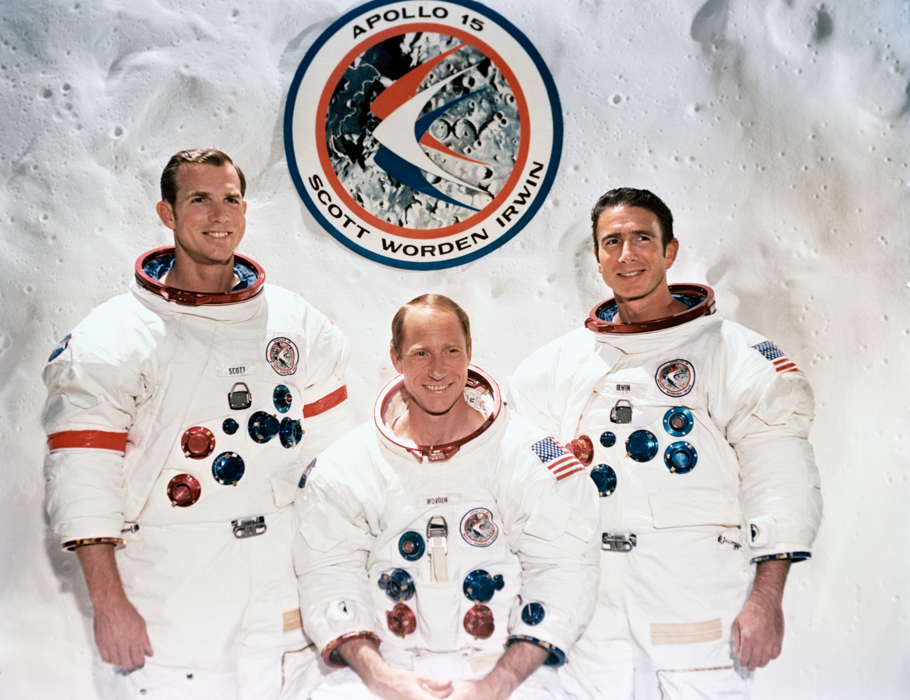

************************************************
Eksperymenty geofizyczne podczas misji Apollo 15
************************************************

Charakterystyka misji
=====================

Podstawowe informacje dotyczące misji
-------------------------------------
.. csv-table:: Wybrane informacje dotyczące parametrów misji Apollo 15 :cite:`Garber2019`, :cite:`Johnston1975`, :cite:`Orloff2000`.
    :stub-columns: 1
    :file: data/apollo15-info.csv

Załoga
------
.. csv-table:: Lista członków załogi głównej i zapasowej dla misji Apollo 15 :cite:`Johnston1975`.
    :file: data/apollo15-crew.csv
    :header-rows: 1

    Załoga misji Apollo 15. Od lewej astronauci: Scott, Worden, Irwin

Charakterystyka miejsca lądowania
---------------------------------
The central station, located 125 meters North West of the LM at 26.13407 N latitude, 3.62981 E longitude, was turned on at 1837 UT on July 31 1971 and shut down on September 30 1977.
:cite:`Lindsay2008`

.. figure:: img/apollo15-map.png
    :name: figure-alsep-apollo15-map

    Mapa lokacji lądowania i rozstawienia eksperymentów naukowych podczas misji Apollo 15. Źródło: NASA/USGS/LPI/ASU

Eksploracja powierzchni Księżyca
--------------------------------
.. csv-table:: Harmonogram spacerów kosmicznych na powierzchni księżyca podczas misji Apollo 15 :cite:`LPI2019`.
    :file: data/apollo15-eva.csv
    :header-rows: 1

Lista eksperymentów
-------------------
#. Cold Cathode Ion Gauge (CCIG)
#. Heat Flow Experiment (HFE)
#. Lunar Dust Detector (LDD)
#. Laser Ranging Retro-Reflector (LRRR)*
#. Lunar Surface Magnetometer (LSM)
#. Passive Seismic Experiment (PSE)
#. Suprathermal Ion Detector Experiment (SIDE)
#. Solar Wind Composition (SWC)*

\* - Eksperyment dodatkowy, niebędący częścią ALSEP

:cite:`Lindsay2008` :cite:`Meyer2009`, :cite:`LPI2019`

.. figure:: img/apollo15-setup.jpg
    :name: figure-alsep-apollo15-setup

    Źródło: :cite:`ImageProjectApolloArchive`.

.. todo:: podpis dla Figure

Przygotowanie do misji
----------------------
.. csv-table:: Obszary geograficzne na Ziemi wykorzystane podczas przeszkolenia geologicznego astronautów do misji Apollo 15.
    :file: data/apollo15-training.csv
    :header-rows: 1

Eksperymenty w ramach pakietu ALSEP
===================================

Heat Flow Experiment (HFE)
--------------------------
.. figure:: img/apollo15-HFE.jpg
    :name: figure-alsep-apollo15-HFE

    Źródło: :cite:`ImageProjectApolloArchive`.

.. todo:: podpis dla Figure

Lunar Dust Detector (LDD)
-------------------------

Lunar Surface Magnetometer (LSM)
--------------------------------
* Commanded OFF on 15 June 1974

.. figure:: img/apollo15-LSM.jpg
    :name: figure-alsep-apollo15-LSM

    Źródło: :cite:`ImageProjectApolloArchive`.

.. todo:: podpis dla Figure

Passive Seismic Experiment (PSE)
--------------------------------
.. figure:: img/apollo15-PSE.jpg
    :name: figure-alsep-apollo15-PSE

.. todo:: podpis dla Figure

SIDE/CCIG
---------
* Cold Cathode Ion Gauge (CCIG)
* Suprathermal Ion Detector Experiment (SIDE)

.. figure:: img/apollo15-SIDE_CCIG.jpg
    :name: figure-alsep-apollo15-SIDE_CCIG

    Źródło: :cite:`ImageProjectApolloArchive`.

.. todo:: podpis dla Figure

SWS
---
.. figure:: img/apollo15-SWS.jpg
    :name: figure-alsep-apollo15-SWS

    Źródło: :cite:`ImageProjectApolloArchive`.

.. todo:: podpis dla Figure

Eksperymenty poza pakietem ALSEP
================================

Lunar Ranging Retro-Reflector (LRRR)
------------------------------------
* with 300 fused silica cubes

This passive experiment consisted of an array of 100 fused silica cubes on Apollo 11, arranged to reflect a beam of light back on a parallel path to its origin. The LRRR placed on the Moon was aligned precisely so that it faced the Earth. Scientists from around the world directed laser beams at the instrument which reflected them back to Earth; the elapsed time for the round trip allowed precise measurements of distances, down to an accuracy of 8 centimeters, between the Earth and the Moon. This instrument continued operating until June 1981.

Apart from accurately determining the Moon's distance from the Earth, results have shown there is considerable warping of the lunar surface as it journeys around the Earth.

These reflectors were also deployed on the Apollo 14 and 15 missions.  The Apollo 15 reflector had 300 silica cubes.

.. figure:: img/apollo15-LRRR.jpg
    :name: figure-alsep-apollo15-LRRR

    Źródło: :cite:`ImageProjectApolloArchive`.

.. todo:: podpis dla Figure

Solar Wind Composition Experiment (SWC)
---------------------------------------
* exposed for 41 hours 8 minutes

The Solar Wind Composition Experiment (SWC), an aluminum foil panel, similar to household foil, that collected atomic particles released by the Sun into space was provided by scientists from Switzerland.  During Apollo 11 it was deployed and exposed for 1 hour 17 minutes and returned to Earth by the Apollo 11 crew for analysis by the Swiss experiment team.

