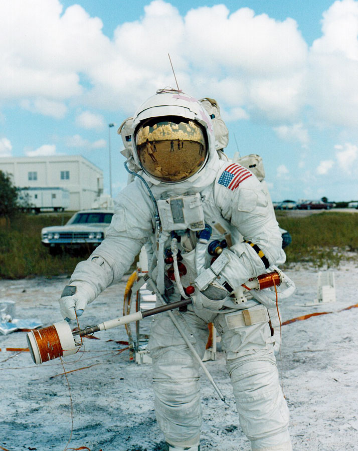
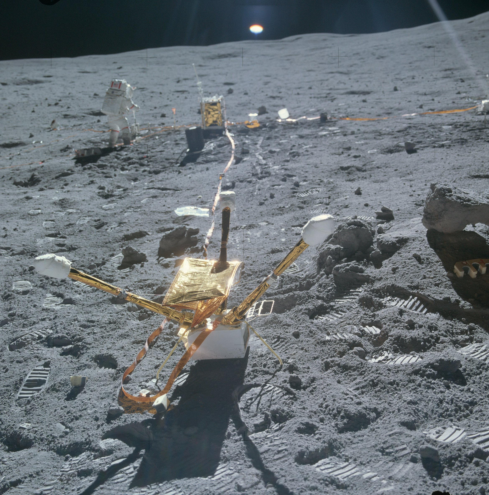
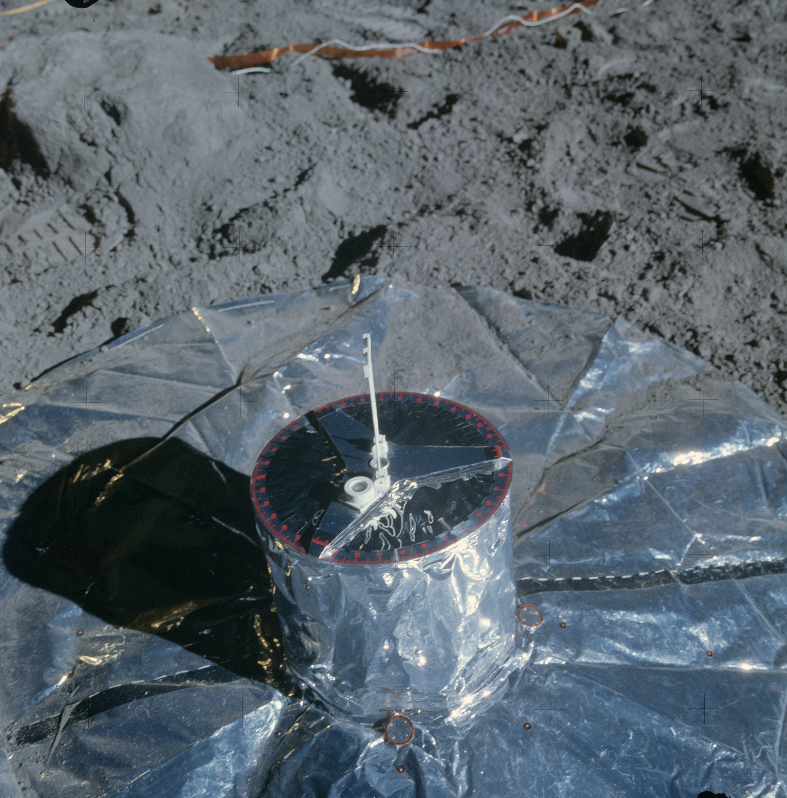

************************************************
Eksperymenty geofizyczne podczas misji Apollo 16
************************************************

Parametry misji
===============

Załoga
------

Data i czas misji
-----------------

Cel misji
---------

Miejsce lądowania
-----------------
The central station, located 100 meters West South West of the Lunar Module at 8.97537 S latitude, 15.49812 E longitude, was turned on at 1938 UT on April 211972 and shut down along with the other ALSEP stations on September 30 1977.

    Źródło: :cite:`ImageProjectApolloArchive`.

.. todo:: podpis dla Figure

Lista eksperymentów
-------------------
#. Active Seismic Experiment (ASE)
#. Cosmic Ray Detector (CRD)*
#. Heat Flow Experiment (HFE)
#. Lunar Portable Magnetometer (LPM)*
#. Lunar Surface Magnetometer (LSM)
#. Passive Seismic Experiment (PSE)
#. Solar Wind Composition (SWC)*

\* - Eksperyment dodatkowy, niebędący częścią ALSEP

Eksperymenty w ramach pakietu ALSEP
===================================

Active Seismic Experiment (ASE)
-------------------------------
.. figure:: img/apollo16-ASE1.jpg
    :name: figure-alsep-apollo16-ASE1

    Źródło: :cite:`ImageProjectApolloArchive`.

.. todo:: podpis dla Figure

    Źródło: :cite:`ImageProjectApolloArchive`.

.. todo:: podpis dla Figure

Heat Flow Experiment (HFE)
--------------------------
.. figure:: img/apollo16-HFE.jpg
    :name: figure-alsep-apollo16-HFE

    Źródło: :cite:`ImageProjectApolloArchive`.

.. todo:: podpis dla Figure

Lunar Surface Magnetometer (LSM)
--------------------------------

    Źródło: :cite:`ImageProjectApolloArchive`.

.. todo:: podpis dla Figure

Passive Seismic Experiment (PSE)
--------------------------------

    Źródło: :cite:`ImageProjectApolloArchive`.

.. todo:: podpis dla Figure

Eksperymenty poza pakietem ALSEP
================================

Cosmic Ray Detector (CRD)
-------------------------

Lunar Portable Magnetometer (LPM)
---------------------------------

Solar Wind Composition Experiment (SWC)
---------------------------------------
* exposed for 45 hours 5 minutes

The Solar Wind Composition Experiment (SWC), an aluminum foil panel, similar to household foil, that collected atomic particles released by the Sun into space was provided by scientists from Switzerland.  During Apollo 11 it was deployed and exposed for 1 hour 17 minutes and returned to Earth by the Apollo 11 crew for analysis by the Swiss experiment team.
