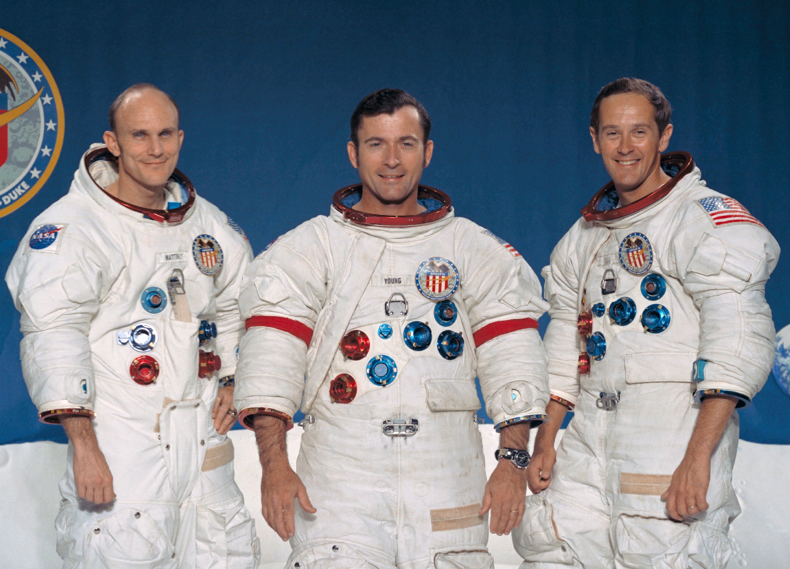

************************************************
Eksperymenty geofizyczne podczas misji Apollo 16
************************************************

Charakterystyka misji
=====================

Podstawowe informacje dotyczące misji
-------------------------------------
.. csv-table:: Wybrane informacje dotyczące parametrów misji Apollo 16.
    :stub-columns: 1
    :file: data/apollo16-info.csv

Załoga
------
.. csv-table:: Lista członków załogi głównej i zapasowej dla misji Apollo 16.
    :file: data/apollo16-crew.csv
    :header-rows: 1

    Załoga misji Apollo 16. Od lewej astronauci: Mattingly, Young, Duke

Charakterystyka miejsca lądowania
---------------------------------
The central station, located 100 meters West South West of the Lunar Module at 8.97537 S latitude, 15.49812 E longitude, was turned on at 1938 UT on April 211972 and shut down along with the other ALSEP stations on September 30 1977.

.. figure:: img/apollo16-map.png
    :name: figure-alsep-apollo16-map

    Mapa lokacji lądowania i rozstawienia eksperymentów naukowych podczas misji Apollo 16. Źródło: NASA/USGS/LPI/ASU

Eksploracja powierzchni Księżyca
--------------------------------
.. csv-table:: Harmonogram spacerów kosmicznych na powierzchni księżyca podczas misji Apollo 16.
    :file: data/apollo16-eva.csv
    :header-rows: 1

Lista eksperymentów
-------------------
#. Active Seismic Experiment (ASE)
#. Cosmic Ray Detector (CRD)*
#. Heat Flow Experiment (HFE)
#. Lunar Portable Magnetometer (LPM)*
#. Lunar Surface Magnetometer (LSM)
#. Passive Seismic Experiment (PSE)
#. Solar Wind Composition (SWC)*

\* - Eksperyment dodatkowy, niebędący częścią ALSEP

    Źródło: :cite:`ImageProjectApolloArchive`.

.. todo:: podpis dla Figure

Przygotowanie do misji
----------------------
.. csv-table:: Obszary geograficzne na Ziemi wykorzystane podczas przeszkolenia geologicznego astronautów do misji Apollo 16.
    :file: data/apollo16-training.csv
    :header-rows: 1

Eksperymenty w ramach pakietu ALSEP
===================================

Active Seismic Experiment (ASE)
-------------------------------
.. figure:: img/apollo16-ASE1.jpg
    :name: figure-alsep-apollo16-ASE1

    Źródło: :cite:`ImageProjectApolloArchive`.

.. todo:: podpis dla Figure

.. figure:: img/apollo16-ASE2.jpg
    :name: figure-alsep-apollo16-ASE2

    Źródło: :cite:`ImageProjectApolloArchive`.

.. todo:: podpis dla Figure

Heat Flow Experiment (HFE)
--------------------------
.. figure:: img/apollo16-HFE.jpg
    :name: figure-alsep-apollo16-HFE

    Źródło: :cite:`ImageProjectApolloArchive`.

.. todo:: podpis dla Figure

Lunar Surface Magnetometer (LSM)
--------------------------------
.. figure:: img/apollo16-LSM.jpg
    :name: figure-alsep-apollo16-LSM

    Źródło: :cite:`ImageProjectApolloArchive`.

.. todo:: podpis dla Figure

Passive Seismic Experiment (PSE)
--------------------------------
.. figure:: img/apollo16-PSE.jpg
    :name: figure-alsep-apollo16-PSE

    Źródło: :cite:`ImageProjectApolloArchive`.

.. todo:: podpis dla Figure

Eksperymenty poza pakietem ALSEP
================================

Cosmic Ray Detector (CRD)
-------------------------

Lunar Portable Magnetometer (LPM)
---------------------------------

Solar Wind Composition Experiment (SWC)
---------------------------------------
* exposed for 45 hours 5 minutes

The Solar Wind Composition Experiment (SWC), an aluminum foil panel, similar to household foil, that collected atomic particles released by the Sun into space was provided by scientists from Switzerland.  During Apollo 11 it was deployed and exposed for 1 hour 17 minutes and returned to Earth by the Apollo 11 crew for analysis by the Swiss experiment team.
