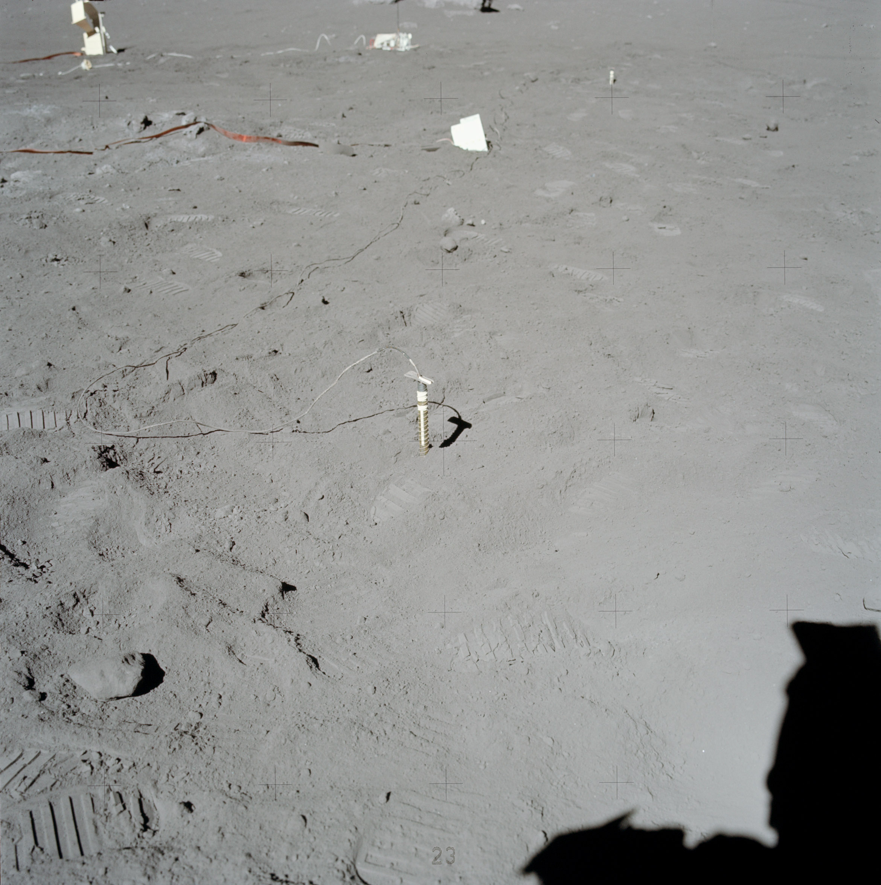

************************************************
Eksperymenty geofizyczne podczas misji Apollo 17
************************************************

Parametry misji
===============

Załoga
------

Data i czas misji
-----------------

Cel misji
---------

Miejsce lądowania
-----------------
The central station, located 185 meters West North West of the LM at 20.19209 N latitude, 30.76492 E longitude, was turned on at 0253 UT on December 12 1972 and shut down along with the other ALSEP stations on September 30 1977.

    Źródło: :cite:`ImageProjectApolloArchive`.

.. todo:: podpis dla Figure

.. figure:: img/apollo17-site.jpg
    :name: figure-alsep-apollo17-site

    Źródło: :cite:`ImageProjectApolloArchive`.

.. todo:: podpis dla Figure

Lista eksperymentów
-------------------
#. Cosmic Ray Detector (CRD)*
#. Heat Flow Experiment (HFE)
#. Lunar Atmospheric Composition Experiment (LACE)
#. Lunar Ejecta and Meteorite Experiment (LEAM)
#. Lunar Surface Gravimeter Experiment (LSG)
#. Lunar Seismic Profiling Experiment (LSPE)
#. Neutron Probe*
#. Surface Electrical Properties (SEP)*
#. Traverse Gravimeter Experiment (TGE)*

\* - Eksperyment dodatkowy, niebędący częścią ALSEP

Eksperymenty w ramach pakietu ALSEP
===================================

Heat Flow Experiment (HFE)
--------------------------

    Źródło: :cite:`ImageProjectApolloArchive`.

.. todo:: podpis dla Figure

Lunar Atmospheric Composition Experiment (LACE)
-----------------------------------------------

    Źródło: :cite:`ImageProjectApolloArchive`.

.. todo:: podpis dla Figure

Lunar Ejecta and Meteorite Experiment (LEAM)
--------------------------------------------
.. figure:: img/apollo17-LEAM.jpg
    :name: figure-alsep-apollo17-LEAM

    Źródło: :cite:`ImageProjectApolloArchive`.

.. todo:: podpis dla Figure

Lunar Surface Gravimeter Experiment (LSG)
-----------------------------------------

    Źródło: :cite:`ImageProjectApolloArchive`.

.. todo:: podpis dla Figure

Lunar Seismic Profiling Experiment (LSPE)
-----------------------------------------
.. figure:: img/apollo17-LSPE1.jpg
    :name: figure-alsep-apollo17-LSPE1

    Źródło: :cite:`ImageProjectApolloArchive`.

.. todo:: podpis dla Figure

    Źródło: :cite:`ImageProjectApolloArchive`.

.. todo:: podpis dla Figure

.. figure:: img/apollo17-LSPE3.jpg
    :name: figure-alsep-apollo17-LSPE3

    Źródło: :cite:`ImageProjectApolloArchive`.

.. todo:: podpis dla Figure

Eksperymenty poza pakietem ALSEP
================================

Cosmic Ray Detector (CRD)
-------------------------

Traverse Gravimeter Experiment (TGE)
------------------------------------

Neutron Probe
-------------

Surface Electrical Properties (SEP)
-----------------------------------
