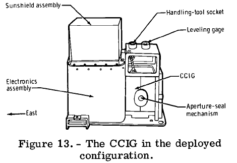
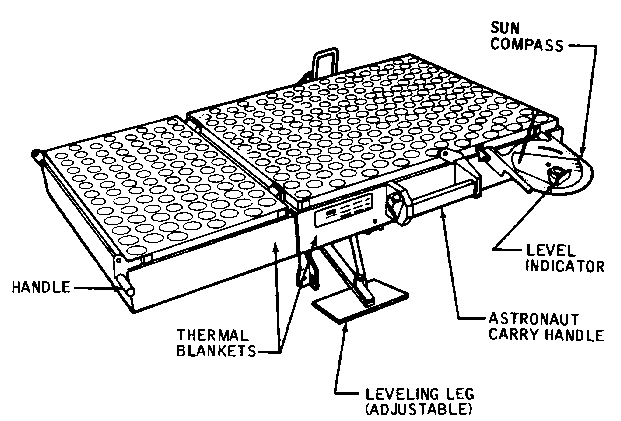

****************
O pakiecie ALSEP
****************

The ALSEP program cost NASA an estimated $US200 million, including the design and development of the stations and experiments, support engineering work in Houston, and the analysis of the data by dozens of University laboratories around the world. It cost NASA $US2 million a year to operate.

When funding for the technical and scientific support ran out, all five ALSEP stations were officially shut down on September 30 1977, after more than 153,000 commands were transmitted to them, and more than one trillion bits of science data were received on Earth. Although the experiments were turned off, the transmitters continued to send carrier signals which were used by various institutions, including the Jet Propulsion Laboratory, for geodetic and astrometric studies, and spacecraft navigation.

Transport
=========
.. figure:: img/alsep-SEQ.jpg

Opis Eksperymentów
==================
.. figure:: img/alsep-ASE.png

.. figure:: img/alsep-central-station.jpg

.. figure:: img/alsep-LEAM.gif
.. figure:: img/alsep-LRRR1.gif

.. figure:: img/alsep-LSG.gif
.. figure:: img/alsep-LSM.png
.. figure:: img/alsep-LSPE1.gif
.. figure:: img/alsep-LSPE2.jpg

.. figure:: img/alsep-RTG2.jpg

