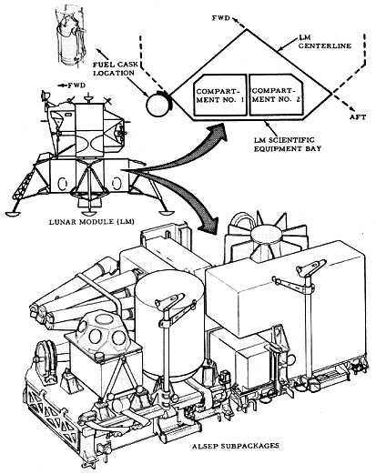
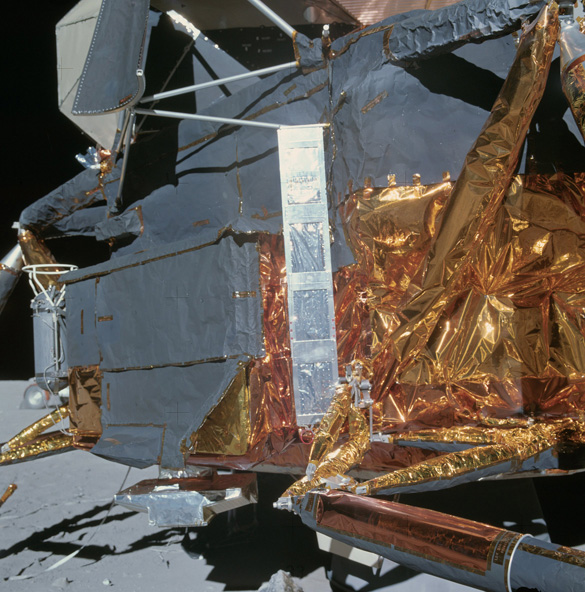
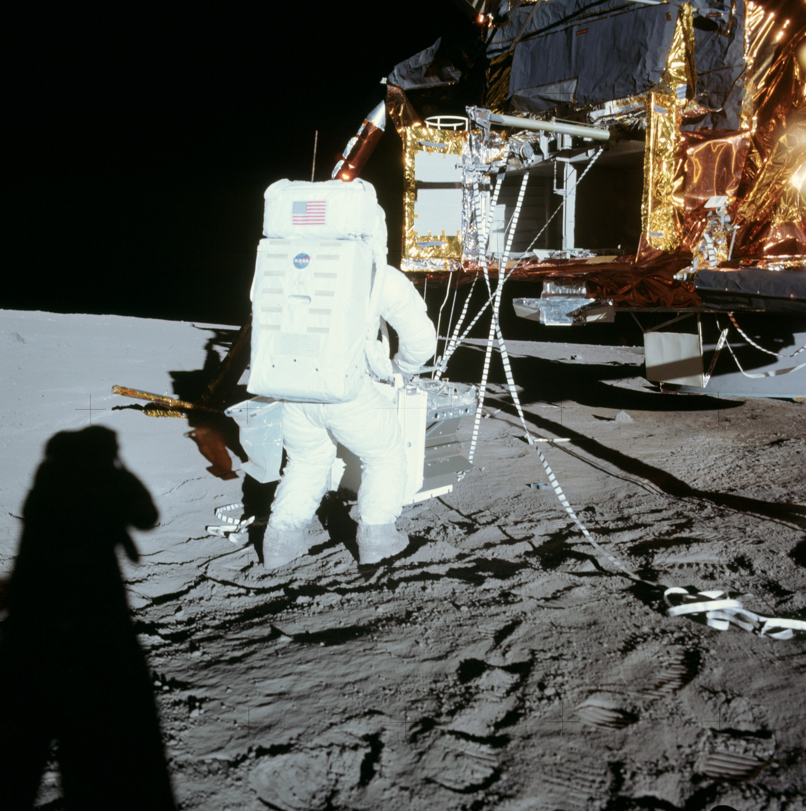

****************
O pakiecie ALSEP
****************

Księżyc bombardowany jest wiatrem słonecznych, który składa się z naładowanych cząstek, w większości protonów i elektronów emanujących ze Słońca. Wiatr niesie ze sobą również międzyplanetarne pole magnetyczne :cite:`Apollo12PressKit`.

Planeta Ziemia otoczona jest polem magnetycznym, które chroni ją przed bezpośrednim wypływem strumienia wysokoenergetycznych cząstek. Księżyc, ma zaniedbywalne pole magnetyczne. Z tego względu powierzchnia Księżyca narażona jest na wpływ szkodliwego promieniowania :cite:`Apollo12PressKit`.

Eksperymenty z pakietu Apollo Lunar Surface Experiments Package (ALSEP) były przeznaczone do zbadania szkodliwego wpływu wiatru słonecznego, powierzchni księżyca oraz sejsmiki Księżyca. Część eksperymentów była zaprojektowana aby mierzyć i przesyłać informacje po opuszczeniu powierzchni przez astronautów.

Program ALSEP kosztował 200 mln. USD, wliczając w to zaprojektowanie oraz wytworzenie stacji centralnych, eksperymentów, wsparcia inżynieryjnego w Houston i analizy danych przez laboratoria w USA i na świecie. Koszt operacyjny utrzymania infrastruktury zdalnego wykonywania eksperymentów wynosił 2 mln. USD rocznie. Ceny podane wg. wartości amerykańskiego dolara lat 1969-1972 :cite:`Lindsay2008`.

Program ALSEP został zamknięty wraz z wyczepianiem budżetu projektu 30 września 1977 roku. W trakcie całego okresu zostało wysłanych 153 tys. poleceń i otrzymano około tryliona bitów informacji naukowych. Mimo wyłączenia infrastruktury naziemnej, część eksperymentów pasywnie emitowała informacje za pośrednictwem fal radiowych. Dane te były przechwytywane i wykorzystywane przez różne instytucje tj. Jet Propulsion Laboratory w celu opracowywania pomiarów geodezyjnych, astrometrycznych oraz nawigacji statków kosmicznych :cite:`Lindsay2008`.

Nazwa
=====
* Early Apollo Surface Experiments Package (EASEP)
* Apollo Lunar Surface Experiments Package (ALSEP)

Transport
=========

    Źródło: :cite:`Knudson2013`

Scientific Equipment Bay (SEQ)
------------------------------

    Photo AS16-113-18335 shows the dark grey doors of the Scientific Equipment Bay (SEQ) to the left of center, with a silver-colored, cosmic ray detector panel to the right of the doors and the protective cask  for the RTG plutonium fuel element beyound the doors on the far left.  A lanyard was used to pull the  main door up and out of the way, revealing side doors which could be opened by hand. Źródło: :cite:`Lindsay2008`.

    Alan Bean has just offloaded Apollo 12 ALSEP package No. 2 from the SEQ Bay using a retractable boom, pulleys, and cables. Cooling fins on the RTG can be seen just to the right of Alan's right knee. Photo AS12-46-6783. Źródło: :cite:`Lindsay2008`.
