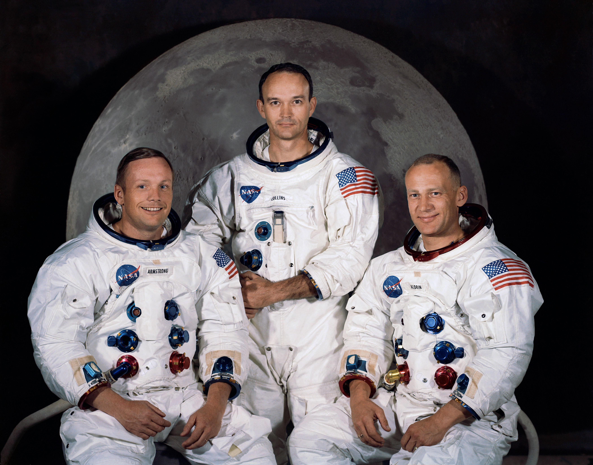

***************
Misja Apollo 11
***************

Charakterystyka misji
=====================

Celem misji Apollo 11 było pierwsze załogowe lądowanie na powierzchni Księżyca. Podczas misji postawiono pierwsze kroki na powierzchni, zatknięto flagę USA oraz pozostawiono tabliczkę:

    Here Men From Planet Earth First Set Foot Upon the Moon. July 1969 A.D. We Came In Peace For All Mankind.

    W tym oto miejscu ludzie z planety Ziemia postawili po raz pierwszy stopę na Księżycu. Lipiec roku 1969 A.D. Przybyliśmy w pokoju w imieniu całej ludzkości.

Astronauta Neil Armstrong zaraz po zejściu na powierzchnię pobrał tzw. "próbkę bezpieczeństwa" (ang. *Contingency Sample*). Był to mały odłamek skalny, pobrany na wypadek konieczności szybkiego powrotu na Ziemię. Podczas misji Apollo 11 celem nie były eksperymenty naukowe, chociaż pobrano próbki gruntu i przeprowadzono eksperymenty geofizyczne.

Podstawowe informacje dotyczące misji
-------------------------------------
.. csv-table:: Wybrane informacje dotyczące parametrów misji Apollo 11 :cite:`Garber2019`, :cite:`Johnston1975`, :cite:`Orloff2000`.
    :stub-columns: 1
    :file: data/apollo11-info.csv

Załoga
------
.. csv-table:: Lista członków załogi głównej i zapasowej dla misji Apollo 11 :cite:`Johnston1975`, :cite:`Lindsay2008`.
    :file: data/apollo11-crew.csv
    :header-rows: 1

    Załoga misji Apollo 11. Od lewej astronauci: Armstrong, Collins, Aldrin. Źródło: :cite:`Lindsay2008`.

Miejsce lądowania
-----------------
.. figure:: img/apollo11-map.png
    :name: figure-apollo11-map

    Mapa lokacji lądowania i rozstawienia eksperymentów naukowych podczas misji Apollo 11. Źródło: NASA/USGS/LPI/ASU

Eksploracja powierzchni Księżyca
--------------------------------
.. csv-table:: Harmonogram spacerów kosmicznych na powierzchni księżyca podczas misji Apollo 11 :cite:`LPI2019`.
    :file: data/apollo11-eva.csv
    :header-rows: 1

Lista eksperymentów
-------------------
#. Lunar Dust Detector (LDD)
#. Lunar Ranging Retro-Reflector (LRRR)
#. Passive Seismic Experiment Package (PSEP)
#. Solar Wind Composition Experiment (SWCE)*

\* - Eksperyment dodatkowy, niebędący częścią EASEP

:cite:`Lindsay2008` :cite:`Meyer2009`, :cite:`LPI2019`

.. figure:: img/apollo11-setup.jpg
    :name: figure-apollo11-setup

    Astronauta Buzz Aldrin w trakcie rozstawiania eksperymentów w ramach pakietu EASEP. Źródło: :cite:`ImageProjectApolloArchive`.

Przygotowanie do misji
----------------------
.. csv-table:: Obszary geograficzne na Ziemi wykorzystane podczas przeszkolenia geologicznego astronautów do misji Apollo 11.
    :file: data/apollo11-training.csv
    :header-rows: 1

Eksperymenty wykonane podczas misji
===================================

Lunar Dust Detector (LDD)
-------------------------

Lunar Ranging Retro-Reflector (LRRR)
------------------------------------
.. figure:: img/apollo11-LRRR.jpg
    :name: figure-apollo11-LRRR

    Źródło: :cite:`ImageProjectApolloArchive`.

Passive Seismic Experiment Package (PSEP)
-----------------------------------------
.. figure:: img/apollo11-PSEP.jpg
    :name: figure-apollo11-PSEP

    Źródło: :cite:`ImageProjectApolloArchive`.

Solar Wind Composition Experiment (SWCE)
----------------------------------------

    Astronauta Buzz Aldrin w trakcie rozstawiania eksperymentu SWCE. Źródło: Źródło: :cite:`ImageProjectApolloArchive`.
