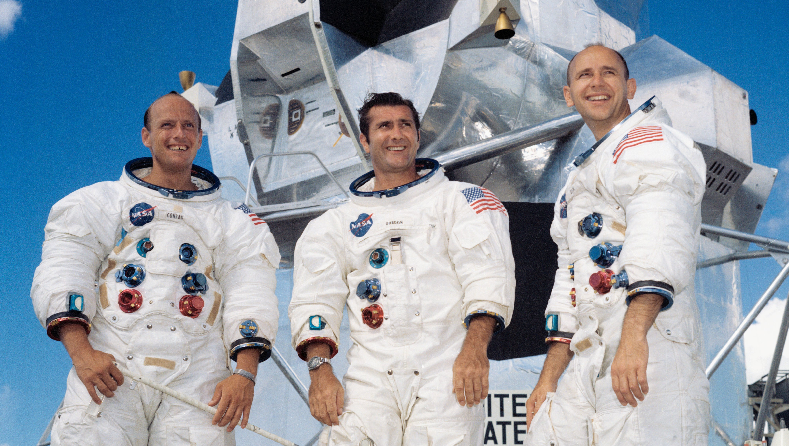
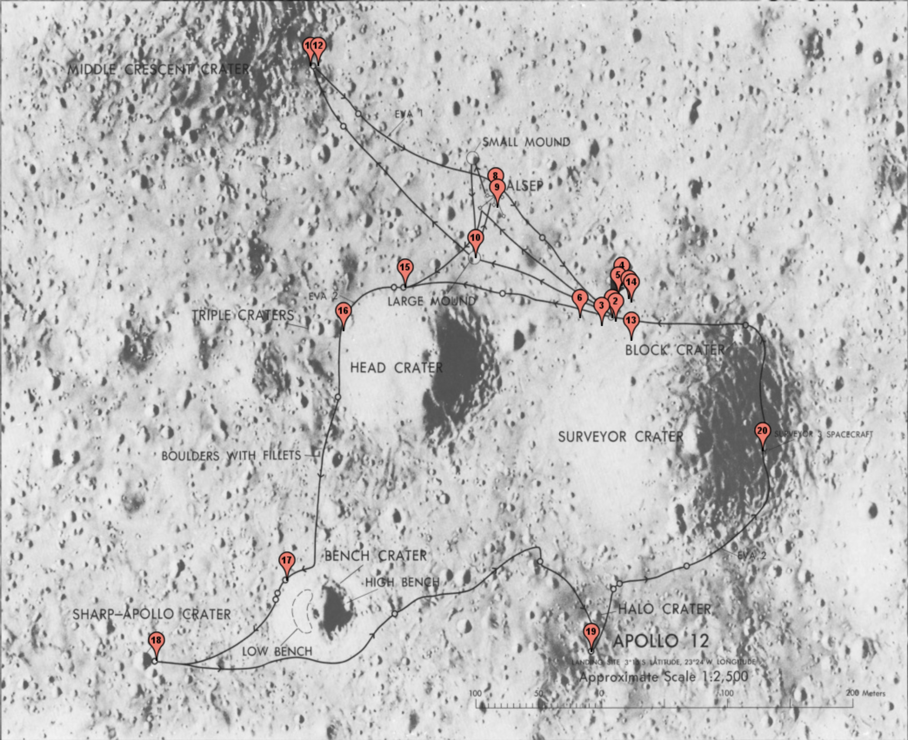
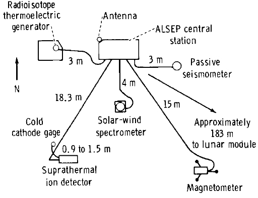
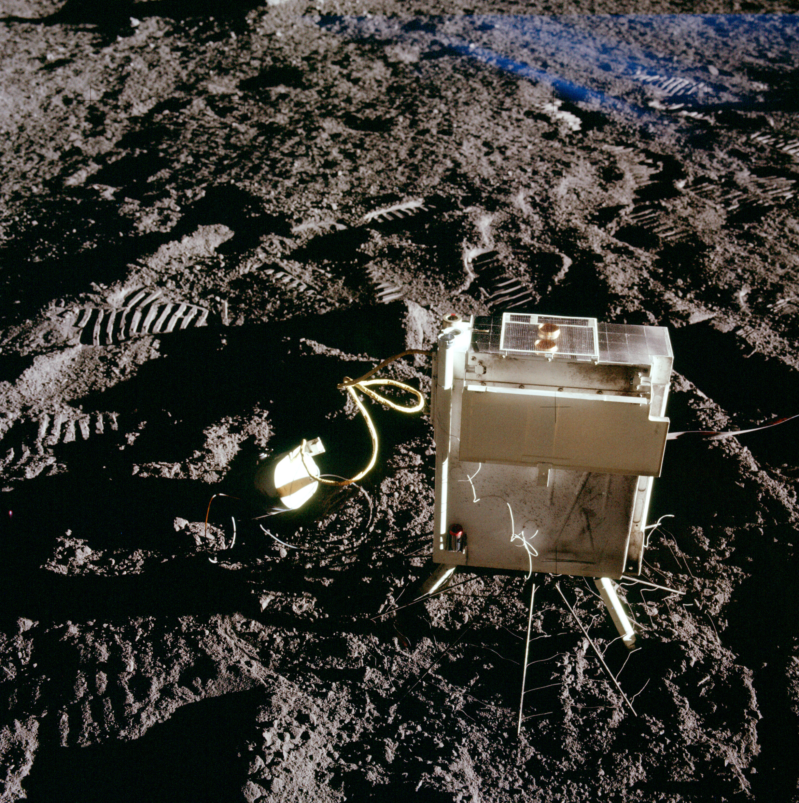
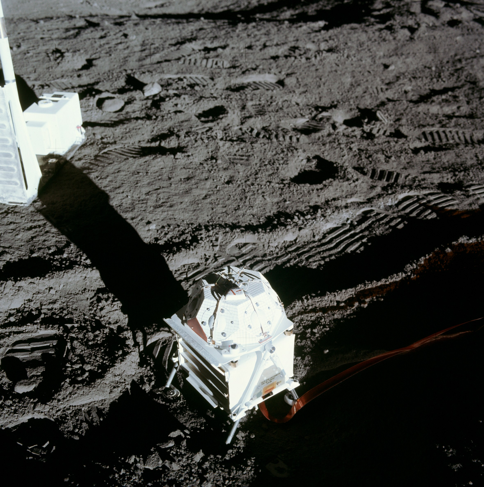

***************
Misji Apollo 12
***************

Charakterystyka misji
=====================
Celem misji Apollo 12 była wizyta miejsca lądowania sondy *Surveyor 3*, która wylądowała na powierzchni w kwietniu 1967 roku. Lądowanie podczas tej misji było jednym z najbardziej precyzyjnych :cite:`Calio1970`.

Apollo 12 było pierwszą misją podczas, której wykonano eksperymenty z pakietu :term:`ALSEP`.

Podstawowe informacje dotyczące misji
=====================================
.. csv-table:: Wybrane informacje dotyczące parametrów misji Apollo 12 :cite:`Garber2019`, :cite:`Johnston1975`, :cite:`Orloff2000`.
    :stub-columns: 1
    :file: data/apollo12-info.csv

Załoga
======
.. csv-table:: Lista członków załogi głównej i zapasowej dla misji Apollo 12 :cite:`Johnston1975`.
    :file: data/apollo12-crew.csv
    :header-rows: 1

    Załoga misji Apollo 12. Od lewej astronauci: Conrad, Gordon, Bean

Miejsce lądowania
=================

    Mapa lokacji lądowania i rozstawienia eksperymentów naukowych podczas misji Apollo 12. Źródło: NASA/USGS/LPI/ASU, :cite:`Lindsay2008`, :cite:`Apollo12PressKit`.

Eksploracja powierzchni Księżyca
================================
.. csv-table:: Harmonogram spacerów kosmicznych na powierzchni księżyca podczas misji Apollo 12 :cite:`LPI2019`.
    :file: data/apollo12-eva.csv
    :header-rows: 1

Lista eksperymentów
===================
W trakcie misji Apollo 12 wykonano następujące eksperymenty :cite:`Lindsay2008` :cite:`Meyer2009`, :cite:`LPI2019`, :cite:`Apollo12PressKit`, :cite:`Calio1970`:

    #. :ref:`Cold Cathode Ion Gauge`
    #. :ref:`Lunar Dust Detector`
    #. :ref:`Lunar Surface Magnetometer`
    #. :ref:`Passive Seismic Experiment`
    #. :ref:`Suprathermal Ion Detector Experiment`
    #. :ref:`Solar Wind Composition Experiment`
    #. :ref:`Solar Wind Spectrometer`

    Źródło: :cite:`ImageProjectApolloArchive`.

Zdjęcia eksperymentów na powierzchni
====================================
.. figure:: img/apollo12-LSM.jpg
    :name: figure-apollo12-LSM

    :ref:`Lunar Surface Magnetometer`. Źródło: :cite:`ImageProjectApolloArchive`.

.. figure:: img/apollo12-PSE.jpg
    :name: figure-apollo12-PSE

    :ref:`Passive Seismic Experiment`. Źródło: :cite:`ImageProjectApolloArchive`.

    :ref:`Suprathermal Ion Detector Experiment` / :ref:`Cold Cathode Ion Gauge`. Źródło: :cite:`ImageProjectApolloArchive`.

    :ref:`Solar Wind Spectrometer`. Źródło: :cite:`ImageProjectApolloArchive`.

