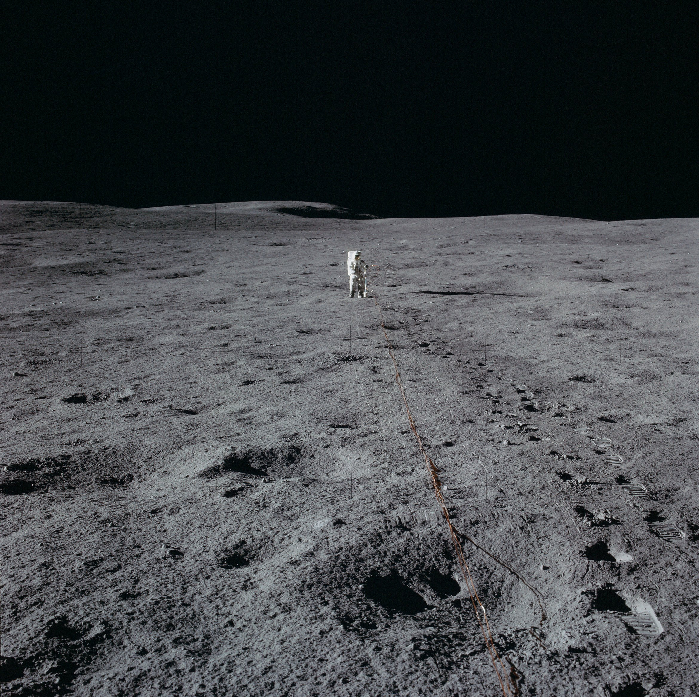
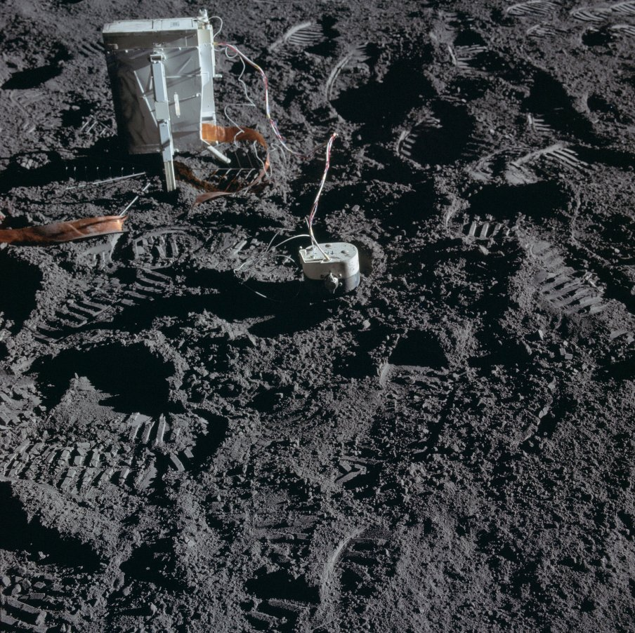

***************
Misji Apollo 14
***************

Charakterystyka misji
=====================

Podstawowe informacje dotyczące misji
-------------------------------------
.. csv-table:: Wybrane informacje dotyczące parametrów misji Apollo 14 :cite:`Garber2019`, :cite:`Johnston1975`, :cite:`Orloff2000`.
    :stub-columns: 1
    :file: data/apollo14-info.csv

Załoga
------
.. csv-table:: Lista członków załogi głównej i zapasowej dla misji Apollo 14 :cite:`Johnston1975`.
    :file: data/apollo14-crew.csv
    :header-rows: 1

.. figure:: img/apollo14-crew.jpg
    :name: figure-apollo14-crew

    Załoga misji Apollo 14. Od lewej astronauci: Rosa, Shepard, Mitchel

Miejsce lądowania
---------------------------------
The central station, located 180 meters West of the LM at 3.64398 S latitude, 17.47748 W longitude, was turned on at 1723 UT on February 5 1971 and failed during January 1976.
:cite:`Lindsay2008`

.. figure:: img/apollo14-map.png
    :name: figure-apollo14-map

    Mapa lokacji lądowania i rozstawienia eksperymentów naukowych podczas misji Apollo 14. Źródło: NASA/USGS/LPI/ASU

Eksploracja powierzchni Księżyca
--------------------------------
.. csv-table:: Harmonogram spacerów kosmicznych na powierzchni księżyca podczas misji Apollo 14 :cite:`LPI2019`.
    :file: data/apollo14-eva.csv
    :header-rows: 1

Lista eksperymentów
-------------------
#. Active Seismic Experiment (ASE)
#. Charged Particle Lunar Environmental Experiment (CPLEE)
#. Cold Cathode Ion Gauge (CCIG)
#. Lunar Dust Detector (LDD)
#. Lunar Portable Magnetometer (LPM)*
#. Laser Ranging Retro-reflector (LRRR)*
#. Passive Seismic Experiment (PSE)
#. Suprathermal Ion Detector Experiment (SIDE)
#. Solar Wind Composition (SWCE)*

\* - Eksperyment dodatkowy, niebędący częścią ALSEP

:cite:`Lindsay2008` :cite:`Meyer2009`, :cite:`LPI2019`

    Źródło: :cite:`ImageProjectApolloArchive`.

Przygotowanie do misji
----------------------
.. csv-table:: Obszary geograficzne na Ziemi wykorzystane podczas przeszkolenia geologicznego astronautów do misji Apollo 14.
    :file: data/apollo14-training.csv
    :header-rows: 1

Eksperymenty wykonane podczas misji
===================================

Active Seismic Experiment (ASE)
-------------------------------
.. figure:: img/apollo14-ASE1.jpg
    :name: figure-apollo14-ASE1

    Źródło: :cite:`ImageProjectApolloArchive`.

    Źródło: :cite:`ImageProjectApolloArchive`.

Charged Particle Lunar Environmental Experiment (CPLEE)
-------------------------------------------------------
.. figure:: img/apollo14-CPLEE.jpg
    :name: figure-apollo14-CPLEE

    Źródło: :cite:`ImageProjectApolloArchive`.

Lunar Dust Detector (LDD)
-------------------------

Passive Seismic Experiment (PSE)
--------------------------------
.. figure:: img/apollo14-PSE.jpg
    :name: figure-apollo14-PSE

    Źródło: :cite:`ImageProjectApolloArchive`.

SIDE/CCIG
---------
* Cold Cathode Ion Gauge (CCIG)
* Suprathermal Ion Detector Experiment (SIDE)

    Źródło: :cite:`ImageProjectApolloArchive`.

Lunar Portable Magnetometer (LPM)
---------------------------------

Lunar Ranging Retro-Reflector (LRRR)
------------------------------------
* with 100 fused silica cubes

.. figure:: img/apollo14-LRRR.jpg
    :name: figure-apollo14-LRRR

    Źródło: :cite:`ImageProjectApolloArchive`.

Solar Wind Composition Experiment (SWCE)
----------------------------------------
