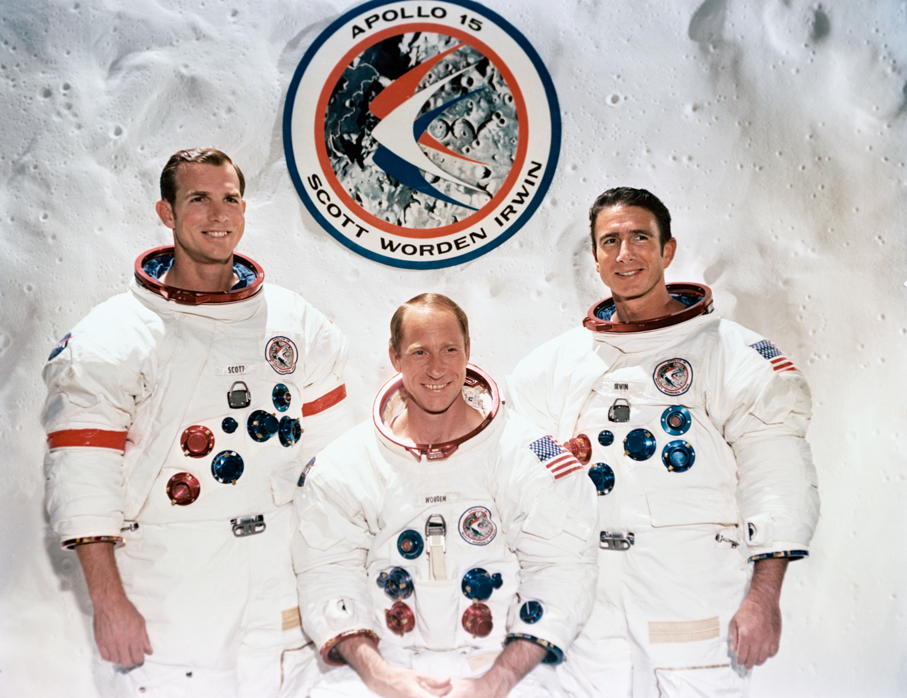

***************
Misji Apollo 15
***************

Charakterystyka misji
=====================
Pierwsza misja, która przy okazji badań powierzchniowych wykonała również pomiary na orbicie wykorzystując sensory umieszczone w module :term:`CSM`.

Zmodyfikowane skafandry :term:`A7L` wykorzystywane podczas :term:`EVA` pozwoliły na dłuższy pobyt powierzchniowy.

Apollo 15 był również pierwszą misją, podczas której zastosowano elektryczny łazik księżycowy :term:`LRV` (ang. *Lunar Roving Vehicle*).

Podstawowe informacje dotyczące misji
-------------------------------------
.. csv-table:: Wybrane informacje dotyczące parametrów misji Apollo 15 :cite:`Garber2019`, :cite:`Johnston1975`, :cite:`Orloff2000`.
    :stub-columns: 1
    :file: data/apollo15-info.csv

Załoga
------
.. csv-table:: Lista członków załogi głównej i zapasowej dla misji Apollo 15 :cite:`Johnston1975`.
    :file: data/apollo15-crew.csv
    :header-rows: 1

    Załoga misji Apollo 15. Od lewej astronauci: Scott, Worden, Irwin

Miejsce lądowania
-----------------
The central station, located 125 meters North West of the LM at 26.13407 N latitude, 3.62981 E longitude, was turned on at 1837 UT on July 31 1971 and shut down on September 30 1977.
:cite:`Lindsay2008`

.. figure:: img/apollo15-map.png
    :name: figure-apollo15-map

    Mapa lokacji lądowania i rozstawienia eksperymentów naukowych podczas misji Apollo 15. Źródło: NASA/USGS/LPI/ASU

Eksploracja powierzchni Księżyca
--------------------------------
.. csv-table:: Harmonogram spacerów kosmicznych na powierzchni księżyca podczas misji Apollo 15 :cite:`LPI2019`.
    :file: data/apollo15-eva.csv
    :header-rows: 1

Lista eksperymentów
-------------------
#. Cold Cathode Ion Gauge (CCIG)
#. Heat Flow Experiment (HFE)
#. Lunar Dust Detector (LDD)
#. Laser Ranging Retro-Reflector (LRRR)*
#. Lunar Surface Magnetometer (LSM)
#. Passive Seismic Experiment (PSE)
#. Suprathermal Ion Detector Experiment (SIDE)
#. Solar Wind Composition (SWCE)*

\* - Eksperyment dodatkowy, niebędący częścią ALSEP

:cite:`Lindsay2008` :cite:`Meyer2009`, :cite:`LPI2019`

    Źródło: :cite:`ImageProjectApolloArchive`.

Przygotowanie do misji
----------------------
.. csv-table:: Obszary geograficzne na Ziemi wykorzystane podczas przeszkolenia geologicznego astronautów do misji Apollo 15.
    :file: data/apollo15-training.csv
    :header-rows: 1

Eksperymenty wykonane podczas misji
===================================

Heat Flow Experiment (HFE)
--------------------------

    Źródło: :cite:`ImageProjectApolloArchive`.

Lunar Dust Detector (LDD)
-------------------------

Lunar Surface Magnetometer (LSM)
--------------------------------
* Commanded OFF on 15 June 1974

    Źródło: :cite:`ImageProjectApolloArchive`.

Passive Seismic Experiment (PSE)
--------------------------------
.. figure:: img/apollo15-PSE.jpg
    :name: figure-apollo15-PSE

SIDE/CCIG
---------
* Cold Cathode Ion Gauge (CCIG)
* Suprathermal Ion Detector Experiment (SIDE)

.. figure:: img/apollo15-SIDE_CCIG.jpg
    :name: figure-apollo15-SIDE_CCIG

    Źródło: :cite:`ImageProjectApolloArchive`.

SWS
---
.. figure:: img/apollo15-SWS.jpg
    :name: figure-apollo15-SWS

    Źródło: :cite:`ImageProjectApolloArchive`.

Lunar Ranging Retro-Reflector (LRRR)
------------------------------------
* with 300 fused silica cubes

.. figure:: img/apollo15-LRRR.jpg
    :name: figure-apollo15-LRRR

    Źródło: :cite:`ImageProjectApolloArchive`.

Solar Wind Composition Experiment (SWCE)
----------------------------------------
* exposed for 41 hours 8 minutes
