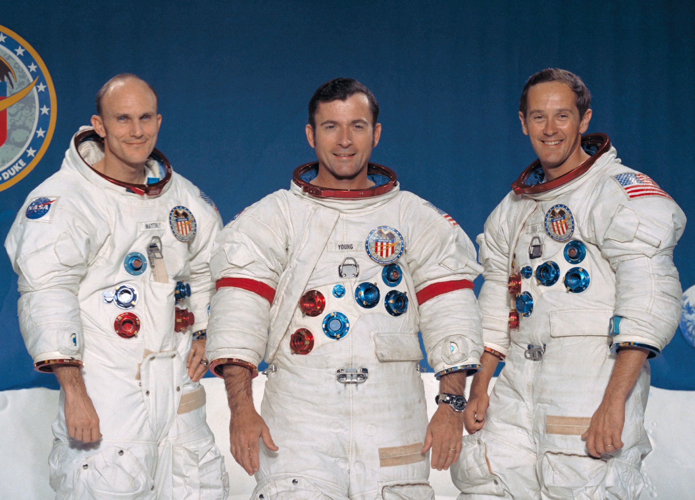
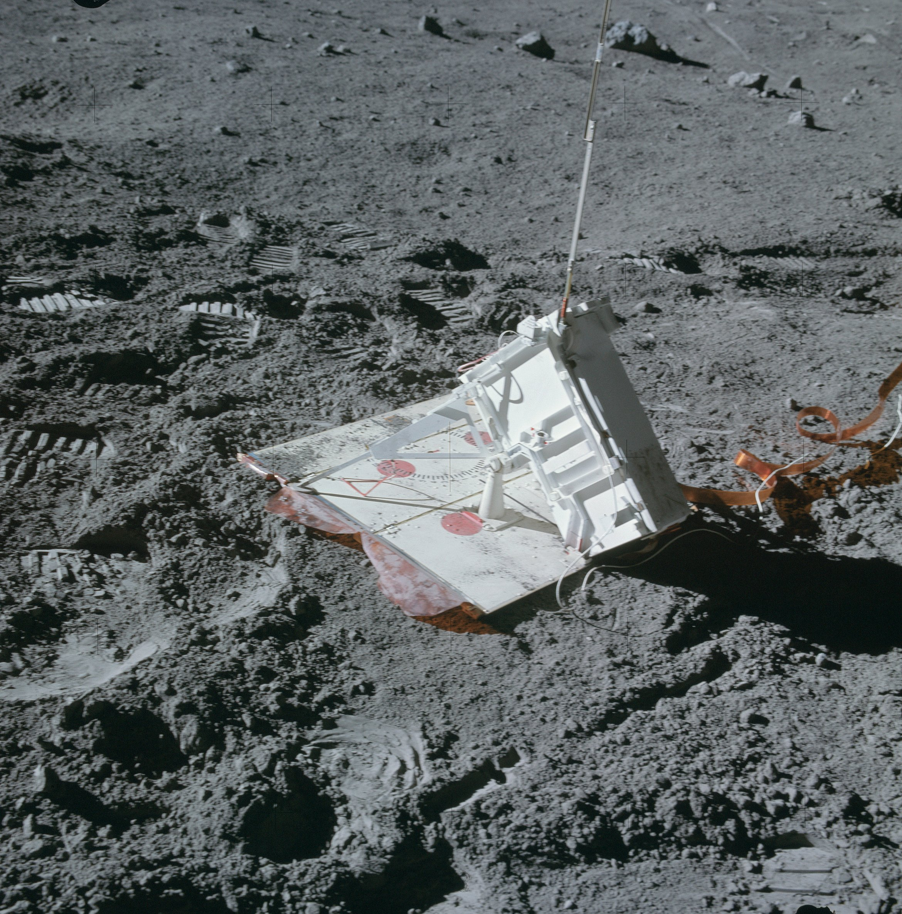
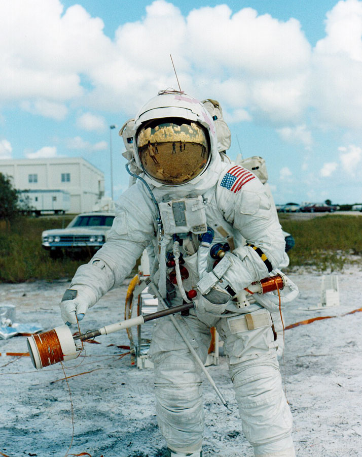
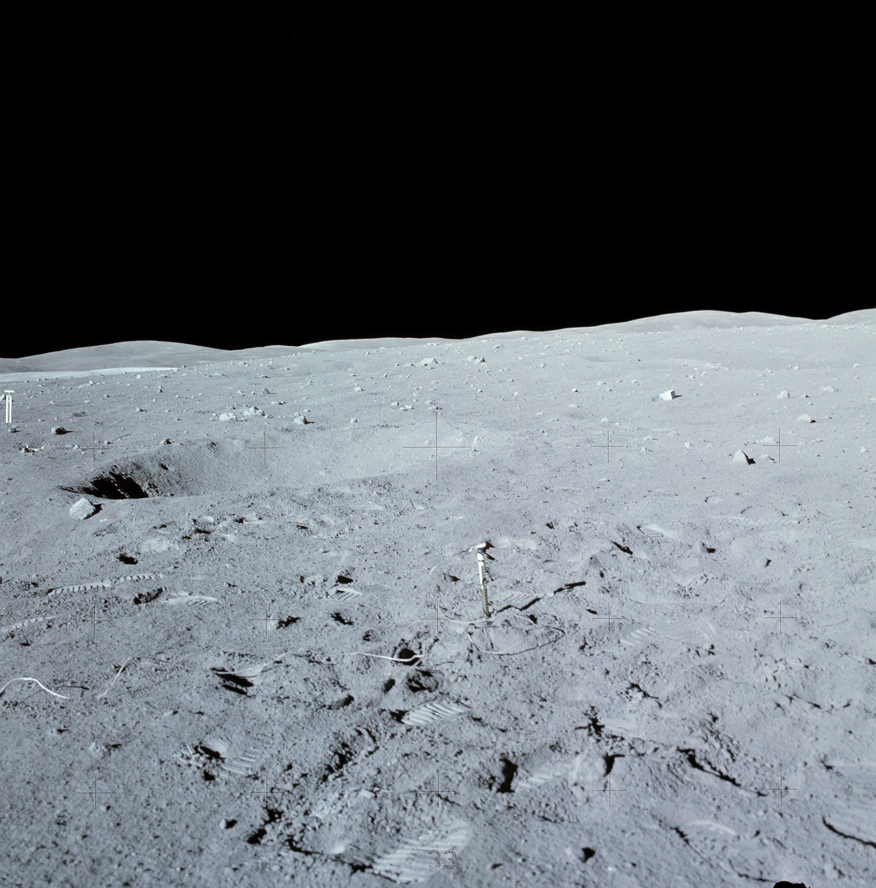
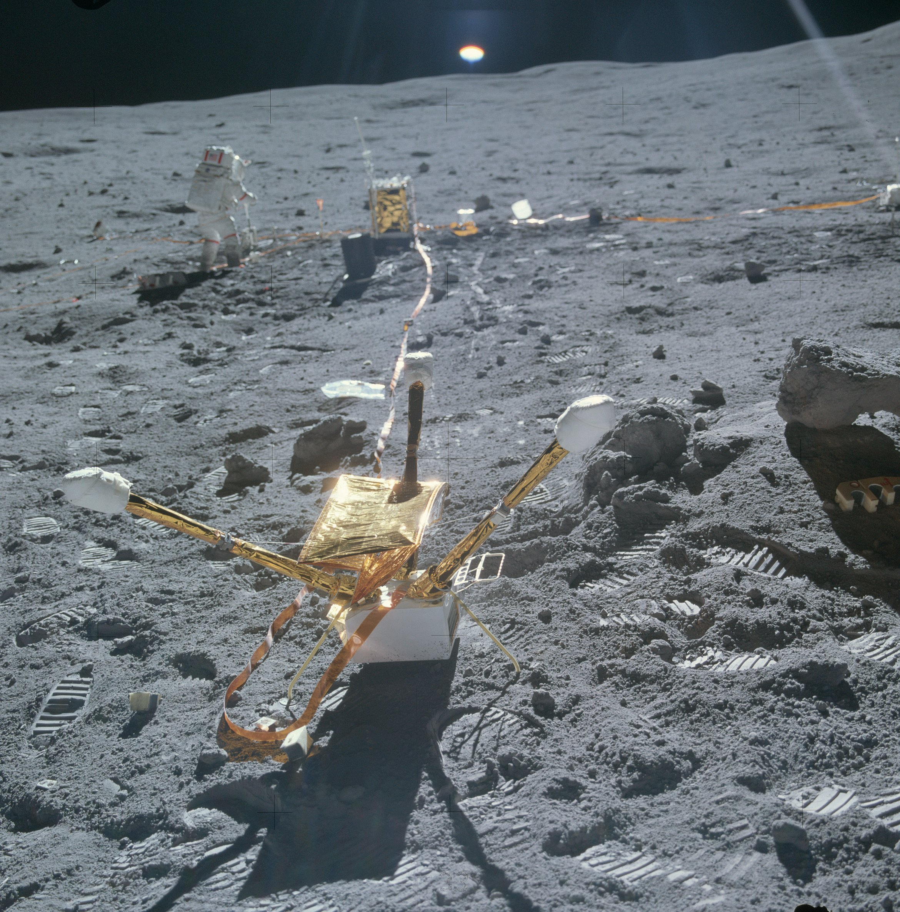
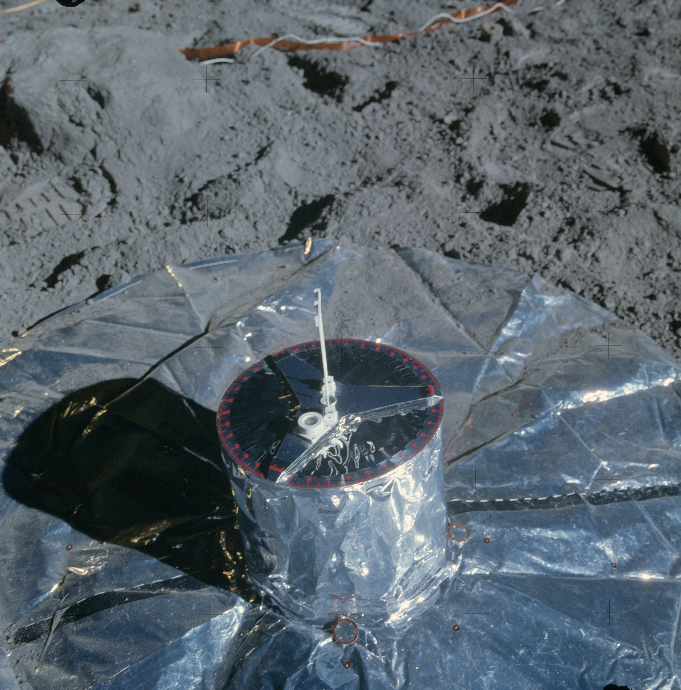

***************
Misji Apollo 16
***************

Charakterystyka misji
=====================

Podstawowe informacje dotyczące misji
-------------------------------------
.. csv-table:: Wybrane informacje dotyczące parametrów misji Apollo 16 :cite:`Garber2019`, :cite:`Johnston1975`, :cite:`Orloff2000`.
    :stub-columns: 1
    :file: data/apollo16-info.csv

First study of highlands area. Selected surface experiments deployed, ultraviolet camera/spectrograph used for first time on Moon, and LRV used for second time. LRV traversed 26.7 km. Three EVAs totaling 20 hours 14 minutes. 95.8 kg (213 lbs) of lunar samples collected. Lunar surface stay-time, 71 hours; in lunar orbit 126 hours, with 64 orbits. Subsatellite released in lunar orbit. Mattingly performed 1-hour trans-Earth EVA.

Załoga
------
.. csv-table:: Lista członków załogi głównej i zapasowej dla misji Apollo 16 :cite:`Johnston1975`.
    :file: data/apollo16-crew.csv
    :header-rows: 1

    Załoga misji Apollo 16. Od lewej astronauci: Mattingly, Young, Duke

Miejsce lądowania
-----------------
The central station, located 100 meters West South West of the Lunar Module at 8.97537 S latitude, 15.49812 E longitude, was turned on at 1938 UT on April 211972 and shut down along with the other ALSEP stations on September 30 1977 :cite:`Lindsay2008`

.. figure:: img/apollo16-map.png
    :name: figure-apollo16-map

    Mapa lokacji lądowania i rozstawienia eksperymentów naukowych podczas misji Apollo 16. Źródło: NASA/USGS/LPI/ASU

Eksploracja powierzchni Księżyca
--------------------------------
.. csv-table:: Harmonogram spacerów kosmicznych na powierzchni księżyca podczas misji Apollo 16 :cite:`LPI2019`.
    :file: data/apollo16-eva.csv
    :header-rows: 1

Lista eksperymentów
-------------------
#. Active Seismic Experiment (ASE)
#. Cosmic Ray Detector (CRD)*
#. Heat Flow Experiment (HFE)
#. Lunar Portable Magnetometer (LPM)*
#. Lunar Surface Magnetometer (LSM)
#. Passive Seismic Experiment (PSE)
#. Solar Wind Composition (SWCE)*

:cite:`Lindsay2008` :cite:`Meyer2009`, :cite:`LPI2019`

\* - Eksperyment dodatkowy, niebędący częścią ALSEP

    Źródło: :cite:`ImageProjectApolloArchive`.

Przygotowanie do misji
----------------------
.. csv-table:: Obszary geograficzne na Ziemi wykorzystane podczas przeszkolenia geologicznego astronautów do misji Apollo 16.
    :file: data/apollo16-training.csv
    :header-rows: 1

Eksperymenty wykonane podczas misji
===================================

Active Seismic Experiment (ASE)
-------------------------------

    Źródło: :cite:`ImageProjectApolloArchive`.

    Źródło: :cite:`ImageProjectApolloArchive`.

Heat Flow Experiment (HFE)
--------------------------

    Źródło: :cite:`ImageProjectApolloArchive`.

Lunar Surface Magnetometer (LSM)
--------------------------------

    Źródło: :cite:`ImageProjectApolloArchive`.

Passive Seismic Experiment (PSE)
--------------------------------

    Źródło: :cite:`ImageProjectApolloArchive`.

Cosmic Ray Detector (CRD)
-------------------------

Lunar Portable Magnetometer (LPM)
---------------------------------

Solar Wind Composition Experiment (SWCE)
----------------------------------------
* Apollo 16: exposed for 45 hours 5 minutes

