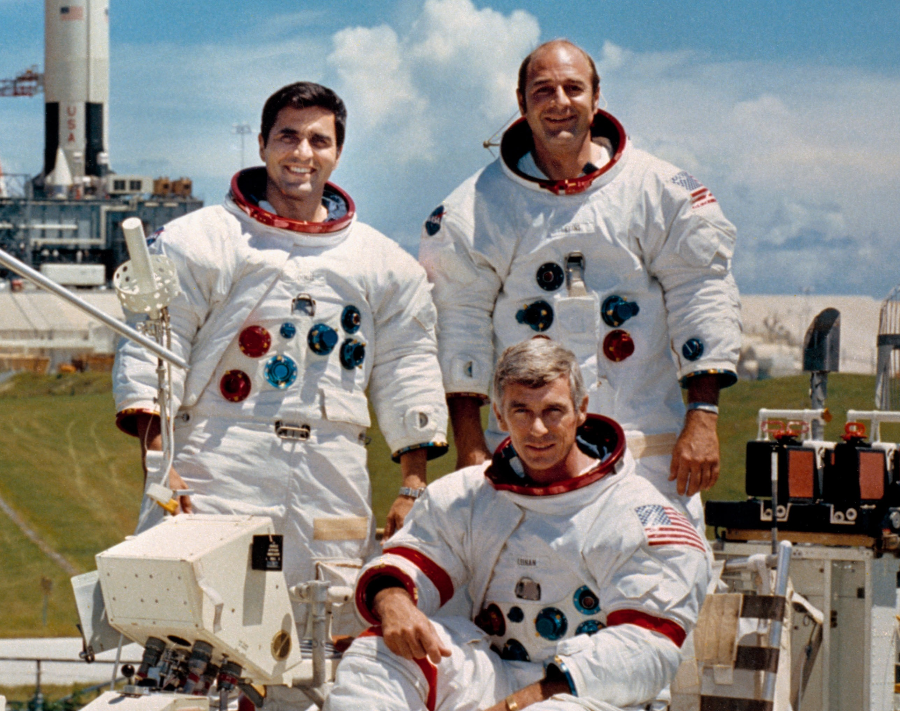
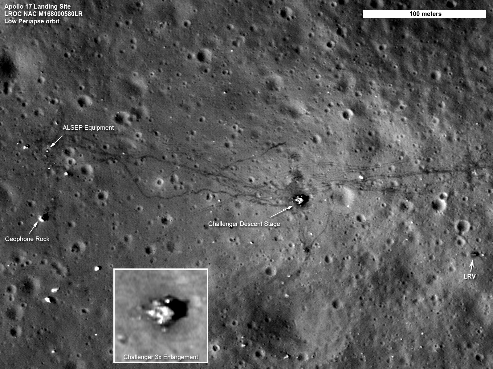
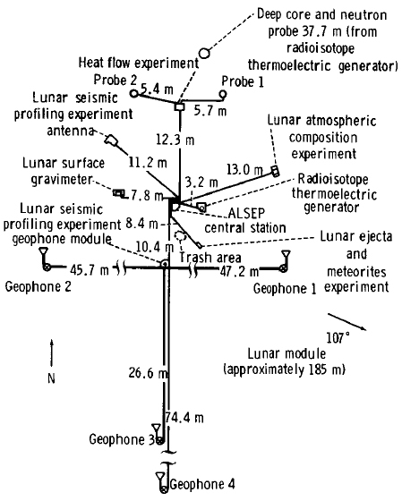
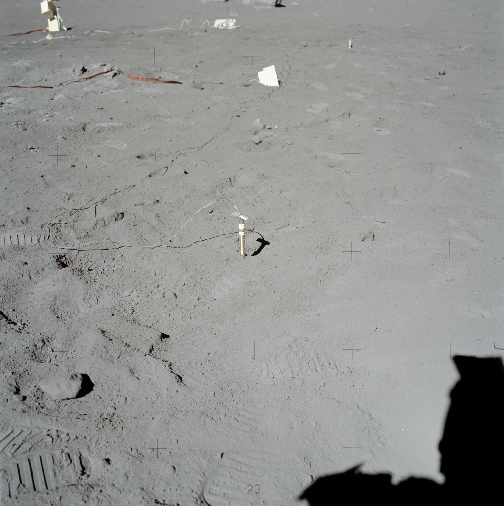
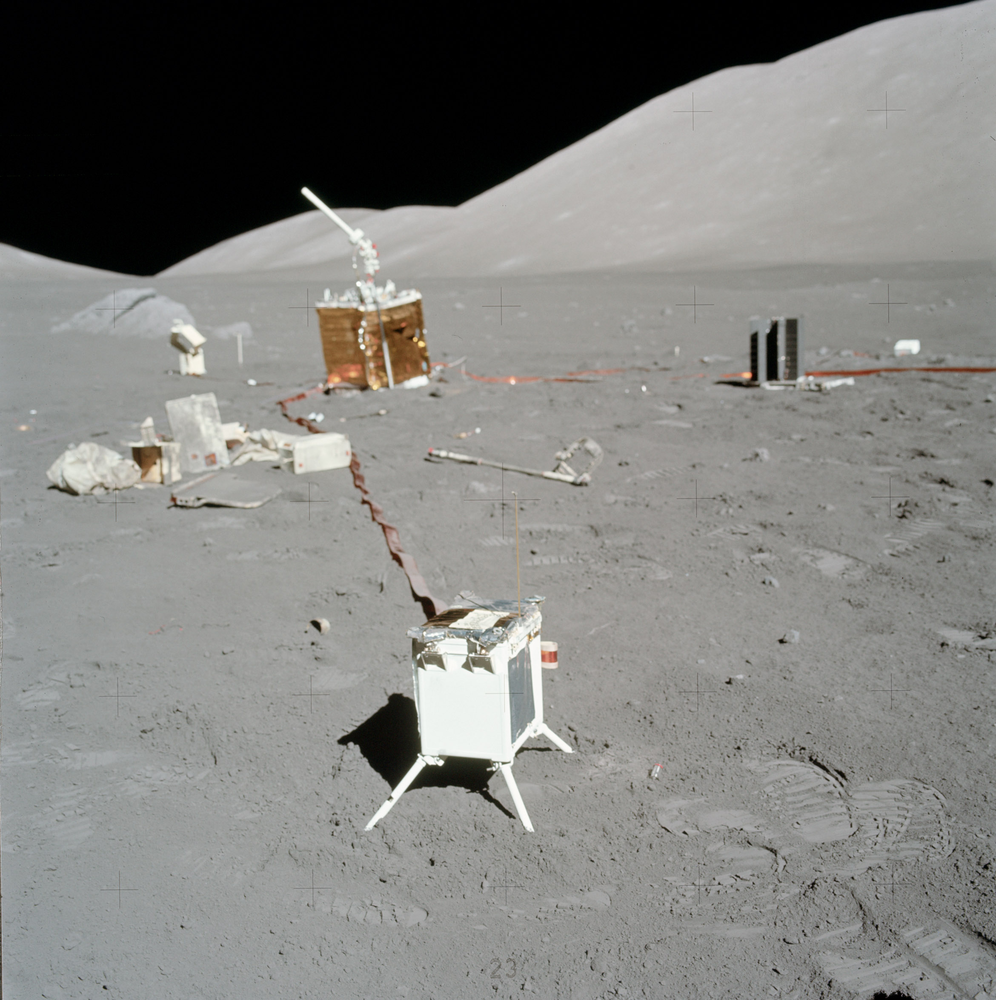
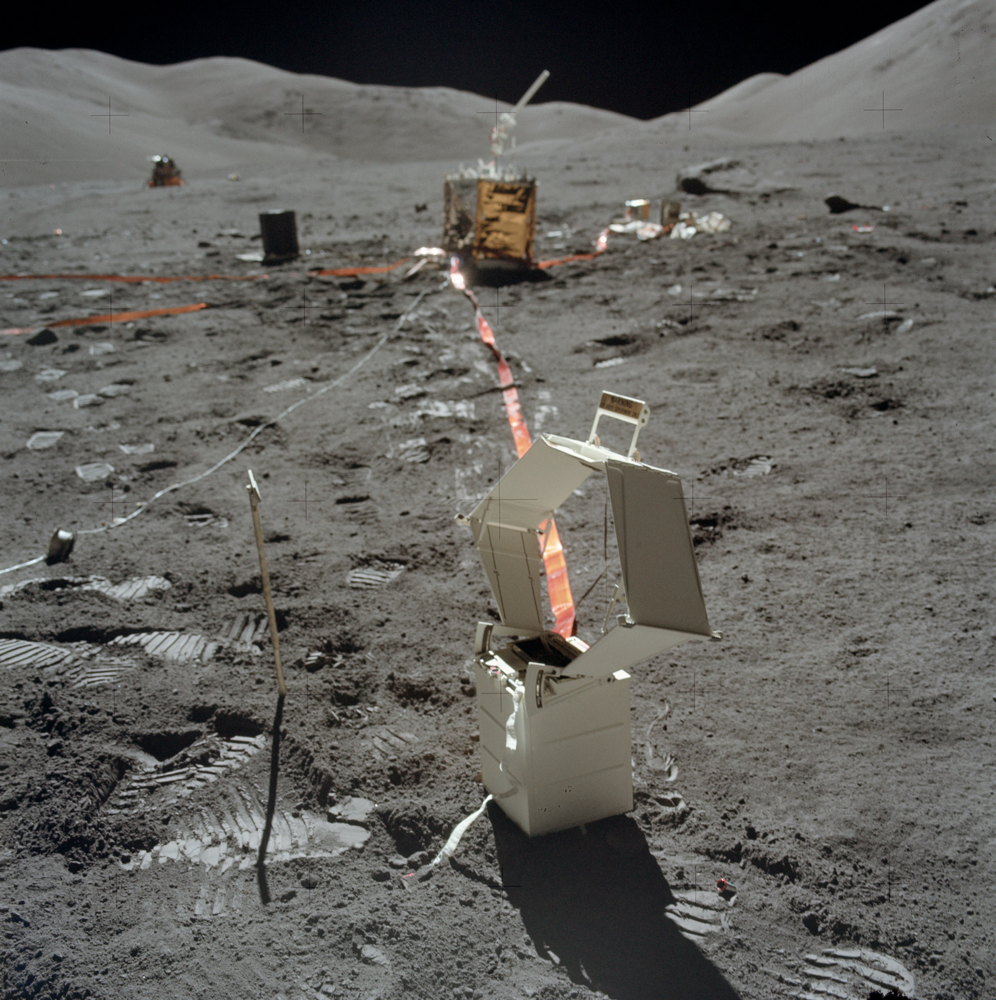
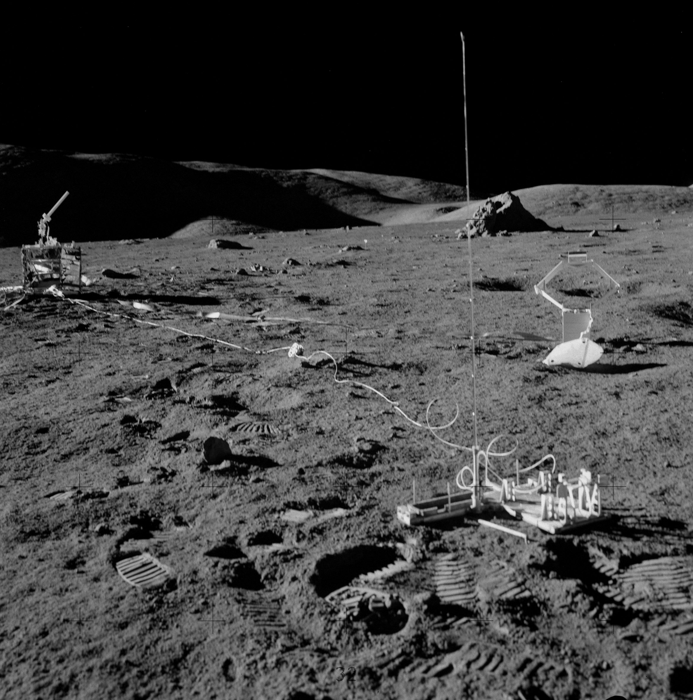
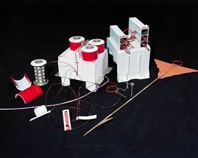

.. _Apollo 17:

***************
Misja Apollo 17
***************

Charakterystyka misji
=====================
Misja o największym znaczeniu naukowym. Pierwsze lądowanie na powierzchnię Księżyca przez naukowca (Harrison Schmitt). Rozstawiono 6 dodatkowych eksperymentów geofizycznych :cite:`Parker1973`.

Podstawowe informacje dotyczące misji
=====================================
.. csv-table:: Wybrane informacje dotyczące parametrów misji Apollo 17 :cite:`Garber2019`, :cite:`Johnston1975`, :cite:`Orloff2000`.
    :stub-columns: 1
    :file: data/apollo17-info.csv

Załoga
======
.. csv-table:: Lista członków załogi głównej i zapasowej dla misji Apollo 17 :cite:`Johnston1975`.
    :file: data/apollo17-crew.csv
    :header-rows: 1

    Załoga misji Apollo 17. Od lewej astronauci: Schmitt, Cernan (dół), Evans (góra)

Miejsce lądowania
=================
.. figure:: img/apollo17-map.png
    :name: figure-apollo17-map

    Mapa lokacji lądowania i rozstawienia eksperymentów naukowych podczas misji Apollo 17. Źródło: NASA/USGS/LPI/ASU, :cite:`Lindsay2008`.

    Mapa lokacji lądowania i rozstawienia eksperymentów naukowych podczas misji Apollo 17. Źródło: :cite:`ImageProjectApolloArchive`.

Eksploracja powierzchni Księżyca
================================
.. csv-table:: Harmonogram spacerów kosmicznych na powierzchni księżyca podczas misji Apollo 17 :cite:`LPI2019`.
    :file: data/apollo17-eva.csv
    :header-rows: 1

Lista eksperymentów
===================
W trakcie misji Apollo 17 wykonano następujące eksperymenty :cite:`Lindsay2008` :cite:`Meyer2009`, :cite:`LPI2019`, :cite:`Parker1973`:

    #. :ref:`Cosmic Ray Detector`
    #. :ref:`Heat Flow Experiment`
    #. :ref:`Lunar Atmospheric Composition Experiment`
    #. :ref:`Lunar Ejecta and Meteorite Experiment`
    #. :ref:`Lunar Surface Gravimeter Experiment`
    #. :ref:`Lunar Seismic Profiling Experiment`
    #. :ref:`Neutron Probe Experiment`
    #. :ref:`Surface Electrical Properties Experiment`
    #. :ref:`Traverse Gravimeter Experiment`

    Mapa schematyczna rozstawienia eksperymentów naukowych podczas misji Apollo 17. Źródło: :cite:`ImageProjectApolloArchive`.

Przygotowanie do misji
======================
.. csv-table:: Obszary geograficzne na Ziemi wykorzystane podczas przeszkolenia geologicznego astronautów do misji Apollo 17.
    :file: data/apollo17-training.csv
    :header-rows: 1

Zdjęcia eksperymentów na powierzchni
====================================

    :ref:`Heat Flow Experiment`. Źródło: :cite:`ImageProjectApolloArchive`.

.. figure:: img/apollo17-LACE.jpg
    :name: figure-apollo17-LACE

    :ref:`Lunar Atmospheric Composition Experiment`. Źródło: :cite:`ImageProjectApolloArchive`.

    :ref:`Lunar Ejecta and Meteorite Experiment`. Źródło: :cite:`ImageProjectApolloArchive`.

    :ref:`Lunar Surface Gravimeter Experiment`. Źródło: :cite:`ImageProjectApolloArchive`.

    :ref:`Lunar Seismic Profiling Experiment`. Źródło: :cite:`ImageProjectApolloArchive`.

.. figure:: img/apollo17-LSPE2.jpg
    :name: figure-apollo17-LSPE2

    :ref:`Lunar Seismic Profiling Experiment`. Źródło: :cite:`ImageProjectApolloArchive`.

    :ref:`Lunar Seismic Profiling Experiment`. Źródło: :cite:`ImageProjectApolloArchive`.
